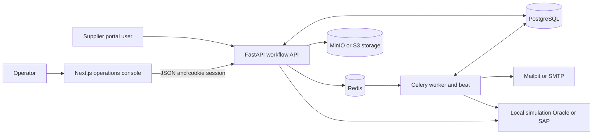
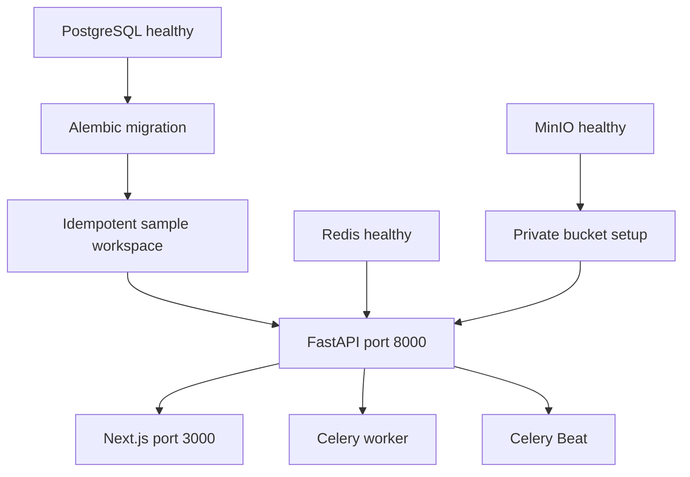
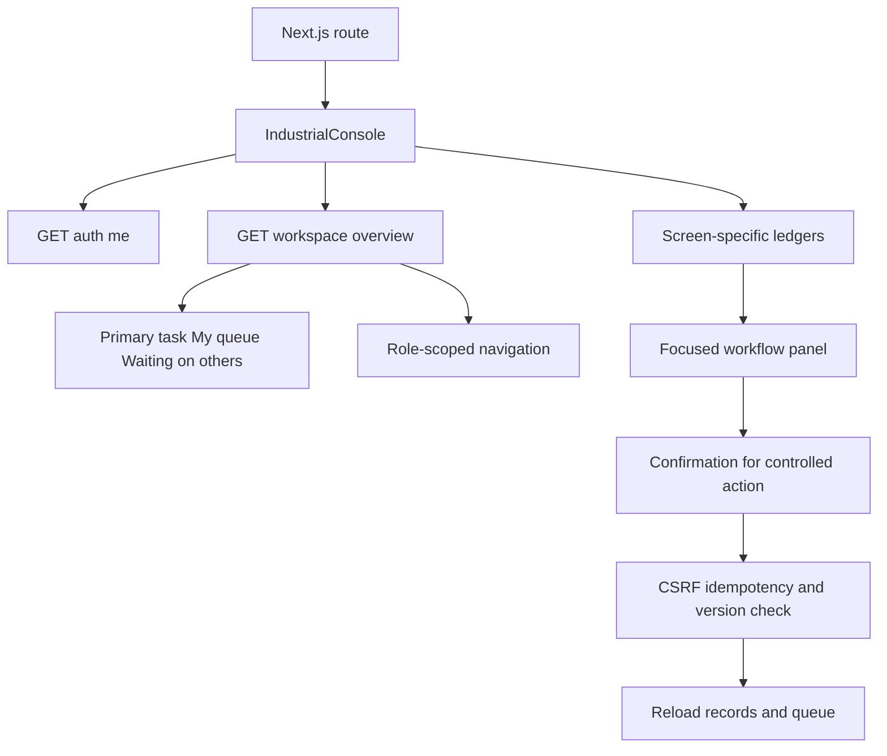
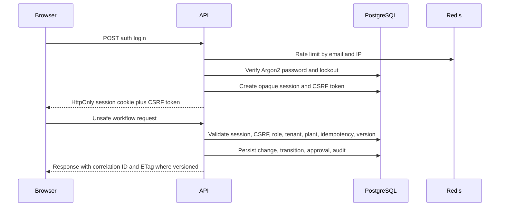
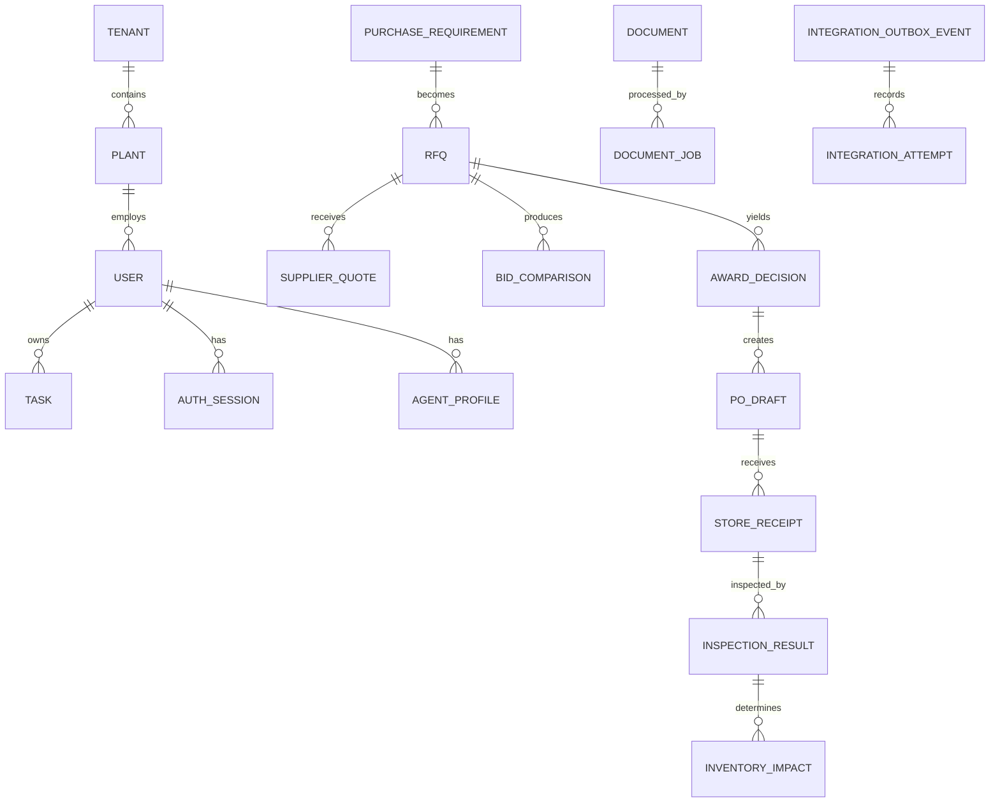
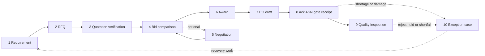
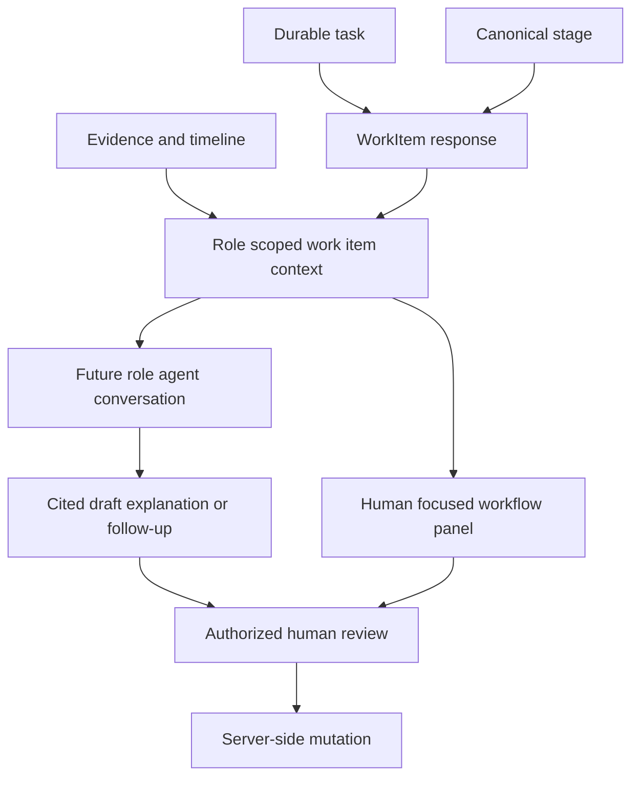
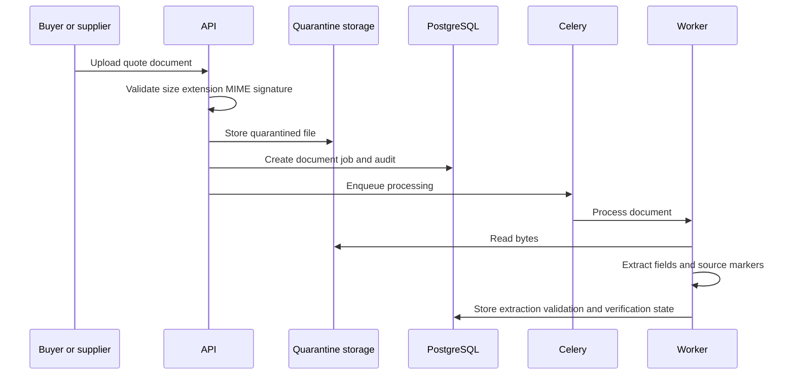
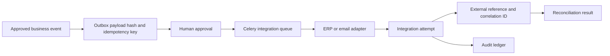

# GenuineGigs Architecture Guide

> A code-aligned guide to procurement, governed role agents, runtime, data, and safeguards.

## 1. Product In Plain Language

GenuineGigs is a manufacturing operations platform. The first module guides a material requirement through RFQ, quotation verification, supplier selection, PO preparation, inbound receipt, quality inspection, and exception recovery.

- ERP remains the system of record for external purchase and inventory.
- GenuineGigs manages role work, evidence, approval, exception handling, audit, and integration delivery around ERP records.
- Humans retain authority over approval, ERP posting, inventory change, master-data change, and case closure.
- A work item is the shared context boundary for a human and a future role agent.



## 2. Runtime And Repository

```text
apps/web/                  Next.js 16 and React 19 console
  app/                     Screen routes
  components/industrial/   Shell, task-first workspace, ledger UI
  components/features/     Focused workflow forms
  lib/                     API client, formatting, URL selection
apps/api/                  FastAPI service
  app/main.py              HTTP routes
  app/domains/             Procurement rules and state machine
  app/db/                  SQLAlchemy models, seed data, sessions
  app/core/                Security, roles, middleware, metrics
  documents.py             Upload and extraction pipeline
  integrations.py          Outbox delivery and import jobs
  erp.py                   Local, Oracle, SAP adapter boundary
  workers.py               Celery tasks
  migrations/              Alembic database history
packages/shared/           Generated FastAPI OpenAPI TypeScript contract
docker-compose.yml         Complete local runtime topology
```

Docker Compose starts PostgreSQL, Redis, MinIO, Mailpit, migration, seed, API, web, Celery worker, and Beat. Migration and seed are one-shot jobs; the API never creates schema itself.



| Service | Purpose |
| --- | --- |
| web | Production-mode console on port 3000 |
| api | FastAPI API and health endpoints on port 8000 |
| postgres | Primary transactional store |
| redis | Celery broker/backend and login throttling |
| minio | S3-compatible local document/evidence storage |
| worker and beat | Document, integration, email, sync, and recovery work |
| mailpit | Local SMTP sink and mailbox |

Compose uses PostgreSQL. A directly started API without `DATABASE_URL` uses a separate SQLite database.

## 3. Frontend And Task First UX

All operation routes use `IndustrialConsole`: procurement, RFQ builder, quotes, approvals, PO drafts, inbound, quality, cases, outbox, integrations, audit, and admin.



The default route asks **What do I need to do next?** A work item carries a plain-language goal, technical term, why-now explanation, required evidence, expected result, owner, due date, severity, blocker, safe record URL, allowed human actions, and future agent capabilities.

Opening a work item is only navigation using the selected cycle/record URL. It never publishes, approves, posts, dispatches, or closes anything. Navigation separates **My work** from **Process records**.

The client aligns the local API hostname to the browser hostname so `localhost` and `127.0.0.1` do not split the session cookie.

## 4. Security And Authority



| Safeguard | Implementation |
| --- | --- |
| Passwords | Argon2 hashes |
| Sessions | Random opaque cookie; only SHA-256 hash stored in PostgreSQL |
| CSRF | Unsafe authenticated routes require `x-csrf-token` |
| Login defense | Redis throttle plus database lockout after repeated failure |
| Scope | Operational queries filter by tenant and authorized plant |
| Roles | Server-side `require_role` and `require_read_role` |
| Idempotency | Unsafe routes except login/logout require `Idempotency-Key` |
| Concurrency | `If-Match` returns 412 for stale versioned writes |
| Traceability | `X-Correlation-ID`, redacted portal tokens, audit records |

The API is authoritative. UI visibility and confirmation reduce mistakes but cannot grant permission.

| Role | Main responsibility |
| --- | --- |
| Purchase Executive | Requirements, RFQs, evidence review, comparison, negotiation draft |
| Purchase Manager | Award, negotiation, PO, and outbox approval |
| Store Manager | ASN, gate entry, physical receipt |
| Quality Inspector | Inspection and inventory impact |
| Plant Manager | Risk and authorized exception oversight |
| Admin | User, role, plant, and agent administration |

## 5. Data And Procurement Lifecycle

All operational records are tenant- and plant-scoped. The major groups are organization, master data, work/cases, procurement, inbound/quality, documents/evidence, governance/audit, integrations, and authentication.





| Stage | Owner | Key rule/outcome |
| --- | --- | --- |
| Requirement | Purchase Executive | Captures item, quantity, UOM, need-by date, specification |
| RFQ | Purchase Executive | Approved need and eligible suppliers create invitations/outbox |
| Verification | Purchase Executive | Extracted quote fields checked against source evidence |
| Comparison | Executive prepares, manager reviews | Delivery, certificate, compliance, history, landed cost |
| Negotiation | Executive drafts, manager approves | Optional; counteroffers are re-verified |
| Award | Purchase Manager | Verified eligible supplier selected with rationale |
| PO draft | Purchase Manager | Approved award creates mapped PO and ERP outbox |
| Inbound | Supplier and Store Manager | Acknowledgement, ASN, gate, receipt |
| Quality | Quality Inspector | Accepted/rejected/held quantities create inventory impact |
| Exception | Assigned owner | Recovery work for shortage, damage, rejection, or hold |

Open exceptions are blockers or parallel recovery work. They do not replace the actual current procurement stage for every cycle.

The domain state machine rejects invalid transitions with 409. A normal transition updates the record, creates/completes tasks, writes workflow history, writes approval history where needed, and writes an audit event. External work also creates an outbox record.

## 6. Work Items And Governed Role Agents



`GET /workspace/overview` returns `work_items` and retains legacy `next_actions` for compatibility. `GET /workspace/work-items/{id}/context` returns the selected task, stage, linked workflow record, evidence/timeline references, permitted capabilities, restricted actions, and escalation owner.

The role-agent runtime now provides membership-scoped threads, messages, runs, context envelopes, proposals, delegations, formal manager status, fresh objectives, and an agent workspace. Agents can draft RFQ/negotiation content, extract quotes, explain comparisons, summarize risk, request updates, and create governed follow-up tasks. They cannot approve, post ERP data, update inventory, alter master data, or close cases. Every allowed or blocked action is audited.

Conversations are scoped to a personal queue, work item, objective, or team follow-up. Suggestions carry work-item/source references, expected effect, missing information, required human confirmation, and audit correlation. See docs/architecture/role-agent-os.md for identity, context isolation, communication, and deployment details.

## 7. Documents, Integrations, And Failure Handling



Documents start in quarantine. Parsing produces candidate values and evidence markers, never final commercial truth. A buyer verifies fields before the quote can be used for recommendation. Timeouts/failures become visible manual-entry/failure states; Beat recovers stalled jobs.



`ERPAdapter` is the provider contract for pull, push, and reconciliation. Local ERP simulates records and posting correlations. Oracle Fusion includes OAuth and REST payload paths, with real writes only in explicit live mode. SAP currently supplies the OData contract boundary. Safe defaults are `ERP_WRITE_MODE=simulation` and `ERP_LIVE_ENABLED=false`.

| Situation | Expected behavior |
| --- | --- |
| Invalid role or CSRF | 403 without mutation |
| Missing idempotency key | 428 before mutation |
| Stale record | 412 rather than overwrite |
| Invalid lifecycle transition | 409 |
| Parser timeout | Manual-entry document state |
| External timeout | Bounded Celery retry with backoff/jitter |
| Failed delivery | Visible, retryable outbox event |
| External reconciliation | Stored reference, attempt, payload/status comparison, audit |

## 8. Verification And Code Navigation

| Question | Start with |
| --- | --- |
| Why does a task appear | `apps/api/app/domains/workflows.py` |
| Why is an action allowed/blocked | `workflows.py`, `core/permissions.py`, `domains/state_machine.py` |
| Where is a UI action wired | `apps/web/components/features/WorkflowForms.tsx` and `lib/api.ts` |
| How is the console assembled | `apps/web/components/industrial/IndustrialConsole.tsx` |
| Where is a field stored | `apps/api/app/db/models.py` |
| How does a document become evidence | `documents.py` and `workers.py` |
| How does a PO reach ERP | `workflows.py`, `integrations.py`, `erp.py` |
| Why did a request repeat/fail | `core/middleware.py`, `core/security.py`, audit/outbox records |

Run locally with:

```bash
docker compose up --build
```

Open `http://localhost:3000` or `http://127.0.0.1:3000` and use one hostname consistently. Validate changes with:

```bash
docker compose ps
npm run typecheck
npm run build:web
npm run check:api-contract
npm run test:api
npm run test:e2e
```

## Current Scope And Invariants

Implemented: procurement V2 with Executive RFQ publication, Manager quotation extraction/comparison, immutable RFQ/comparison/PO PDFs, Plant Manager plus Purchase Executive comparison approval, final PO confirmation, Gate/Store/Quality handoffs, task-first work items, governed role agents, fresh/demo workspaces, audit/outbox/reconciliation, local ERP simulation, and Oracle/SAP integration boundaries.

Not yet shipped: autonomous controlled actions, complete SAP live writes, enterprise SSO, billing, production model certification, and multi-region recovery.

1. ERP authority is never bypassed.
2. Opening a task is navigation, never execution.
3. Controlled actions require human confirmation and server-side permission.
4. Decisions and future agent suggestions carry source evidence.
5. Tenant and plant scope apply to every operational query.
6. External effects are visible, idempotent, audited, and reconcilable.
7. Responsive views must contain operational data without overlap or hidden text.
