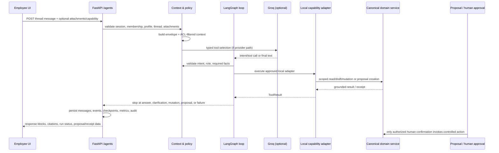

# GenuineGigs Agentic Framework: Repository-Grounded Implementation Guide

This document describes the agentic implementation that exists in this repository as of 2026-08-05. It is intended as a technical handoff for an LLM or engineer who needs to understand, modify, or extend the system without first rediscovering the architecture from source.

It distinguishes **implemented runtime behavior** from design intent where that matters. The source of truth remains the code; paths below are repository-relative.

## 1. What GenuineGigs implements

GenuineGigs is not a single tenant-wide chatbot. It is a governed, role-bound employee-agent system layered over a deterministic manufacturing procurement workflow.

The core unit is:

`Account → WorkspaceMembership → AgentProfile → private AgentThread → AgentRun`

Each active workspace membership has its own `AgentProfile`. The profile controls the agent's role, provider/model settings, budgets, enablement, prompt/policy version, and escalation metadata. The model is never treated as an authority source. It can select an allowed typed capability or phrase a grounded answer, but server code performs identity, scope, validation, persistence, and any business effect.

Normal product workflows remain available when agents are disabled, when the provider is unavailable, or when a proposal is rejected.

The procurement role model is:

| Role | Main operational ownership | Agent posture |
| --- | --- | --- |
| Plant Manager | requirement direction, management oversight, certain approvals/closures | can see formal reporting-subtree status and delegate downward |
| Purchase Executive | RFQ preparation/publication and supplier outreach | prepares RFQ drafts, handles assigned requirement work |
| Purchase Manager | quotations, comparison, negotiations, PO preparation | reviews evidence, prepares comparisons and controlled PO proposals |
| Gate Operator | gate entry | reads assigned work and prepares controlled gate-entry proposals |
| Store Manager | receipt/ASN handling | reads assigned work and prepares controlled receipt/ASN proposals |
| Quality Inspector | quality inspection/disposition | reads assigned work and prepares controlled inspection proposals |
| Admin | workspace and policy administration | broad operational access, but still uses server-controlled capabilities and confirmation rules |

## 2. Technology stack and the exact role of LangGraph

### Runtime technologies

| Concern | Actual implementation |
| --- | --- |
| HTTP/API | FastAPI in `apps/api/app/main.py` plus `apps/api/app/routers/agents.py` |
| Validation | Pydantic v2 schemas in `apps/api/app/agent_schemas.py` and `api_schemas.py` |
| Persistence | SQLAlchemy ORM models in `apps/api/app/db/models.py`; PostgreSQL in production/local Compose, SQLite used in tests/dev paths |
| Agent graph | LangGraph `StateGraph` in `apps/api/app/agent_runtime.py` |
| Model/provider | `langchain-groq` / Groq `ChatGroq` in `agent_service.provider_response()`; model profile is per `AgentProfile` |
| Tool invocation | Local Python capability adapters, never remote model-executed tools |
| Background jobs | Celery + Redis: documents, integration/email/sync jobs, scheduled follow-ups, document-triggered agent continuation |
| Storage/evidence | S3-compatible MinIO buckets in Compose; private document/quarantine/evidence buckets |
| Knowledge model | ACL-labelled `KnowledgeDocument`/`KnowledgeChunk`; pgvector extension is enabled by migration for PostgreSQL |
| UI | Next.js/React, with role-agent drawer/workspace in `apps/web/components/industrial/AgentDrawer.tsx` and `AgentWorkspace.tsx` |
| Audit/metrics | business audit events plus `AgentEvent`, `AgentCheckpoint`, `AgentToolCall`, `AgentActionReceipt`, Prometheus metrics |

Dependencies are declared in `apps/api/pyproject.toml`, including `langgraph`, `langchain-core`, `langchain-groq`, `groq`, `celery[redis]`, `pgvector`, and `cryptography`.

### Is LangGraph used?

Yes, but narrowly and deliberately. `apps/api/app/agent_runtime.py` imports `StateGraph`, `START`, and `END` from LangGraph and constructs a two-node graph:

```text
START → decide → execute → decide → … → END
```

The graph is a **server-controlled bounded tool/observation loop**, not an open-ended autonomous planner.

- `decide` obtains either a final response or the next typed tool request.
- `execute` runs the selected local capability adapter.
- Conditional edges stop on final answer, time budget, decision budget, tool budget, clarification, processing, blocked/failed outcome, successful business mutation, or proposal creation.
- Calls are bounded by settings such as `AGENT_MAX_GRAPH_STEPS`, `AGENT_MAX_TOOL_CALLS`, `AGENT_MAX_RUN_SECONDS`, candidate limits, one completed mutation, and one controlled proposal.

The model does **not** receive a LangGraph tool with database, shell, HTTP, file-system, storage, or ERP credentials. The graph only invokes the local `execute` callback after a role-scoped capability has been validated.

### Synchronous versus background execution

Interactive messages use a synchronous path:

```text
POST /agent/threads/{thread_id}/messages
  → agent_service.run_message(...)
  → provider selection / direct action
  → bounded LangGraph loop
  → canonical service/proposal
  → persisted response
```

This happens in the API request. It is not presently a generic Celery LLM-run queue.

Celery does run surrounding asynchronous work:

- document validation/extraction (`process_document`);
- resume of a quotation-upload agent continuation after documents finish parsing;
- recovery of queued document jobs;
- supplier email/integration dispatch and synchronization;
- scheduled internal task follow-ups and procurement follow-ups;
- retention enforcement.

Compose declares an `agents` worker queue, and Helm separates an `agent` worker deployment from the workflow worker deployment. In the checked-in worker registry, the concrete registered tasks are currently document/integration/follow-up/retention oriented; do not assume a generic agent-run Celery task exists unless one is added and registered.

## 3. Key source map

| File | Responsibility |
| --- | --- |
| `apps/api/app/agent_service.py` | primary orchestration, context, provider calls, intent processing, capability adapter dispatch, delegation/proposal logic, workspace bootstrap |
| `apps/api/app/agent_capabilities.py` | authoritative capability registry, role eligibility, required fields, controlled flag, adapter registry |
| `apps/api/app/agent_runtime.py` | bounded LangGraph decide/execute loop and stop conditions |
| `apps/api/app/agent_schemas.py` | typed context, intent, state, proposal, delegation, tool-result and request schemas |
| `apps/api/app/agent_state.py` | versioned thread-state load/validate/merge/persist rules |
| `apps/api/app/agent_resolution.py` | scoped material, supplier, record, requirement, and assignee resolution |
| `apps/api/app/task_service.py` | canonical task lifecycle, hierarchy checks, idempotent task creation, manager follow-ups, scheduled notifications |
| `apps/api/app/routers/agents.py` | authenticated HTTP interface for threads, messages, runs, proposals, delegations, tasks, workspace policy |
| `apps/api/app/db/models.py` | durable identity, agent, task, knowledge, evidence and audit models |
| `apps/api/app/core/config.py` | feature switches, provider config, token/time/depth/retention limits |
| `apps/api/app/workers.py` / `celery_app.py` | Celery workers, document continuation, recurring follow-up schedule |
| `apps/api/app/domains/workflows.py` / `procurement_v2.py` | authoritative procurement mutations the adapters call |
| `apps/web/components/industrial/AgentDrawer.tsx` | persistent Ask GenuineGigs UI, private threads, attachments, proposal actions |
| `apps/web/components/industrial/AgentWorkspace.tsx` | agent home, run activity, delegation and hierarchy UI |
| `docs/architecture/role-agent-os.md` | code-aligned architectural intent and rollout guidance |
| `docs/architecture/current-runtime-truth.md` | audited distinction between live paths and declared interfaces |
| `docs/runbooks/agent-operations.md` | operational controls, emergency stop, outage, retention and release guidance |

## 4. Identity, tenancy, membership, and profile creation

### Identity boundary

`User` is not enough to scope an agent. The selected `WorkspaceMembership` is the access boundary. It contains tenant, default plant, permitted plants, department, role, reporting manager, explicit permissions, and active/invited status.

Session security pins the selected membership. A workspace switch changes the scope used by the frontend and API. Agent queries are scoped by tenant and plant and then narrowed by membership/task ownership where applicable.

### Agent profile creation

`AgentProfile` is persisted per membership, not shared per role. The important fields are:

- `membership_id`, `user_id`, `tenant_id`, `plant_id`, and `role`;
- `display_name`;
- stored `allowed_actions` and `blocked_actions` metadata;
- `prompt_version` and `policy_version`;
- provider/model profile;
- per-run token budget and monthly token budget;
- `enabled`;
- escalation manager/policy metadata.

Profiles are created or reconciled during workspace bootstrap and employee creation in `agent_service.py`. The Admin UI explicitly describes this as “Create employee accounts and role agents.” The demo seed also creates profiles. Bootstrap logic creates the standard role set and reporting relations.

### Triple enablement gate

An agent is available only when all of these are true (`assert_agent_available`):

1. deployment config `AGENT_ENABLED` is true;
2. `Tenant.agent_enabled` is true;
3. that membership’s `AgentProfile.enabled` is true.

Missing profile, disabled tenant, disabled deployment, or disabled profile fails with a 503-style agent-unavailable response while normal workflow endpoints remain operational.

Admin policy routes under `/admin/workspace/agent-policy` can enable/disable the workspace policy. Disabling cancels active runs and returns `normal_workflows_available: true`.

## 5. Context isolation: what an agent can see

### Server-generated context envelope

`build_context_envelope()` creates an `AgentContextEnvelope` immediately before use. The model does not supply its own tenant, role, work-item scope, or entity allowlist.

The envelope includes:

- tenant/workspace and selected plant;
- membership ID and role;
- thread ID/type and thread owner;
- optional objective/work-item ID;
- explicit `allowed_entity_ids` derived from an owned/shared task or visible objective;
- reporting descendants only for Plant Manager/Admin context;
- IDs of approved knowledge documents visible to the membership;
- allowed read, draft, delegation, and proposal tool names;
- restricted actions;
- token/time/handoff/delegation-depth limits;
- correlation ID and policy version.

For a work-item thread, the envelope exposes only the task and its directly linked entity. For an objective thread, the objective must be owned by the member or a visible reporting descendant. For a personal thread, the thread is private and data access remains scoped by the capability/service being run.

### Thread privacy

`thread_for_membership()` checks tenant, plant, active status, owner membership, and explicit participant membership IDs. Messages are queried by `thread_id` **and** membership. Managers receive formal task/delegation projections, not a subordinate's private chat transcript.

Thread types are `personal`, `work_item`, `objective`, and `team_follow_up`. Thread state uses schema version 3 and is persisted through `persist_thread_state()` rather than arbitrary JSON writes.

### Knowledge and documents

Knowledge documents must be approved and not retired. `approved_knowledge()` filters them before use by role ACL and plant ACL. Similarity/ranking may organize already-authorized chunks; it cannot extend permission.

Uploaded documents are untrusted evidence. They can be parsed and linked to controlled workflows but never change prompt policy, role grants, or tool availability. Agent message attachments are immutable message/document links with explicit parse/inference/review state.

### ID and record resolution

`agent_resolution.py` resolves records, materials, suppliers, requirements, and assignees through tenant/plant scoped queries. It accepts an exact internal ID or business number where appropriate, handles tightly-defined recent/latest requirement behavior, and fails on ambiguity. A model-suggested ID is only an input to server re-authorization; it is never trusted on its own.

## 6. Capability registry and role restriction model

`CAPABILITY_REGISTRY` in `agent_capabilities.py` is the public tool surface. Each capability contains:

- `capability_id`;
- permitted roles;
- required and optional fields;
- whether it is `controlled`;
- accepted attachment MIME types where needed;
- local adapter name;
- intended response-card type.

`validate_intent()` performs two critical checks:

1. unknown capability → HTTP 422;
2. capability not allowed for membership role → HTTP 403.

It also derives `requires_confirmation` from the registry’s `controlled` flag. Registered adapter lookup is fail-closed: an unregistered adapter yields “temporarily unavailable,” not a fallback side effect.

### Capability families

The registry covers these families:

| Family | Examples |
| --- | --- |
| Read/context | work explanation, my tasks, team tasks, get record, daily brief, risks, policy, management summary |
| Master/reference | approved material lookup, supplier compliance/performance, material-master request proposal |
| Requirement/RFQ | create requirement, review lifecycle, prepare RFQ draft, publish RFQ proposal |
| Quotations | upload supported attachments, extraction review, exchange-rate record/link, field-verification proposal |
| Sourcing decisions | comparison preparation, comparison submission/decision proposals, negotiation, PO proposal/email/change |
| Inbound/quality | ASN, gate, receipt, inspection, supplier return/replacement proposals |
| Finance/integration | invoice attachment preparation/match/payment status, finance handoff, Excel preview/review/approval/export |
| Coordination | request task update, delegate task, team status |

The model sees only a filtered set of descriptions/specifications appropriate to the selected context and role. `lifecycle_capability_ids()` additionally narrows the exposed set based on user wording, selected record type, and attachments.

### Hard restricted actions

The envelope always includes a restricted-action list such as approval, publishing, ERP posting, inventory update, master-data/permission changes, closing an exception, impersonation, unrestricted HTTP, and generic SQL. This is explanatory context; enforcement is actually repeated in the registry, proposal flow, canonical services, role checks, workflow state transitions, idempotency, and version checks.

## 7. Provider invocation and deterministic degradation

### Groq path

`provider_response()` is the interactive provider boundary.

When profile provider is Groq and `GROQ_API_KEY` exists:

1. `ChatGroq` is constructed with the profile model (default `openai/gpt-oss-120b`), timeout, retries, and a planning token cap.
2. Function specs are built only for selected allowed capabilities.
3. A system prompt states the restricted role-agent behavior.
4. The provider receives compact authorized context, current confirmed facts, a bounded recent history window, and no secrets/credentials.
5. Tool call output becomes an `IntentEnvelope`; plain output becomes contextual answer intent.
6. Server code revalidates the intent and merges user-grounded facts before any adapter runs.

After local execution, `compose_grounded_answer()` can use Groq to rewrite the already-grounded result into concise natural language. It receives the narrow persisted result packet, not arbitrary database data or tool authority.

### Direct action path

UI capability buttons may send `requested_capability`. This bypasses model interpretation but **does not bypass validation**: the same `IntentEnvelope`, role validation, resolution, adapter, receipt, and proposal rules apply.

### Limited/deterministic behavior

The repository has deterministic intent/resolution paths for provider outage and test/development mode. They only continue supported, unambiguous requests and still go through the exact same capability and server authorization layer. A provider outage does not create a weaker mutation path.

Relevant settings include:

```text
AGENT_ENABLED
AI_PROVIDER
GROQ_API_KEY
AGENT_ALLOW_DETERMINISTIC_FALLBACK
AGENT_PRIMARY_MODEL / AGENT_FAST_MODEL
AGENT_MAX_RUN_SECONDS
AGENT_MAX_GRAPH_STEPS
AGENT_MAX_TOOL_CALLS
AGENT_MAX_BUSINESS_MUTATIONS
AGENT_MAX_CONTROLLED_PROPOSALS
AGENT_MAX_DELEGATION_DEPTH
AGENT_MAX_HANDOFFS
AGENT_DEFAULT_TOKEN_BUDGET
AGENT_DEFAULT_MONTHLY_TOKEN_BUDGET
```

The production runbook recommends agents disabled initially and deterministic fallback disabled unless explicitly accepted.

## 8. End-to-end message execution flow

### Request sequence



### Actual steps in `run_message()`

1. Resolve active membership and agent profile.
2. Enforce the triple enablement gate.
3. Load the owned/participating thread and validate message attachment ownership/processing state.
4. Build server context and citations; load validated thread state.
5. Create a durable `AgentRun` with correlation/trace IDs, policy version, context hash, provider/model fields, and active-context summary.
6. Persist `run_started`, `context_resolved`, and checkpoint events.
7. Obtain intent from direct UI capability or provider/deterministic pathway.
8. Merge explicit employee facts into thread state with provenance. User facts win over omitted/paraphrased model fields.
9. Validate capability and run `run_bounded_tool_loop()`.
10. Dispatch the registered local adapter. The adapter resolves canonical records and calls domain services or creates a proposal.
11. Classify result as completed, proposal created, clarification needed, processing, blocked, failed, or observation.
12. Validate the final grounded response and preserve business identifiers.
13. Persist assistant message, citations, events, checkpoints, run metrics, tool records/receipts, and business audit events.

The loop stops after a successful mutation or controlled proposal. It can make multiple safe reads/resolutions beforehand, subject to configured limits.

### Cancellation and continuation

`POST /agent/runs/{run_id}/cancel` sets `cancellation_requested`; queued/running runs become cancelled and record an event. Thread deletion also flags running/waiting/paused runs cancelled.

Document-driven quotation batches may create a run in `waiting_on_documents` / processing state. `workers.process_document()` triggers `resume_quotation_batch_after_document()` once parsing finishes. The continuation reuses durable attachment references and typed thread state; it does not require the user to upload again or rely on a hidden transcript.

## 9. Human authority and controlled proposals

### Why proposals exist

Consequential actions are intentionally split into:

```text
agent prepares a proposal
→ authorized human reviews a preview/effect
→ server rechecks authority, expiry and record state
→ canonical workflow service executes
→ receipt/audit is persisted
```

The agent does not directly publish an RFQ, approve a comparison, issue a PO, post ERP data, update inventory, or close an exception merely because the model asked for it.

### `AgentProposal` data contract

`AgentProposal` stores action, target type/id, preview, expected effect, required authority, record version, confirmation state, expiry, risk class, required capability, decision/rejection rationale, and a unique idempotency key.

`CONTROLLED_ACTIONS` in `agent_service.py` maps action to target entity and authority role. Examples include RFQ publication, comparison submit/decision, PO confirmation, gate/receipt/inspection, outbox dispatch, case closure, quote verification, finance handoff, import approval, replacement actions, certificate decisions, and requirement lifecycle closure.

### Confirmation

`confirm_proposal()` requires:

- same tenant and plant;
- proposal owner membership equals caller membership;
- caller role equals the proposal’s required authority;
- pending state and unexpired proposal;
- then execution through an explicit server-side `action_map` calling the authoritative workflow/domain service.

On success it records confirmation identity/timestamp, creates an `AgentActionReceipt`, updates typed thread state, emits run events, and creates audit records. Rejection requires a rationale and updates proposal/thread/run state without producing the external business effect.

Concurrency/version safety is additionally enforced by canonical endpoints/models through optimistic versions/ETags and domain checks. Proposal confirmation is not a general-purpose escape hatch.

## 10. Delegation, hierarchy, and task coordination

### Reporting hierarchy

The hierarchy is stored on `WorkspaceMembership.manager_membership_id`, not inferred from role names alone. `reporting_descendants()` and `task_service.descendants()` perform bounded breadth-first traversal of active members in the same tenant.

Bootstrap establishes standard reporting relations; employee-admin forms can set “Reports to.” The database may additionally store `AgentProfile.escalation_manager_id` and escalation policy metadata.

### Canonical Task is the coordination primitive

`Task`, not an agent message, is the durable work item. Important fields include:

- owner user/membership/role, creator and delegator memberships;
- assignment source and optional source agent run;
- parent task, objective and delegation links;
- requested outcome, instructions, expected output, priority and due date;
- entity/case links;
- acceptance status, execution status, blocker, completion summary;
- last/next follow-up time and escalation level;
- semantic key for active-task idempotency.

Task statuses use a controlled lifecycle:

```text
open → accepted | in_progress | cancelled
accepted → in_progress | blocked | cancelled
in_progress → blocked | review | completed | cancelled
blocked → in_progress | cancelled
review → in_progress | completed | cancelled
```

Only the assignee can progress execution. Only the delegator or Admin can cancel. A blocked transition requires a blocker reason; completion requires a summary. Managers receive notifications when delegated work is blocked or completed.

### Creating a task/delegation

`task_service.create_task()` rejects an assignee outside the caller’s reporting descendants, except self/Admin. It creates an active semantic key from tenant, plant, task type, context entity, and assignee. A partial unique active-task index plus retry-on-integrity-error prevents duplicate active tasks under concurrency.

`agent_service.create_delegation()` creates a separate durable `AgentDelegation` packet. Assignment recipients must be reporting descendants. A collaboration request may target another member but cannot be sent to self; it does not confer assignment/mutation authority. Delegation depth is derived from the previous objective handoff and must not exceed `AGENT_MAX_DELEGATION_DEPTH` (default 3).

The delegation packet holds only minimal coordination data:

- sender/recipient agent profiles and memberships;
- objective/work-item references;
- requested outcome;
- constraints/context packet;
- due date;
- status/response;
- depth.

It intentionally excludes the sender’s private chat transcript and unrelated records.

### Recipient response

Only the recipient membership can call `respond_to_delegation()`. Responses can report acceptance, in-progress status, completion, clarification, commitment time, summary, or blocker. For the linked owned task, acceptance/status fields are synchronized and completion closes the task.

### Specialized procurement delegation

`execute_procurement_delegation()` is the key implemented low-risk automation path. When a valid Plant Manager intent includes/has resolved material, quantity, need-by date, and Purchase Executive assignee, server code creates the canonical purchase requirement, an assigned Purchase Executive task, and a durable delegation. It also writes tool-call/audit/action-receipt records and idempotency material. RFQ publication and further controlled actions remain human-authorized.

## 11. Follow-ups, escalations, and notifications

### Manager-requested follow-up

`request_follow_up()` is available only to an Admin, direct delegator, or reporting manager. It:

1. verifies visibility and active task state;
2. records `last_follow_up_at` and optional `next_follow_up_at`;
3. increments escalation level if overdue;
4. creates an idempotency-keyed notification for the task owner;
5. writes audit metadata.

### Scheduled internal follow-ups

Celery Beat runs `app.workers.run_internal_followups` every 300 seconds. It calls `task_service.run_internal_followups()`.

That sweep creates deduplicated notifications for tasks due within 24 hours or overdue, advances `next_follow_up_at`, and calls procurement-specific follow-up checks.

### Procurement-specific follow-ups

`run_procurement_followups()` emits factual, deduplicated notifications for examples including:

- supplier RFQs nearing/past deadline with insufficient responses;
- quotations waiting for extraction/evidence review;
- verified quotation validity expiring;
- pending comparison approvals past their threshold;
- and other workflow exception conditions defined later in the service.

These are notifications/queue signals, not autonomous external supplier messages. External deliveries still use controlled outbox/integration policies.

## 12. Persistence, auditability, state, and observability

### Durable agent entities

The main models are:

| Model | Persisted purpose |
| --- | --- |
| `AgentProfile` | membership-bound configuration and enablement |
| `AgentThread` | private/purpose-scoped conversation and typed state |
| `AgentMessage` | user/agent content, blocks, citations, correlation ID, private visibility |
| `AgentMessageAttachment` | immutable message-to-document attachment with processing and resolution status |
| `AgentRun` | provider/model, state, budgets, trace/correlation, active context, error, counters, termination reason |
| `AgentEvent` | append-only sequenced human-visible runtime events |
| `AgentCheckpoint` | bounded serialized operational state snapshots and hashes |
| `AgentToolCall` | requested tool, arguments, target, allow/deny decision, result hash, latency |
| `AgentProposal` | controlled human-confirmation workflow |
| `AgentActionReceipt` | proof of successful persisted mutation/confirmation |
| `AgentDelegation` | durable handoff packet and response |
| `AgentMemory` | membership-private key/value memory with provenance and expiry |
| `KnowledgeDocument` / `KnowledgeChunk` | approved, ACL-filtered knowledge corpus |
| `AgentFeedback` | user evaluation fields |

`record_run_event()` uses a per-run sequence. `record_run_checkpoint()` hashes serialized state and rejects a checkpoint larger than `AGENT_MAX_CONTEXT_BYTES`. Visible status/output/citation/proposal/error events can be projected to the UI without exposing hidden chain-of-thought.

Business audit remains authoritative alongside agent records. Agent correlation IDs connect messages, runs, tools, proposals, receipts, delegations, notifications, and workflow events.

### Metrics

Agent service records Prometheus-style metrics such as run outcome/latency and tool-call success/failure (`AGENT_RUNS`, `AGENT_RUN_LATENCY`, `AGENT_TOOL_CALLS`). Operations should monitor failures, denials, provider errors, budget exhaustion, proposal expiry/rejection, delegation depth/loops, queue age, and citation quality.

## 13. HTTP interface summary

All mutating routes require CSRF validation and authenticated selected membership. Key endpoints in `routers/agents.py` include:

| Endpoint | Purpose |
| --- | --- |
| `GET /agent/home` | profile, enablement/provider mode, queue, threads, runs, proposals, delegations, receipts, events |
| `GET/POST /agent/threads` | list/create scoped private threads |
| `GET/DELETE /agent/threads/{id}` | read/delete authorized thread |
| `GET /agent/threads/{id}/context` | inspect the computed context envelope |
| `POST /agent/threads/{id}/messages` | run one governed agent turn |
| attachment resolution/retry routes | resolve inferred RFQ/supplier links and retry parse processing |
| `GET /agent/runs/{id}` and `/activity` | inspect run, events, tools, proposals, receipts, checkpoints |
| `POST /agent/runs/{id}/cancel` | cooperative run cancellation |
| proposal list/create/confirm/reject routes | human control plane for consequential effects |
| delegation list/create/respond routes | hierarchy-safe structured handoffs |
| `GET /agent/team-status` | formal scoped team projection |
| `/tasks`, `/tasks/team`, `/tasks/{id}`, `/tasks/{id}/transition` | canonical task coordination API |
| `/admin/workspace/agent-policy` | read/update workspace agent availability; disabling cancels active runs |

## 14. UI behavior

The frontend does not grant authority. It consumes backend-provided scopes and routes actions through the API.

- `AgentDrawer.tsx` provides the Ask GenuineGigs drawer: personal/work-item conversation, message attachments, thread history, capability suggestions, proposal confirmation/rejection, and current task context.
- `AgentWorkspace.tsx` presents agent home data: queue, profile/provider status, runs, delegations, receipts, and reporting hierarchy status.
- `WorkflowForms.tsx` labels approved knowledge and agent administration controls.
- My Work uses canonical task and workspace-home data. It should explain whether the user can act or is waiting on another owner; opening a task is navigation, not completion.

The UI must never fabricate an enabled model state. It should surface unavailable/limited mode, pending human confirmation, source/evidence context, and ordinary manual workflows.

## 15. Deployment and operations

### Local Compose

`docker-compose.yml` starts:

- PostgreSQL with pgvector;
- Redis;
- MinIO plus bucket/version initialization;
- Mailpit;
- migration and seed jobs;
- API;
- Celery worker for `agents,documents,integrations,email,sync` queues;
- Celery Beat;
- Next.js web application.

The local default enables agents and allows deterministic fallback for development. Treat this as development ergonomics, not production policy.

### Helm

`deploy/helm/genuinegigs/templates/workers.yaml` renders independently scalable deployments:

- agent worker consuming `agents`;
- workflow worker consuming `documents,integrations,email,sync`.

The API, web, migration job, workers, external PostgreSQL/Redis/S3-compatible storage, and Kubernetes Secrets are deployed separately. Health/readiness gates use the API health endpoints.

### Safe production rollout

The runbook recommends:

1. deploy with `AGENT_ENABLED=false`;
2. migrate and validate tenant/workspace isolation;
3. configure approved role knowledge, model/provider allowlists, budgets, and retention;
4. run mocked policy/isolation tests and restricted provider evaluations;
5. enable a small internal tenant/profile cohort;
6. observe denials, cost, latency, citations, proposal outcomes, failures, and queues;
7. promote model/prompt/policy versions gradually;
8. keep live ERP writes independently disabled until connector acceptance.

Emergency stop is per tenant through Admin policy or globally through `AGENT_ENABLED=false` plus API/agent worker restart. Preserve audit/run/proposal/delegation state; do not shut down normal workflow infrastructure.

## 16. Security invariants and extension rules

Any future agent extension must preserve these constraints:

1. Never let a model choose tenant, plant, membership, role, or entity scope.
2. Add new actions to `CAPABILITY_REGISTRY` with explicit roles, required fields, controlled status, attachment types, and a registered adapter.
3. Re-authorize every target record in the adapter/domain service, even after registry validation.
4. Use canonical workflow/domain services; do not write business state directly from an LLM adapter.
5. Make external, financial, inventory, publishing, approval, and lifecycle effects proposals or explicit human-controlled workflow actions.
6. Add idempotency and record-version handling for every mutation/effect.
7. Create `AgentActionReceipt` only after the domain transaction succeeds.
8. Keep private threads private; manager status must be a formal, minimal projection.
9. Forward only a minimal delegation context packet; never forward private transcript history.
10. Bound graph steps, total calls, reads, mutations, proposals, candidates, context bytes, time, handoffs, and delegation depth.
11. Preserve correlation IDs and audit events through every new path.
12. Make ordinary manual workflow behavior available when the agent/provider is disabled or fails.

## 17. Verification assets

The repository contains targeted tests that should be read before modifying agent behavior:

| Test file | Coverage focus |
| --- | --- |
| `apps/api/tests/test_role_agents.py` | profile/role isolation, delegation hierarchy, workspace enablement, core role flows |
| `apps/api/tests/test_agent_intent_runtime.py` | grounded intent handling, attachment continuation, idempotency, follow-ups, provider/controlled behavior |
| `apps/api/tests/test_agent_provider_budget.py` | provider and context/token budget behavior |
| `apps/api/tests/agent_eval/test_agent_contract.py` | deterministic agent contract/evaluation checks |
| `apps/web/e2e/role-workflows.spec.ts` | role UI and Ask GenuineGigs interactions |
| `apps/web/e2e/client-demo-screenshots.spec.ts` | curated visual/client-demo agent scenarios |
| `docs/architecture/current-runtime-truth.md` | repository-wide verified runtime assertions and known boundaries |

Before shipping an agent change, run the relevant API tests, TypeScript lint, Next.js production build, and browser role-workflow coverage. For any new capability, add tests for: cross-tenant denial, wrong-role denial, forged ID rejection, stale/idempotent retry behavior, provider outage, cancellation, proposal expiry/confirmation, and manual-workflow continuity.

## 18. Short mental model for another LLM

Use this model when reasoning about GenuineGigs agents:

```text
The model is an interpreter and narrator.
The membership is the identity and permission boundary.
The context envelope is the data boundary.
The capability registry is the exposed action boundary.
The local adapter is the guarded execution boundary.
The canonical workflow service is the business authority.
The proposal is the human authority boundary.
The Task is the coordination primitive.
The Delegation is the minimal inter-agent handoff.
The receipt and audit trail are the proof of an effect.
```

If a proposed change bypasses any of those boundaries, it is not consistent with the current GenuineGigs agentic architecture.
