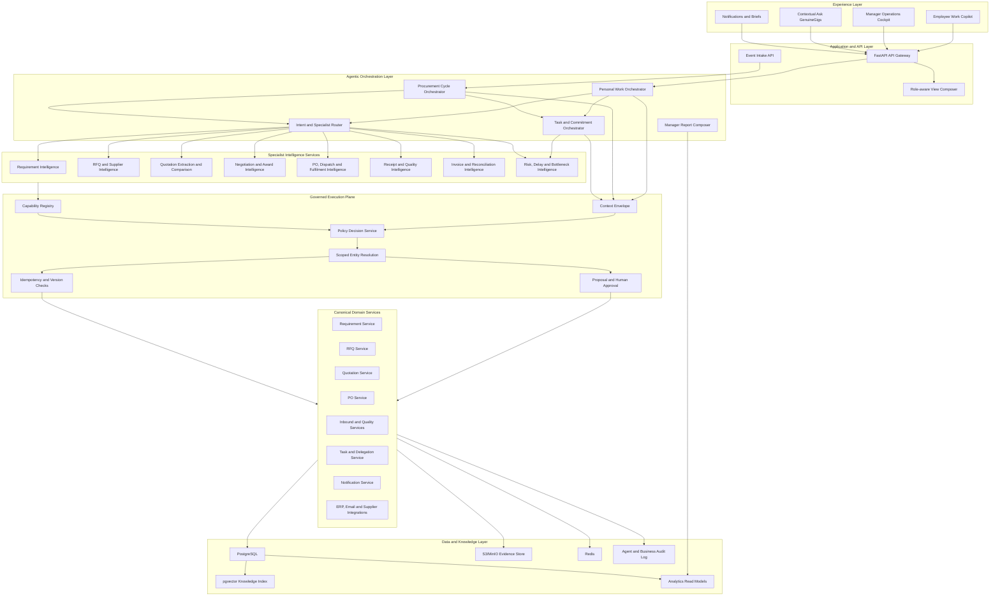
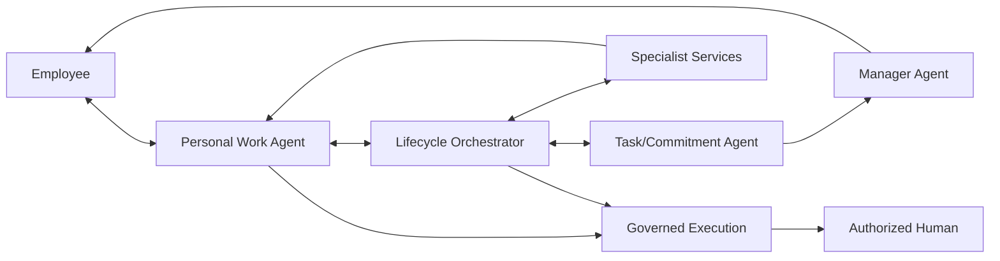

# GenuineGigs Agentic Procurement Operating System
## Detailed Target Architecture and Implementation Guide

**Status:** Proposed target architecture  
**Basis:** Existing repository-grounded agent architecture plus the proposed lifecycle-intelligence and management-coordination model.

---

# 1. Executive decision

GenuineGigs should not position its agentic capability as a collection of role-specific chatbots that perform isolated form actions.

The target product should be:

> A governed procurement operating system that continuously monitors every procurement cycle, prepares the next step, coordinates employees and suppliers, detects exceptions, and presents each employee only the work, decisions, and approvals that require their attention.

The current governance architecture should be retained:

- workspace membership remains the identity and authorization boundary;
- role-specific capability filtering remains;
- canonical business services remain the only mutation authority;
- consequential actions remain proposal- and approval-based;
- private agent conversations remain private;
- tasks and delegations remain durable coordination objects;
- receipts and audit events remain proof of execution.

The main architectural addition is a proactive orchestration layer above the existing governed execution plane.

---

# 2. Product mental model

```text
Procurement cycle = long-lived business objective
Task = accountable unit of employee work
Commitment = promised completion or response
Dependency = reason work cannot proceed
Event = fact that may change the next action
Recommendation = evidence-backed suggested decision
Proposal = controlled request for a consequential action
Receipt = proof that the action succeeded
Agent = interpreter, coordinator, analyst, and narrator
Human = authority for material business and employment decisions
```

The system should operate through three modes:

1. **Observe:** understand state, deadlines, dependencies, and risk.
2. **Prepare and coordinate:** prepare work, create internal tasks, follow up, and escalate.
3. **Request authority:** present proposals for actions requiring confirmation.

---

# 3. High-level architecture



---

# 4. The six core layers

## Layer 1: Experience layer

This is what employees and managers interact with.

The product should not begin with an empty chat box. It should begin with already-prepared operational context.

### Employee experience

The employee receives:

- morning work plan;
- prioritized tasks;
- prepared work packages;
- blockers and dependencies;
- decisions waiting for them;
- items they are watching;
- deadlines and commitments;
- end-of-day wrap-up;
- contextual chat attached to a task, record, or decision.

### Manager experience

The manager receives:

- team exception summary;
- procurement cycles at risk;
- overdue commitments;
- current bottlenecks;
- workload distribution;
- delegation recommendations;
- decisions requiring managerial authority;
- factual operational reports;
- role-specific KPI trends;
- evidence and attribution for delays.

### Design rule

Chat is a secondary interaction method. The primary interface is a role-aware workbench.

---

## Layer 2: Personal Work Orchestrator

Each active membership has a logical Personal Work Orchestrator.

It is not a separate permanently running LLM process. It is a server-side service that composes the employee’s work state from:

- assigned tasks;
- procurement-cycle objectives;
- proposals awaiting the employee;
- dependencies;
- commitments;
- notifications;
- deadlines;
- recent events;
- role and plant;
- current workload;
- work already prepared by specialist services.

### Responsibilities

- rank today’s work;
- explain why an item matters;
- identify the next useful action;
- group related tasks by procurement cycle;
- show waiting versus actionable work;
- invoke a specialist when the employee asks a question;
- create a grounded daily brief;
- prepare end-of-day status;
- never grant authority beyond the membership.

### Recommended output object

```json
{
  "membership_id": "mem_123",
  "generated_at": "2026-08-05T08:00:00+05:30",
  "priority_items": [],
  "prepared_items": [],
  "decisions": [],
  "waiting_items": [],
  "risks": [],
  "commitments": [],
  "suggested_focus_order": [],
  "explanations": []
}
```

This should be generated primarily from deterministic data and optionally phrased by an LLM.

---

## Layer 3: Procurement Cycle Orchestrator

This is the most important new backend component.

A procurement cycle must become a durable objective, not merely an informal sequence of pages and tasks.

### New entity: `ProcurementCycleObjective`

Suggested fields:

```text
id
tenant_id
plant_id
requirement_id
material_id
requested_quantity
need_by_date
budget
priority
current_stage
current_owner_role
status
success_conditions
constraints
autonomy_policy_id
risk_level
risk_reasons
next_evaluation_at
last_evaluated_at
version
created_at
closed_at
```

### Related entities

#### `CycleStageState`

Tracks the status of each major lifecycle stage.

```text
requirement
specification
rfq_preparation
rfq_published
supplier_response
quotation_review
comparison
approval
negotiation
po
dispatch
gate
receipt
inspection
invoice
closure
```

#### `CycleDependency`

```text
upstream_object_type
upstream_object_id
downstream_task_id
dependency_type
owner_membership_id
status
created_at
resolved_at
impact_minutes
```

#### `CycleRisk`

```text
risk_type
severity
probability
business_impact
evidence
detected_by
detected_at
resolution_status
```

### Responsibilities

The orchestrator evaluates each active cycle when:

- a business event occurs;
- a task changes state;
- a document finishes processing;
- a commitment is missed;
- a scheduled evaluation becomes due;
- a human changes priority, deadline, or constraint.

It determines:

1. What stage is the cycle in?
2. What is required to advance?
3. Is the required work already assigned?
4. Is any dependency blocking progress?
5. Is the need-by date or production continuity at risk?
6. Can the system prepare the next work package?
7. Is a human decision required?
8. Should a reminder, task, escalation, or proposal be created?

### Important boundary

The cycle orchestrator does not itself bypass role authorization. It may create recommendations or internal coordination actions allowed by policy, but business effects still go through the governed execution plane.

---

## Layer 4: Task and Commitment Orchestrator

The existing Task model should remain the coordination primitive, but it should be expanded.

### Task additions

```text
planned_start_at
planned_due_at
actual_started_at
actual_completed_at
accepted_at
estimated_effort_minutes
complexity_class
business_impact
production_impact
last_meaningful_activity_at
commitment_at
revised_commitment_at
commitment_revision_reason
blocked_at
blocker_owner_membership_id
blocker_type
blocker_resolved_at
rework_count
quality_result
```

### New entity: `Commitment`

A commitment is different from a task deadline.

```text
id
task_id
membership_id
commitment_type
promised_at
promised_completion_at
status
met_at
revised_at
revision_reason
created_source
```

Examples:

- “I will submit the comparison by 4 PM.”
- “Supplier will dispatch by August 8.”
- “Quality will complete inspection tomorrow morning.”

### Responsibilities

- create formal assignments;
- capture acceptance;
- capture employee commitments;
- detect missed commitments;
- follow up using configurable timing rules;
- record blockers;
- identify the actual blocker owner;
- notify downstream owners when dependencies resolve;
- escalate based on business impact;
- avoid duplicate active tasks;
- never spam users with repeated generic reminders.

### Follow-up policy example

```yaml
task_type: quotation_review
rules:
  - when: not_accepted_after
    duration: 2h
    action: remind_assignee
  - when: deadline_within
    duration: 4h
    condition: no_recent_activity
    action: ask_for_status
  - when: commitment_missed
    duration: 30m
    action: request_blocker_or_revision
  - when: overdue
    duration: 4h
    condition: production_impact_high
    action: escalate_to_direct_manager
```

---

## Layer 5: Specialist Intelligence Services

Do not implement every capability as an independent open-ended agent.

Use a hybrid of deterministic services, extraction models, rules, LLM reasoning, and optimization.

### A. Requirement Intelligence

Functions:

- validate completeness;
- retrieve similar historical requirements;
- suggest approved material master;
- detect ambiguous specifications;
- estimate realistic procurement timeline;
- identify required certificates and quality conditions;
- prepare a structured requirement packet.

### B. RFQ and Supplier Intelligence

Functions:

- identify eligible approved suppliers;
- check compliance and certificate validity;
- calculate supplier coverage;
- recommend deadline;
- draft RFQ content;
- prepare supplier communication;
- monitor response status;
- prepare reminders;
- recommend backup suppliers.

### C. Quotation Intelligence

Functions:

- parse PDF, email, spreadsheet, and scanned quotation evidence;
- extract price, currency, tax, freight, lead time, payment terms, validity, specification, and exclusions;
- assign field confidence;
- request human verification only for uncertain fields;
- normalize units and currencies;
- calculate landed cost deterministically;
- detect commercial and technical deviations;
- prepare comparison tables.

### D. Negotiation and Award Intelligence

Functions:

- benchmark against prior purchases;
- identify negotiation levers;
- compare price, delivery, quality, compliance, and concentration risk;
- generate scenario alternatives;
- prepare split-award options;
- explain trade-offs;
- never make the final award autonomously unless an explicit future policy permits a narrow low-risk use case.

### E. Fulfilment Intelligence

Functions:

- monitor acknowledgement, dispatch, ASN, gate, receipt, and delivery commitments;
- predict need-by-date risk;
- detect dispatch slippage;
- compare inventory coverage with expected arrival;
- prepare supplier escalation;
- identify alternate supply options.

### F. Quality and Inbound Intelligence

Functions:

- prepare receipt and inspection packets;
- surface specification and PO terms;
- compare received quantity and documentation;
- summarize inspection results;
- detect recurring supplier defects;
- prepare return or replacement proposal.

### G. Invoice and Reconciliation Intelligence

Functions:

- match invoice, PO, receipt, tax, freight, and quantity;
- identify mismatch type;
- quantify discrepancy;
- prepare finance handoff;
- suggest the responsible owner.

### H. Risk and Bottleneck Intelligence

Functions:

- detect idle waiting;
- determine blocker attribution;
- rank risks by production and financial impact;
- detect repeated process bottlenecks;
- identify overload;
- create manager-readable explanations.

---

## Layer 6: Governed Execution Plane

This layer already exists conceptually in the current repository and should be strengthened rather than replaced.

The execution sequence remains:

```text
Intent or lifecycle recommendation
→ membership context
→ entity scope resolution
→ capability and policy decision
→ required-field validation
→ record-version and idempotency check
→ safe adapter
→ canonical domain service
→ proposal if authority is required
→ receipt and audit
```

### Policy dimensions

Policies should evaluate:

- tenant;
- plant;
- role;
- membership;
- reporting hierarchy;
- capability;
- target entity;
- spend;
- supplier class;
- material class;
- production impact;
- risk class;
- autonomy tier;
- current workflow stage;
- approval threshold;
- time and shift;
- whether the action is reversible;
- whether external communication is involved.

### Autonomy tiers

```text
Tier 0: Observe
Tier 1: Prepare
Tier 2: Coordinate internally
Tier 3: Execute pre-approved low-risk actions
Tier 4: Human-confirmed consequential actions
```

---

# 5. Agent topology

The product should not expose a confusing collection of agents to users.

Internally, use this topology:



### Personal Work Agent

A user-facing composition layer. It presents tasks and explanations and handles contextual conversation.

### Lifecycle Orchestrator

A long-lived state machine attached to a procurement cycle. It reacts to events and determines next work.

### Task/Commitment Agent

A coordination service that delegates, follows up, detects missed commitments, and escalates.

### Specialist Services

Task-specific intelligence components. Most should not have broad authority or persistent personalities.

### Manager Agent

A summarization and operational-analysis layer. It explains team flow and exceptions but does not make employment decisions.

---

# 6. How one procurement cycle works end to end

Example: procure 2,000 kg of a production material.

## Step 1: Requirement creation

The employee can still use a form or natural language.

Backend:

1. Requirement service creates the canonical requirement.
2. Cycle service creates `ProcurementCycleObjective`.
3. Requirement Intelligence validates completeness.
4. Missing specification becomes a dependency and task.
5. The cycle stage becomes `requirement_ready` only after required facts exist.

User experience:

- requirement saved;
- missing information clearly shown;
- next step already prepared;
- responsible person visible;
- estimated effect on need-by date visible.

## Step 2: RFQ preparation

Backend:

1. RFQ Intelligence retrieves approved suppliers.
2. It checks compliance and past performance.
3. It drafts RFQ content and deadline.
4. It creates a prepared work item for the Purchase Executive.
5. If publication requires authority, it creates a proposal.

User sees:

- “RFQ prepared for review”;
- invited supplier recommendations;
- exclusions and risks;
- missing certificate or specification warnings;
- publish action.

## Step 3: Supplier response monitoring

Backend:

1. Supplier events update response state.
2. A scheduled evaluation checks coverage.
3. The orchestrator detects non-response and deadline risk.
4. Reminder drafts are created.
5. Policy decides whether reminders may be sent automatically or require confirmation.

User sees:

- response progress;
- suppliers not responding;
- prepared reminders;
- backup supplier recommendation;
- no need to manually inspect each RFQ.

## Step 4: Quotation processing

Backend:

1. Documents enter evidence processing.
2. Extraction produces typed fields and confidence values.
3. Deterministic normalization calculates comparable values.
4. Low-confidence fields create a short verification task.
5. Comparison is generated after sufficient verified evidence exists.

User sees:

- “3 quotations processed”;
- “4 fields need review”;
- direct evidence beside each field;
- comparison ready after verification.

## Step 5: Decision preparation

Backend:

1. Award Intelligence computes commercial scenarios.
2. Risk Intelligence adds supplier quality, delivery, and concentration context.
3. The LLM produces a grounded explanation.
4. The Purchase Manager receives a decision card.
5. Final award remains a human decision.

User sees:

- recommended option;
- alternatives;
- price and delivery trade-offs;
- evidence;
- approve, edit, reject, or ask questions.

## Step 6: PO and fulfilment

Backend:

1. Approved award creates PO proposal.
2. Confirmation invokes canonical PO service.
3. Commitments are recorded.
4. Dispatch and inventory risk are monitored.
5. Missed supplier commitments produce escalation options.

User sees:

- current commitment;
- production coverage;
- delay impact;
- prepared supplier escalation;
- alternate sourcing scenario where needed.

## Step 7: Receipt, quality, invoice, closure

Backend:

1. ASN, gate, receipt, and inspection events advance the cycle.
2. Discrepancies become exceptions with owners.
3. Repeated defects update supplier memory.
4. Invoice matching checks PO and receipt.
5. Cycle closes only when success conditions are satisfied or formally waived.

User sees:

- one cycle timeline;
- owner and status of every exception;
- evidence;
- no need to navigate disconnected pages to understand overall state.

---

# 7. Employee-facing interface

## A. My Day

Sections:

1. **Decisions required**
2. **Prepared for you**
3. **Do now**
4. **Waiting on others**
5. **Watching**
6. **At risk**
7. **Completed today**

Each card should answer:

- What is this?
- Why is it important?
- What is the deadline?
- What is already prepared?
- Who owns the next action?
- What happens after I act?
- What evidence supports the recommendation?

## B. Procurement Cycle View

Show:

- high-level stage timeline;
- current stage;
- next required milestone;
- owner;
- dependencies;
- risk level;
- need-by-date confidence;
- tasks;
- supplier response progress;
- decisions and proposals;
- evidence and documents;
- activity timeline.

## C. Contextual conversation

The chat should open attached to:

- a task;
- a procurement cycle;
- a quotation;
- a comparison;
- a supplier;
- a proposal.

Useful questions:

- Why is this the highest priority?
- Why is Supplier B recommended?
- What is blocking this cycle?
- What happens if delivery slips by two days?
- Prepare another scenario.
- Show the source for this value.
- Ask the responsible person for clarification.

## D. Morning brief

Delivered in-app and optionally through configured channels.

It should include:

- today’s top priorities;
- carry-forward work;
- deadlines;
- commitments;
- dependencies;
- prepared actions;
- risks requiring early action.

## E. End-of-day wrap-up

The employee confirms:

- work completed;
- work still active;
- blockers;
- revised commitments;
- help needed;
- tomorrow’s carry-forward.

The employee can correct system attribution before the manager report is finalized.

---

# 8. Manager-facing interface

## A. Operations Control Tower

Show:

- active procurement cycles;
- healthy, waiting, at-risk, and overdue counts;
- cycles threatening production;
- unassigned or unaccepted work;
- dependencies by department;
- pending managerial decisions;
- team workload.

## B. Exception Queue

Each exception should include:

- impact;
- current owner;
- blocker owner;
- age;
- evidence;
- what the system has already done;
- recommended intervention;
- expected outcome.

## C. Delegation Console

The manager can:

- accept suggested assignee;
- inspect workload;
- assign;
- change priority;
- set due date;
- provide outcome and constraints;
- track acceptance and commitment;
- avoid viewing private employee chats.

## D. Team Operations Report

Use deterministic metrics and grounded narrative.

Sections:

- completed work;
- commitments met and missed;
- blockers;
- workload;
- cycle-time changes;
- rework;
- risks detected early;
- manager decisions causing waiting;
- supplier-caused waiting;
- employee contribution highlights;
- areas requiring coaching or support.

Do not create an automatic HR performance verdict.

---

# 9. Analytics and KPI architecture

Create read-optimized analytics tables or materialized views.

Suggested facts:

```text
fact_task_transition
fact_task_commitment
fact_cycle_stage_duration
fact_dependency_wait
fact_proposal_decision
fact_document_correction
fact_supplier_response
fact_quotation_review
fact_rework
fact_escalation
fact_manager_approval_wait
```

Suggested dimensions:

```text
dim_membership
dim_role
dim_plant
dim_material
dim_supplier
dim_task_type
dim_cycle
dim_date
dim_risk_type
```

### Attribution model

Every delay should be broken into:

- employee-controlled active time;
- waiting on internal dependency;
- waiting on manager approval;
- waiting on supplier;
- system processing;
- unassigned time;
- blocked time;
- non-working calendar time.

Do not derive performance conclusions from total calendar duration alone.

### Report generation

1. SQL computes metrics.
2. A typed report payload is created.
3. The LLM summarizes only that payload.
4. Evidence links are attached.
5. Employee corrections and manager notes are stored.
6. The report is versioned and auditable.

---

# 10. Event-driven backend

The target system should be event-driven.

## Event examples

```text
requirement.created
requirement.specification_missing
task.assigned
task.accepted
task.blocked
task.commitment_created
task.commitment_missed
rfq.published
rfq.supplier_responded
quotation.document_processed
quotation.field_verified
comparison.ready
proposal.confirmed
po.issued
supplier.dispatch_missed
receipt.recorded
inspection.failed
invoice.mismatch_detected
cycle.risk_changed
```

## Event envelope

```json
{
  "event_id": "evt_...",
  "event_type": "task.commitment_missed",
  "tenant_id": "tenant_...",
  "plant_id": "plant_...",
  "aggregate_type": "task",
  "aggregate_id": "task_...",
  "aggregate_version": 14,
  "occurred_at": "2026-08-05T10:30:00Z",
  "correlation_id": "corr_...",
  "causation_id": "evt_...",
  "actor_type": "user|agent|system|integration",
  "actor_id": "mem_...",
  "payload": {}
}
```

Use an outbox pattern so business mutations and emitted events remain transactionally consistent.

---

# 11. Technology stack

## Keep

### FastAPI and Pydantic

Continue using:

- FastAPI for authenticated APIs;
- Pydantic for typed intents, events, proposals, reports, and graph state.

### PostgreSQL

Use PostgreSQL for:

- business entities;
- tasks and commitments;
- cycle objectives;
- proposals;
- audit;
- reporting hierarchy;
- event outbox;
- analytics materialized views.

### Redis

Use Redis for:

- short-lived caches;
- rate limits;
- distributed locks where required;
- Celery broker during the initial phase;
- notification deduplication.

### S3-compatible storage

Continue using MinIO locally and an S3-compatible service in production for documents and evidence.

### LangGraph

Keep LangGraph for:

- bounded reasoning loops;
- specialist routing;
- human-in-the-loop preparation flows;
- contextual question answering;
- stateful short/medium agent sessions;
- interrupt points where a human must supply information.

Do not use LangGraph as the sole durable engine for every multi-day procurement lifecycle.

### Celery

Keep Celery initially for:

- document processing;
- email and integration dispatch;
- scheduled sweeps;
- report generation;
- low-complexity background jobs.

---

# 12. Recommended new technologies

## A. Temporal — recommended for long-lived lifecycle orchestration

Use Temporal when procurement cycles must survive:

- service restarts;
- days or weeks of waiting;
- repeated timers;
- human approvals;
- supplier callbacks;
- retries;
- external integration failures;
- cancellation;
- compensation.

Suggested division:

```text
Temporal:
long-lived procurement cycle, timers, retries, signals, commitments

LangGraph:
bounded reasoning, specialist selection, evidence synthesis, human-facing explanation
```

Do not rewrite everything immediately. Start with one Temporal workflow for `ProcurementCycleObjective` and keep existing FastAPI/Celery services around it.

### Example workflow structure

```text
ProcurementCycleWorkflow
  wait for requirement readiness
  prepare RFQ package
  wait for publish confirmation
  monitor supplier responses
  trigger reminders
  wait for sufficient quotations
  process comparison
  wait for award decision
  monitor PO and fulfilment
  wait for receipt and inspection
  reconcile invoice
  close cycle
```

Each business operation should be a Temporal Activity invoking a canonical service. Human actions and external events become workflow Signals.

## B. Open Policy Agent — recommended for policy-as-code

Your current registry and server checks should remain, but OPA can centralize dynamic policy decisions such as:

- whether a reminder may be sent automatically;
- whether an internal task may be assigned automatically;
- whether a supplier communication requires confirmation;
- whether a spend threshold requires another approval;
- which fields or records may be exposed;
- autonomy level by tenant, plant, role, category, and risk.

OPA should return a decision, not perform the action.

Example input:

```json
{
  "actor": {
    "membership_id": "mem_123",
    "role": "purchase_manager",
    "plant_id": "plant_a"
  },
  "action": "send_supplier_reminder",
  "resource": {
    "rfq_id": "rfq_291",
    "risk_class": "low",
    "supplier_class": "approved"
  },
  "context": {
    "autonomy_tier": 3,
    "deadline_hours": 20
  }
}
```

Example output:

```json
{
  "allow": true,
  "requires_confirmation": false,
  "obligations": ["record_audit", "use_approved_template"]
}
```

## C. Event streaming — optional, not immediately mandatory

For an early-stage product, PostgreSQL outbox plus Celery is sufficient.

Add Kafka or Redpanda only when:

- event volume becomes high;
- many independent consumers need the same events;
- you need replayable event streams;
- integrations become numerous;
- real-time analytics requires it.

Redpanda is operationally simpler than a traditional Kafka deployment, but introducing it too early adds complexity.

## D. Workflow analytics

Use one of:

- PostgreSQL materialized views for early versions;
- ClickHouse when event and analytics volume becomes high;
- dbt for tested transformations and KPI definitions.

Recommended progression:

```text
Phase 1: PostgreSQL views/materialized views
Phase 2: dbt-managed models
Phase 3: ClickHouse if scale and dashboard latency justify it
```

## E. Observability

Add:

- OpenTelemetry for traces, metrics, and correlation propagation;
- LangSmith or an equivalent LLM tracing platform for prompt/tool evaluation;
- Prometheus and Grafana for service and workflow metrics;
- Sentry for application errors;
- structured logs with tenant-safe redaction.

Every run should trace:

```text
user interaction
→ context construction
→ retrieval
→ model decision
→ capability policy decision
→ adapter
→ domain service
→ proposal/receipt
→ UI response
```

## F. Retrieval and knowledge

Continue using PostgreSQL plus pgvector for early and medium scale.

Implement:

- metadata filtering before retrieval;
- role and plant ACL filtering;
- keyword plus vector hybrid retrieval;
- evidence citations;
- document versioning;
- approved/retired knowledge status;
- field-level provenance.

Do not use vector similarity to authorize data.

## G. Document intelligence

Use a layered pipeline:

1. native text extraction where possible;
2. spreadsheet parser for Excel;
3. PDF layout parser;
4. OCR only for scans;
5. schema-constrained LLM extraction;
6. deterministic validation;
7. confidence scoring;
8. human verification for uncertain fields.

Suitable technologies include:

- PyMuPDF or pdfplumber for native PDF extraction;
- openpyxl for spreadsheets;
- Tesseract or a managed OCR service for scans;
- Pydantic structured outputs;
- document-specific extraction prompts;
- table/layout models when necessary.

## H. Optimization tools

For award scenarios, scheduling, or workload balancing, use deterministic optimization rather than asking an LLM to calculate.

Possible tools:

- Google OR-Tools;
- scipy.optimize;
- PuLP;
- custom weighted scoring.

The LLM explains the result but does not replace the optimizer.

---

# 13. Suggested service decomposition

```text
apps/api/app/
  agents/
    personal_work_service.py
    lifecycle_router.py
    specialist_runtime.py
    response_composer.py

  cycles/
    models.py
    schemas.py
    service.py
    evaluator.py
    risk_engine.py
    event_handlers.py

  commitments/
    models.py
    service.py
    followup_policy.py
    escalation.py

  policies/
    opa_client.py
    policy_input.py
    obligations.py

  analytics/
    kpi_service.py
    attribution.py
    report_payloads.py
    report_composer.py

  events/
    outbox.py
    dispatcher.py
    schemas.py
    consumers.py

  workflows/
    temporal/
      procurement_cycle.py
      activities.py
      signals.py

  intelligence/
    requirements.py
    suppliers.py
    quotations.py
    comparisons.py
    fulfilment.py
    quality.py
    invoices.py
```

Do not split into independent microservices immediately. Start as a modular monolith with clear boundaries. Extract services only after workload or team structure demands it.

---

# 14. Core data additions

Minimum recommended new tables:

```text
procurement_cycle_objectives
cycle_stage_states
cycle_dependencies
cycle_risks
commitments
autonomy_policies
policy_decision_logs
agent_prepared_work_items
operational_reports
operational_report_corrections
event_outbox
```

### `agent_prepared_work_items`

Stores work the system has prepared.

```text
id
tenant_id
plant_id
membership_id
cycle_id
task_id
type
title
summary
payload
evidence
risk
status
expires_at
created_by_run_id
version
```

Examples:

- prepared RFQ;
- prepared supplier reminder;
- prepared comparison;
- prepared PO;
- prepared escalation;
- prepared inspection disposition.

This table allows the UI to show tangible agent output even when the user never opens chat.

---

# 15. API additions

Suggested endpoints:

```text
GET  /workbench/my-day
GET  /workbench/prepared
GET  /workbench/decisions
GET  /workbench/watching
GET  /workbench/risks

GET  /cycles
GET  /cycles/{id}
GET  /cycles/{id}/timeline
GET  /cycles/{id}/risks
GET  /cycles/{id}/next-actions
POST /cycles/{id}/re-evaluate

POST /tasks/{id}/accept
POST /tasks/{id}/commit
POST /tasks/{id}/report-blocker
POST /tasks/{id}/revise-commitment

GET  /manager/operations
GET  /manager/exceptions
GET  /manager/workload
GET  /manager/reports/weekly
POST /manager/reports/{id}/review

GET  /admin/autonomy-policies
PUT  /admin/autonomy-policies/{id}
```

All endpoints must apply selected membership and tenant/plant scope server-side.

---

# 16. Model strategy

Do not use one expensive model for everything.

## Fast model

Use for:

- intent classification;
- card phrasing;
- simple summaries;
- reminder drafting;
- low-risk extraction repair.

## Strong reasoning model

Use for:

- multi-quotation trade-off explanation;
- exception recovery alternatives;
- ambiguous document interpretation;
- manager report synthesis;
- scenario analysis.

## Non-LLM

Use for:

- authorization;
- KPI calculation;
- landed cost;
- date arithmetic;
- deadlines;
- task status;
- workflow transitions;
- idempotency;
- supplier score calculation;
- workload counts;
- financial totals.

## Model gateway

Create a provider abstraction with:

- per-task model selection;
- tenant model policy;
- token and cost budget;
- fallback;
- timeout;
- structured output validation;
- prompt version;
- evaluation version;
- safe logging.

---

# 17. Reliability and safety rules

1. Every business mutation uses a canonical service.
2. Every external effect is idempotent.
3. Every long-lived workflow can resume after failure.
4. Every model output is schema-validated.
5. Every record ID is re-authorized.
6. Every recommendation includes evidence and confidence.
7. Every performance metric is deterministic.
8. Every employee can see and correct relevant operational context.
9. Managers cannot see private employee chats.
10. No automatic promotion, compensation, disciplinary, or termination decision.
11. Every policy decision is logged.
12. Ordinary manual workflows remain available.
13. High-impact actions require explicit confirmation.
14. Notifications are deduplicated and rate-limited.
15. Blocker attribution is separated from task ownership.

---

# 18. Evaluation framework

## Agent quality

- capability-selection accuracy;
- field extraction accuracy;
- grounded citation rate;
- unsupported-claim rate;
- proposal acceptance rate;
- proposal edit rate;
- clarification rate;
- wrong-role denial rate;
- cross-tenant isolation tests.

## Operational value

- requirement-to-RFQ time;
- RFQ-to-comparison time;
- comparison-to-award time;
- manual follow-ups per cycle;
- time spent waiting without an owner;
- percentage of work prepared by the system;
- percentage of cycles advancing without manual chasing;
- number of production risks detected early;
- employee time saved;
- manager coordination time saved.

## Trust

- employee correction rate;
- report dispute rate;
- manager explanation usefulness;
- notification dismissal rate;
- evidence-view usage;
- autonomy-policy override rate.

### North-star metric

> Percentage of active procurement cycles that reach the next required human decision without manual preparation or status chasing.

---

# 19. Implementation roadmap

## Phase 0: Foundation audit

- verify current capability registry;
- map every procurement state transition;
- audit task and delegation data quality;
- define event taxonomy;
- define KPI terminology;
- identify missing timestamps and ownership fields.

## Phase 1: Agentic Workbench

Build:

- My Day API and UI;
- Decisions, Prepared, Waiting, Watching, Risk sections;
- procurement-cycle timeline;
- contextual chat;
- end-of-day wrap-up;
- evidence links.

No major autonomy is required yet.

## Phase 2: Procurement Cycle Objective

Build:

- objective and stage models;
- event outbox;
- cycle evaluator;
- dependencies and risks;
- next-action generation;
- lifecycle dashboard.

Start with requirement through RFQ and quotation comparison.

## Phase 3: Commitment and Follow-up Engine

Build:

- task acceptance;
- commitments;
- blocker attribution;
- reminder policies;
- escalation;
- manager exception queue;
- workload view.

## Phase 4: Quotation Intelligence

Build:

- robust document pipeline;
- typed extraction;
- confidence review;
- normalization;
- landed-cost comparison;
- deviation detection;
- recommendation cards.

This is likely the highest immediate ROI feature.

## Phase 5: Manager Operations Reports

Build:

- deterministic fact tables;
- delay attribution;
- weekly team operations report;
- employee correction workflow;
- manager annotation;
- role-specific KPIs.

Do not add a single opaque employee score.

## Phase 6: Temporal and OPA

Introduce:

- Temporal for long-lived cycles;
- OPA for configurable autonomy;
- Signals for human and supplier events;
- policy decision logs;
- controlled automatic internal coordination.

## Phase 7: Policy-bound execution

Add carefully:

- automatic low-risk internal assignments;
- automatic reminders;
- repeat-buy automation;
- approved supplier communications;
- configurable thresholds;
- full rollback and audit controls.

---

# 20. First practical release scope

For the first strong commercial release, implement:

1. My Day employee workbench.
2. Manager exception cockpit.
3. Procurement cycle objective and timeline.
4. Task acceptance, commitment, and blocker handling.
5. Supplier response monitoring.
6. Quotation extraction and comparison preparation.
7. Prepared work items.
8. Factual weekly operations report.
9. Contextual agent chat.
10. Existing governed proposal flow.

Do not initially implement:

- autonomous supplier award;
- autonomous PO issuance;
- generic multi-agent conversations;
- automatic employee ratings;
- full Kafka infrastructure;
- dozens of microservices;
- continuous LLM polling.

---

# 21. Final target behavior

A successful GenuineGigs deployment should behave like this:

```text
At the start of the day:
Employees receive a prioritized, prepared work plan.

During the day:
The system watches procurement events, dependencies, and commitments.
It prepares work and follows up using policy-controlled rules.

When a decision is needed:
The responsible employee receives evidence, options, and expected impact.

When a cycle is at risk:
The correct owner and manager are informed before production is affected.

At the end of the day:
Employees confirm work, blockers, and revised commitments.

At the end of the week:
Managers receive an evidence-backed operational report showing flow,
bottlenecks, workload, contribution, and intervention needs.

Throughout:
Authority remains role-bound, private chats remain private, business
mutations remain deterministic, and every effect remains auditable.
```

That is the recommended agentic pipeline for GenuineGigs.
