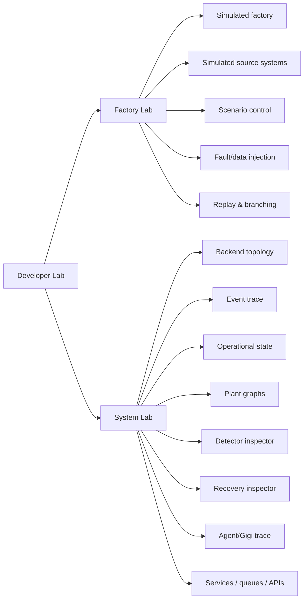
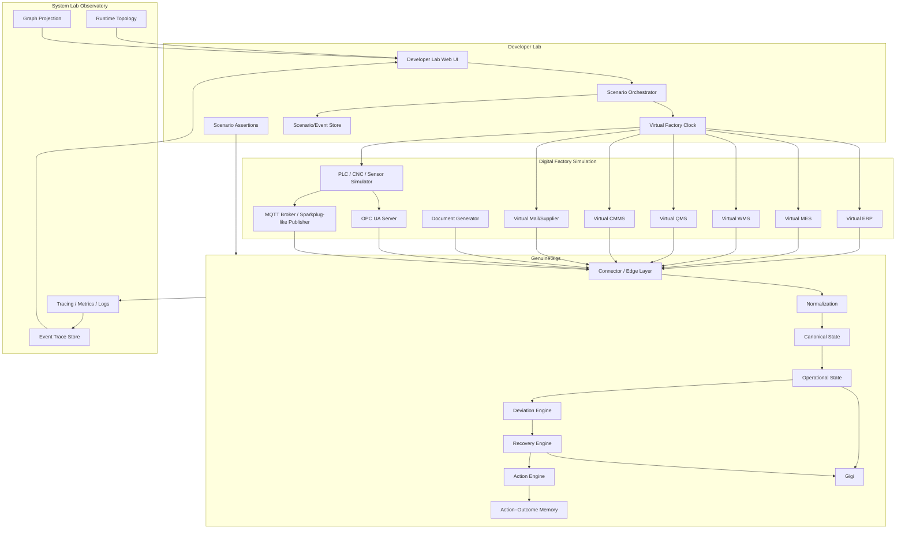
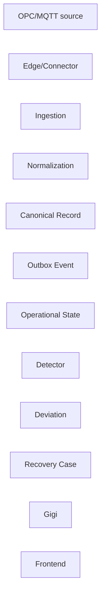
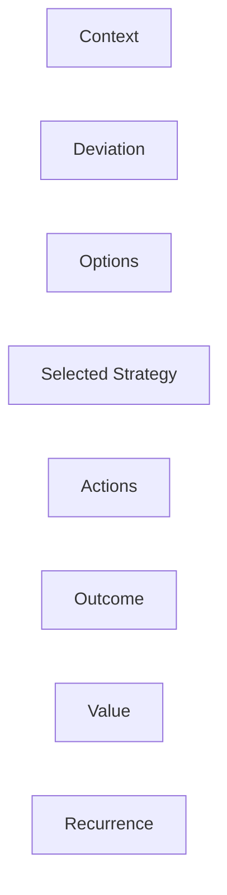
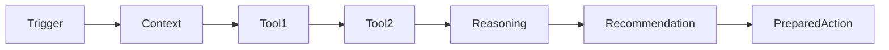
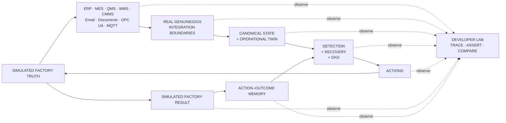

# GenuineGigs Developer Lab — Factory Simulation & Backend Observatory

> **Document purpose**
>
> This document defines the implementation plan for a dedicated **Developer Lab** inside GenuineGigs.
>
> Developer Lab has two equally important responsibilities:
>
> 1. **Factory Lab** — simulate a real manufacturing company and all of the systems/data streams GenuineGigs will eventually connect to.
> 2. **System Lab** — expose and visualize the internal GenuineGigs backend while the simulated factory is running, so the founder/developer can understand exactly how data moves, what the platform inferred, which services ran, why a deviation/recovery strategy was created, and what the system learned.
>
> The objective is not to create a fake dashboard demo.
>
> The objective is to create a **repeatable industrial test environment** where GenuineGigs can be tested almost as if it were deployed inside a real plant before real customer data is available.
>
> The lab must answer:
>
> > If a real factory behaved this way, would GenuineGigs ingest the correct raw information, maintain the correct plant state, detect the right problem, quantify its impact, recommend an appropriate recovery, coordinate actions, verify the outcome, and learn from the result?
>
> Developer Lab is **development/test infrastructure**. It must remain isolated from real customer production environments.

---

# 1. Current Situation

The current V2 implementation already has a useful starting point:

- separate `factory-simulator` service,
- simulated MES/production records,
- downtime,
- WMS/inventory,
- supplier commitments,
- QMS/quality,
- SCADA-like machine events,
- CMMS/maintenance,
- ERP/email/logistics-style business events,
- controllable simulation clock,
- 1× / 10× / 60× time speed,
- per-domain event buffers and cursors,
- HTTP connector integration,
- canonical normalization,
- PostgreSQL operational state,
- deviations/actions/value/Gigi,
- transactional outbox,
- SSE frontend refresh,
- existing Developer Lab topology/observability concepts.

However, the current simulator is insufficient as the long-term testing environment because:

1. its “streaming” path is primarily 2-second HTTP polling;
2. source systems are not sufficiently distinct in protocol/behavior;
3. some scenarios emit downstream facts too directly instead of forcing GenuineGigs to infer them;
4. scenarios are not sufficiently branchable based on GenuineGigs/user recovery actions;
5. realistic data-quality and network failures are limited;
6. real source-system timing differences are not modeled deeply;
7. email/document/supplier interactions are not first-class scenario actors;
8. backend visibility does not yet let the founder inspect the entire reasoning/event path deeply enough;
9. the Plant Causal-Action relationships, operational state, recovery memory and agent activity need better live visualization;
10. there is not yet a formal scenario assertion engine saying what GenuineGigs **should** have detected/learned.

The new Developer Lab must fix these problems without unnecessarily replacing the existing V2 architecture.

---

# 2. Developer Lab Product Model

Developer Lab consists of two major surfaces.



The two sides must be synchronized.

Selecting a scenario event in Factory Lab should allow the user to click:

> **Trace through GenuineGigs**

and immediately see the event's path through the backend.

Selecting a GenuineGigs deviation should allow:

> **Show source facts**

and reveal exactly what the simulator emitted that caused the platform to infer it.

---

# 3. Core Principle — Simulate Reality, Not Expected Answers

This is the most important rule in the entire system.

## Wrong

A scenario sends:

```json
{
  "event": "create_machine_failure_deviation",
  "severity": "high",
  "recommended_action": "replace_bearing"
}
```

This tests nothing.

## Correct

The factory emits facts such as:

```text
10:04 spindle vibration = 5.8 mm/s
10:05 spindle vibration = 6.2
10:06 spindle vibration = 6.9
10:07 spindle temperature = 79.4°C
10:08 spindle vibration = 7.3
10:09 spindle temperature = 82.7°C
10:10 machine rate falls
10:11 Fault 701 occurs
10:11 machine state becomes alarm
10:12 production count stops increasing
```

Separately:

```text
CMMS has no open work order yet.
Stores has one compatible spare.
MES still expects normal production.
```

GenuineGigs must determine:

- whether an abnormal condition exists,
- whether a deviation should be created,
- production impact,
- likely context,
- recovery options.

---

# 4. Standards / Production-Interface Philosophy

The lab should imitate realistic industrial boundaries rather than invent one proprietary test API for everything.

Use the following concepts:

### ISA-95-inspired separation

Model distinct layers:

```text
Enterprise / business systems
ERP · procurement · finance

Manufacturing operations
MES · QMS · WMS · CMMS

Control / machine layer
SCADA · PLC · CNC · sensors
```

Do not merge these source systems into one simulator endpoint conceptually.

### OPC UA

Provide an OPC UA simulator for realistic industrial interoperability testing where appropriate.

### MQTT + Sparkplug-style state

Provide a stateful MQTT path for OT/IIoT testing.

The simulator should support:

- device birth/state,
- metric updates,
- disconnect/death,
- retained/state-aware behavior where useful.

### HTTP/API

Use for:

- ERP,
- MES,
- WMS,
- QMS,
- CMMS,
- logistics,
- supplier portal.

### Email

Use an actual test mail boundary rather than injecting parsed email directly into GenuineGigs.

### Files

Support:

- CSV,
- XLSX,
- PDF,
- SFTP-like/drop-folder behavior

for plants that still operate partly through spreadsheets/documents.

---

# 5. Target Developer Lab Architecture



---

# 6. Repository / Service Structure

Preserve existing service conventions where possible.

Recommended target:

```text
services/
  factory-lab/
    app/
      orchestrator/
      clock/
      plant/
      sources/
        erp/
        mes/
        wms/
        qms/
        cmms/
        email/
        documents/
        ot/
      scenarios/
      faults/
      protocols/
      assertions/
      replay/
      api/
    scenarios/
      baseline/
      production/
      machine/
      material/
      quality/
      maintenance/
      supplier/
      cross_functional/
      chaos/

  opcua-simulator/            # may remain inside factory-lab initially
  mqtt-broker/                # containerized broker

apps/
  web/
    app/developer-lab/
    components/developer-lab/

apps/
  api/
    app/developer_lab/
      router.py
      observability.py
      topology.py
      traces.py
      graph_projection.py
      scenario_bridge.py

infra/
  developer-lab/
    docker-compose.lab.yml
    otel-collector/
```

Do not split every virtual source into a separate deployable service immediately.

Implement them as logically isolated source modules first. Split only where protocol/runtime isolation requires it.

---

# 7. Factory Lab Plant Model

The simulator requires an actual internal factory model.

It should not merely emit disconnected events.

## 7.1 Factory hierarchy

```text
Company
└── Plant
    ├── Area
    │   ├── Line
    │   │   ├── Machine
    │   │   ├── Station
    │   │   └── Buffer
    └── Warehouse / Stores
```

## 7.2 Manufacturing entities

Minimum:

```text
Product
ProductFamily
BOM
Routing
WorkOrder
Operation
Machine
Tool
Material
MaterialLot
Supplier
PurchaseOrder
SupplierCommitment
InventoryPosition
InspectionPlan
QualityCharacteristic
MaintenanceAsset
MaintenancePlan
SparePart
Employee
Role
Shift
CustomerOrder
Shipment
```

## 7.3 Physical process state

Each line/machine should have state such as:

```text
idle
setup
running
blocked
starved
changeover
fault
planned_stop
maintenance
```

---

# 8. Virtual Factory Clock

One authoritative scenario clock is mandatory.

Do not allow each simulator source to run from wall-clock independently.

## 8.1 Clock functions

```text
start
pause
resume
stop
step
jump_to
set_speed
reset
fork
```

Speeds:

```text
0.1×
1×
5×
10×
60×
300×
```

`step` should allow:

```text
+1 sec
+10 sec
+1 min
+5 min
next scheduled event
```

## 8.2 Deterministic execution

Every run has:

```text
scenario_id
scenario_version
run_id
random_seed
factory_start_time
speed
```

Given same:

```text
scenario version + seed + user choices
```

the simulator should reproduce the same base behavior.

---

# 9. Simulation Modes

Developer Lab should support four modes.

## 9.1 Baseline Mode

Healthy factory.

Purpose:

- verify no false deviations,
- test normal rates,
- test ordinary synchronization.

## 9.2 Scenario Mode

Run authored operational situations.

Examples:

- bearing degradation,
- material shortage,
- quality drift.

## 9.3 Manual Injection Mode

Founder changes individual values live.

Examples:

```text
set CNC-04 vibration to 8.2
delay supplier PO-88 by 1 day
hold material LOT-18
stop Line 2
drop QMS connection
change production plan
```

## 9.4 Chaos Mode

Automatically inject data/network/source failures.

Used for robustness tests.

---

# 10. Simulated Source Systems

Each virtual source must have its own behavior, latency and contract.

---

# 11. Virtual ERP

Responsibilities:

```text
material master
supplier master
purchase orders
customer orders
production orders
costs
inventory accounting snapshots
business transactions
```

Support at least two interface personalities.

## 11.1 Generic REST ERP

Endpoints:

```http
GET /erp/materials
GET /erp/suppliers
GET /erp/purchase-orders
GET /erp/production-orders
GET /erp/customer-orders
GET /erp/changes?cursor=
POST /erp/actions/...
```

## 11.2 SAP-like adapter fixture

Do not build SAP itself.

Expose fixtures shaped similarly enough to test the GenuineGigs SAP connector contract:

```text
external IDs
plant codes
material codes
production-order references
revision/change timestamps
```

## 11.3 Tally-like fixture

Support XML/HTTP-style purchase/accounting fixture if current connector expects it.

Purpose:

> test adapter correctness, not claim verified SAP/Tally integration.

---

# 12. Virtual MES

MES owns operational production facts.

Provide:

```text
work-order release
routing
job start
job pause
job completion
production counts
scrap count
operation completion
planned rate
changeover
line schedule
```

Endpoints/events:

```text
production.order.released
production.operation.started
production.output.recorded
production.scrap.recorded
production.rate.changed
production.operation.completed
```

MES may lag behind real machine state.

That lag should be configurable.

Example:

```text
machine stops at 10:15:01
MES downtime entry appears at 10:17:30
```

This is realistic and important.

---

# 13. Virtual WMS / Stores

Simulate:

```text
on-hand stock
reservations
bin/location
issue to production
receipt
transfer
quality hold
staging
spare inventory
```

Events:

```text
inventory.changed
material.staged
material.issued
material.received
spare.issued
```

Support errors:

```text
system says 10 units but physical stock is 7
late staging
wrong location
reservation conflict
```

---

# 14. Virtual QMS

Simulate:

```text
inspection plans
measurements
control limits
defects
rejection
quality hold
lot release
NCR
CAPA
```

Important distinction:

The simulator emits measurements.

GenuineGigs should infer abnormal quality where possible.

Example:

```text
bore size:
10.004
10.006
10.009
10.013
10.017
10.021
```

not:

```text
"quality_drift = true"
```

---

# 15. Virtual CMMS

Simulate:

```text
maintenance request
work order
technician acknowledgement
work started
spare required
repair step
work completed
preventive maintenance
```

CMMS should not automatically exist at machine fault start.

Scenario can define response delay.

Example:

```text
10:11 machine fault
10:15 supervisor creates CMMS work
10:18 technician acknowledges
```

This lets GenuineGigs determine whether it should proactively create/prepare work before the organization does.

---

# 16. Virtual Supplier / Logistics

Supplier is an actor, not just a database row.

Simulate:

```text
commitment acknowledgement
delivery date change
partial shipment
dispatch
ASN
shipment delay
supplier silence
quantity mismatch
price change
quality certificate
```

Possible channels:

```text
supplier portal API
email
ERP commitment update
logistics event
```

A scenario can intentionally create contradictory channels.

Example:

```text
ERP says delivery tomorrow.
Supplier email says two-day delay.
Portal still says tomorrow.
```

GenuineGigs must expose uncertainty rather than silently pick one.

---

# 17. Email Simulation

Email needs first-class testing because real manufacturing workflows heavily depend on it.

Create a test mail environment.

Minimum behavior:

```text
SMTP receive/send
mailbox folders
incoming supplier messages
attachments
threads
delayed replies
no reply
ambiguous language
forwarded mail
revised commitment
```

Factory Lab UI should allow:

```text
Send supplier email
Reply with delay
Reply with confirmation
Attach quote
Attach inspection certificate
Attach PDF
```

Do not insert already-parsed fields directly into GenuineGigs.

Let the email/document pipeline parse them.

---

# 18. Document Generator

Generate synthetic but realistic documents.

Types:

```text
RFQ
supplier quotation
PO
delivery note
inspection report
certificate
maintenance report
shift report
invoice
BOM spreadsheet
production plan spreadsheet
```

Controls:

```text
clean document
rotated/poor scan
missing field
conflicting amount
alternate format
different supplier layout
multi-line tables
```

Purpose:

> test extraction/provenance/confidence, not just happy-path parsing.

---

# 19. OT Simulation

There should be two OT test paths.

## 19.1 MQTT path

Use an actual local MQTT broker.

Publish:

```text
machine state
count
cycle time
alarm
temperature
vibration
pressure
energy
tool life
```

Use a Sparkplug-inspired namespace/state model where compatible with the edge design.

Test:

```text
birth
live values
disconnect
reconnect
stale device
death/offline
```

## 19.2 OPC UA path

Run a real OPC UA simulation server.

Expose hierarchy:

```text
Plant
└── Machining
    └── Line 3
        └── CNC-04
            ├── State
            ├── PartCount
            ├── CycleTime
            ├── SpindleTemperature
            ├── Vibration
            ├── AlarmCode
            └── ToolLife
```

GenuineGigs edge agent should connect as though this were a plant endpoint.

---

# 20. OT Sampling Profiles

Support realistic signal rates.

Examples:

```text
machine state           event-driven
part count              per cycle / 1–5 sec
cycle time              per cycle
temperature             1 sec
vibration RMS           1 sec
energy                  5–15 sec
high-frequency waveform local-only unless explicitly tested
```

Do not send hundreds of raw waveform samples to the cloud by default.

---

# 21. Plant Dynamics Engine

Machine and production facts must influence each other.

Example:

```text
machine running
+
cycle time = 36 sec
→ production count increments
```

If:

```text
machine down
```

then:

```text
production count stops
```

If:

```text
cycle time increases
```

then:

```text
output rate falls
```

If:

```text
quality rejection increases
```

then good output differs from gross output.

This avoids contradictory synthetic data.

---

# 22. Material Dynamics

Production consumes materials.

Example:

```text
each AX-109 consumes:
2 × RM-218
1 × RM-330
```

As units are produced:

```text
inventory decreases
```

If material becomes unavailable:

```text
line can become starved
```

unless alternate/resequencing recovery is chosen.

---

# 23. Quality Dynamics

Quality should depend on realistic variables.

Example rules:

```text
tool wear ↑
→ dimensional drift probability ↑

bad supplier lot
→ defect probability ↑

incorrect process setting
→ rejection probability ↑
```

Use probabilistic effects with seeded randomness.

Do not make every bad signal produce guaranteed rejection.

---

# 24. Maintenance Dynamics

Asset health should evolve.

Example bearing model:

```text
health_index decreases
→ vibration slowly increases
→ temperature increases
→ cycle variability rises
→ alarm
→ potential failure
```

Repair strategy changes future state.

Example:

```text
temporary reset
→ short-term recovery, high recurrence

bearing replacement
→ slower recovery, low recurrence
```

This allows GenuineGigs to learn strategy effectiveness.

---

# 25. Scenario Engine

Scenarios must be declarative, versioned and branchable.

Recommended YAML shape:

```yaml
id: cnc_bearing_degradation
version: 3
name: CNC bearing degradation and production recovery
seed: 8124

initial_state:
  plant: pune
  line: line_3
  work_order: WO-482

timeline:
  - at: "10:00"
    action: start_health_degradation
    target: CNC-04
    parameters:
      temperature_ramp: 0.2
      vibration_ramp: 0.08

  - when:
      machine.vibration_mm_s: ">=7.1"
    action: increase_cycle_variability

  - when:
      machine.health_index: "<=0.35"
    action: trigger_fault
    parameters:
      alarm_code: "701"

branches:
  repair_bearing:
    when: external_action("replace_bearing")
    effects:
      health_index: 0.98
      recurrence_probability: 0.03

  reset_only:
    when: external_action("reset_machine")
    effects:
      health_index: 0.45
      recurrence_probability: 0.70
```

---

# 26. Scenario Assertions

This is critical.

A simulator without expected outcomes only shows animation.

Each scenario should contain **test expectations**.

Assertions must be separate from source events.

Example:

```yaml
assertions:
  - within: "5m after machine fault"
    expect:
      deviation:
        category: maintenance
        severity_at_least: high

  - within: "5m after deviation"
    expect:
      recovery_case: opened

  - expect:
      recovery_strategies:
        contains:
          - repair
          - reroute

  - after: recovery_completed
    expect:
      recovery_outcome: stored
      action_outcome_memory: updated
```

The assertions belong to Developer Lab.

They must **not** be visible to the GenuineGigs runtime under test.

---

# 27. Assertion Categories

Test:

## Ingestion

```text
record received
mapping correct
deduplicated
timestamp preserved
```

## State

```text
correct line execution
correct material readiness
correct machine health
```

## Detection

```text
correct deviation
no false deviation
severity acceptable
```

## Impact

```text
lost units within tolerance
financial impact within tolerance
```

## Recovery

```text
Recovery Case opens
valid strategies generated
unsafe strategy rejected
```

## Execution

```text
correct role/action
approval required
dependency created
```

## Verification

```text
recovered only after evidence
failed strategy not marked success
```

## Learning

```text
outcome stored
future comparable case retrieves prior result
```

---

# 28. Scenario Library

Build a large library over time.

The initial lab should include at least the following.

---

# 29. Normal / No-Issue Scenarios

1. Healthy stable shift.
2. Normal small cycle variation.
3. Planned changeover.
4. Planned preventive maintenance.
5. Normal supplier delivery.
6. Normal quality variation inside limits.

Purpose:

> Measure false-positive behavior.

---

# 30. Production Scenarios

1. Gradual cycle-time slowdown.
2. Sudden rate drop.
3. Work order starts late.
4. Changeover overrun.
5. Operator break causes temporary gap.
6. Line starved.
7. Line blocked downstream.
8. Wrong production plan update.
9. Production counter reset.
10. Duplicate production counters.
11. Counter wrap/restart.
12. Work order switched mid-shift.
13. Production recovery after intervention.
14. Overtime recovery.
15. Reroute to alternate line.

---

# 31. Machine / Reliability Scenarios

1. Bearing heat ramp.
2. Vibration degradation.
3. Sudden servo alarm.
4. Intermittent microstops.
5. Pneumatic pressure loss.
6. Tool wear.
7. Motor overload.
8. Sensor stuck value.
9. Noisy sensor.
10. Sensor spike without actual fault.
11. PLC disconnect.
12. Machine network disconnect.
13. Alarm clears without repair.
14. Fault recurrence after reset.
15. Spare unavailable.
16. Technician slow acknowledgement.
17. Preventive maintenance avoids failure.
18. Maintenance performed but production does not resume.

---

# 32. Quality Scenarios

1. Gradual SPC drift.
2. Sudden defect spike.
3. Single outlier only — no systemic issue.
4. Bad supplier lot.
5. Tool wear causing dimensional drift.
6. Inspection machine miscalibration.
7. Quality hold.
8. Hold released incorrectly.
9. Rework successful.
10. Rework unsuccessful.
11. Measurement data delayed.
12. Measurement duplicated.
13. Missing quality data.
14. Conflicting QMS/manual inspection.

---

# 33. Material / Inventory Scenarios

1. Supplier commitment slips.
2. Supplier partial shipment.
3. Inventory shortage.
4. Inventory mismatch.
5. Material on quality hold.
6. Material exists but not staged.
7. Wrong reservation.
8. Alternate material available.
9. Internal plant stock transfer.
10. Receipt delayed at Gate.
11. Received material waiting inspection.
12. Material consumed faster than BOM expectation.
13. Supplier sends revised commitment by email only.
14. ERP commitment remains stale.
15. Two work orders compete for same material.

---

# 34. Procurement / Supplier Scenarios

1. RFQ responses arrive asynchronously.
2. Quote attachment malformed.
3. Supplier changes price.
4. Supplier changes lead time.
5. Supplier fails to acknowledge PO.
6. Supplier email contradicts ERP.
7. Supplier promises unrealistic date.
8. Split shipment offered.
9. Alternate supplier available.
10. Expedite cost vs production-loss tradeoff.

---

# 35. Cross-Functional Scenarios

These are the most valuable.

## Example 1

```text
machine fault
→ line falls behind
→ spare unavailable
→ procurement needed
→ supplier can deliver after 6 hours
→ reroute available
→ quality approval required
```

Test whether GenuineGigs coordinates Maintenance + Stores + Procurement + Quality + Production.

## Example 2

```text
supplier delay
→ material risk
→ production resequencing
→ alternate line
→ tool conflict
→ maintenance reschedule
```

## Example 3

```text
quality drift
→ suspect material lot
→ inventory quarantine
→ production shortage
→ supplier replacement
```

---

# 36. Human / Organizational Scenarios

1. Employee does not acknowledge task.
2. Employee acknowledges but does nothing.
3. Employee completes action late.
4. Manager does not approve.
5. Manager rejects recommendation.
6. Human selects alternative strategy.
7. Employee reports blocker.
8. Wrong employee assigned.
9. Shift handover loses unresolved issue.
10. Employee action resolves problem before escalation.

These test Gigi coordination, SLAs, hierarchy and learning.

---

# 37. Recovery-Strategy Branching

The simulator must respond differently depending on chosen recovery.

Example machine fault:

```text
repair bearing
→ 50 minute recovery
→ excellent health
→ low recurrence

reset controller
→ 8 minute recovery
→ recurrence 30 min later

reroute job
→ production resumes on alternate line
→ extra changeover
→ possible quality risk

do nothing
→ missed output grows
```

This is mandatory for testing Action–Outcome learning.

---

# 38. Data Quality / Chaos Scenarios

Real factories do not provide perfect data.

Support controlled injection of:

```text
duplicate event
out-of-order event
late event
missing event
wrong timestamp
clock skew
schema version change
unknown material code
unknown asset
invalid unit
null value
counter reset
connection timeout
partial API response
HTTP 500
rate limit
mail delay
MQTT disconnect
OPC UA server restart
stale source
backfill burst
```

---

# 39. Chaos Control Panel

Developer can choose:

```text
Network latency: 0–5000 ms
Packet/event loss: 0–20%
Duplicate probability
Out-of-order probability
Clock skew
Source downtime
API error rate
MQTT disconnect
OPC restart
ERP lag
MES lag
QMS lag
Email delivery lag
```

Chaos configuration belongs to the run record.

---

# 40. Load / Scale Profiles

Test beyond one line.

Profiles:

```text
Tiny
1 plant · 1 line · 3 machines

Pilot
1 plant · 5 lines · 30 assets

Medium
1 plant · 20 lines · 150 assets

Enterprise
5 plants · 100 lines · 1,000 assets
```

For each profile define:

```text
events/sec
signals/sec
work orders/day
quality measurements/hour
supplier updates/day
users
```

Do not require enterprise scale for every developer run.

---

# 41. Replay

Every simulation run must be replayable.

Store:

```text
scenario
version
seed
initial state
manual injections
user/GenuineGigs actions
all source events
timing
```

Replay modes:

```text
exact replay
source-only replay
fast replay
step replay
```

---

# 42. Branch / Fork

At any point:

> **Fork run from here**

Example:

At 10:20 machine fault occurs.

Fork:

```text
Branch A → approve repair
Branch B → reroute
Branch C → no action
```

Compare GenuineGigs outcome across branches.

This is extremely useful for testing Recovery Engine behavior.

---

# 43. Golden Scenarios

Certain scenarios become regression tests.

Mark:

```text
GOLDEN
```

CI can run them automatically.

Examples:

```text
healthy_shift
bearing_failure_repair
supplier_delay_alternate_material
spc_drift_containment
```

A code change fails CI if expected assertions regress beyond tolerance.

---

# 44. Factory Lab UI

Developer Lab must not feel like another end-user factory dashboard.

This is a developer/founder control environment.

Primary tabs:

```text
Overview
Factory
Sources
Scenarios
Inject
Timeline
Assertions
Replay
System
Graphs
Traces
Agents
Services
```

---

# 45. Developer Lab Overview

Show:

```text
Current run
Scenario
Virtual time
Speed
Run health

Factory state summary
Events emitted/sec
Events ingested/sec
Active deviations
Recovery Cases
Assertions passed/failed

Services health
Connector health
Queues/outbox
Gigi runs
```

One-click:

```text
Pause
Step
Speed
Reset
Fork
```

---

# 46. Factory View

Visual factory topology:

```text
Plant
├ Line 1
│  ├ CNC-01
│  └ CNC-02
├ Line 2
...
```

Color **only physical/source state**, not GenuineGigs interpretation.

Click asset:

show raw simulator truth:

```text
machine state
signals
health index
current job
material
quality
```

This is the ground-truth side.

---

# 47. Source Systems View

Cards:

```text
ERP
MES
WMS
QMS
CMMS
Email
OPC UA
MQTT
```

For each:

```text
connected
latency
last event
events emitted
schema version
current faults
```

Allow:

```text
pause source
delay source
drop events
inspect payload
```

---

# 48. Scenario Editor

Initial implementation can be YAML editor + form.

Later visual builder.

Must support:

```text
timeline events
conditional triggers
branches
random variables
fault injection
assertions
```

UI features:

```text
validate
run
save version
clone
diff versions
```

---

# 49. Live Scenario Timeline

One unified timeline containing only simulated-world facts.

Example:

```text
10:03 MES job started
10:07 OPC signal vibration 6.9
10:09 OPC temp 82.7
10:11 PLC alarm 701
10:11 production counter stops
10:15 CMMS work created
```

Click event:

```text
raw payload
source
protocol
event ID
virtual timestamp
ingestion trace link
```

---

# 50. Assertion Panel

Display:

```text
PASS  Ingestion within 3 sec
PASS  Machine-health deviation created
PASS  Severity ≥ HIGH
FAIL  Recovery Case opened within 5 sec
WAIT  Outcome verification
```

Never leak expected assertions to the runtime under test.

---

# 51. SYSTEM LAB — BACKEND OBSERVATORY

The second half of Developer Lab exists so the founder can understand the otherwise invisible backend.

This is not only technical logging.

It must visualize the **product architecture while it is operating**.

---

# 52. OpenTelemetry Instrumentation

Instrument important services with trace IDs.

Use traces, metrics and structured logs.

Every important flow should preserve:

```text
trace_id
correlation_id
causation_id
tenant_id
plant_id
source_event_id
deviation_id
recovery_case_id
strategy_id
action_id
agent_run_id
```

Do not put secrets/document contents into telemetry.

---

# 53. End-to-End Event Trace

The most valuable System Lab feature.

Select one factory event:

```text
SCADA signal 10:09
```

Display:



Each node displays:

```text
status
start/end
latency
input summary
output summary
error
```

Click for details.

---

# 54. Runtime Topology View

Visualize actual running components.

```text
Web
API
PostgreSQL
Redis
Celery Worker
Celery Beat
Outbox Consumer
Factory Lab
Edge Agent
MQTT Broker
OPC UA Simulator
MinIO
Mail test server
```

Edges should show:

```text
HTTP
SQL
Redis/Celery
SSE
MQTT
OPC UA
SMTP
```

Live metrics:

```text
requests/sec
event rate
latency
error rate
queue depth
last heartbeat
```

---

# 55. API Observatory

List V2 endpoints.

For each:

```text
method
route
owner module
requests
p50/p95 latency
error rate
last request
authorized/denied count
```

Click:

```text
recent traces
request schema
response schema
dependencies called
SQL query count
```

Mask sensitive values.

---

# 56. Worker / Queue Observatory

Show:

```text
Celery jobs
scheduled jobs
running jobs
failed jobs
retrying jobs
dead-letter/outbox
consumer receipts
```

Include:

```text
job name
age
attempts
latency
correlation ID
```

---

# 57. Connector Observatory

For each source connector:

```text
health
mode
cursor
last success
last failure
records received
accepted
deduplicated
rejected
mapping failures
staleness
```

Click rejected record:

```text
raw source
mapping
reason rejected
```

---

# 58. Canonical State Inspector

Allow browsing canonical entities:

```text
Plants
Lines
Assets
Work Orders
Production Points
Downtime
Quality Events
Inventory
Commitments
Maintenance
```

This is developer-only and can be table-heavy.

Each record shows:

```text
source provenance
external ID
ingestion timestamp
related events
```

---

# 59. Operational Twin / State Inspector

If V2.1 state snapshots are implemented, show:

```text
current version
previous versions
state diff
freshness
```

For a line:

```text
execution        RUNNING
performance      BEHIND
machine health   WATCH
quality          NORMAL
material         AT_RISK
recovery         EXECUTING
```

Allow:

> compare simulator ground truth vs GenuineGigs inferred state.

This is extremely important.

---

# 60. Ground Truth vs GenuineGigs View

For each entity:

```text
Factory Lab Truth                  GenuineGigs State
────────────────────────────────────────────────────
Machine RUNNING                    RUNNING
Health degraded                    WATCH
Material physically 600            600
Supplier will be late              not yet known
Quality drift active               WATCH
```

Highlight differences.

Categories:

```text
correct
expected knowledge lag
stale
incorrect inference
unknown
```

---

# 61. Plant Causal-Action Graph Explorer

Do not require Neo4j.

Build graph projection from relational relationships.

Nodes:

```text
Plant
Line
Asset
WorkOrder
Material
Supplier
Lot
QualityEvent
Deviation
RecoveryCase
RecoveryStrategy
Action
User/Role
ValueEntry
Outcome
```

Edges:

```text
runs_on
requires
supplied_by
affected_by
caused_or_contributed
detected_as
recovered_by
assigned_to
blocked_by
produced_outcome
created_value
```

Interactive features:

```text
pan/zoom
filter node type
filter timeframe
expand neighbors
trace path
hide low-value nodes
```

---

# 62. Action–Outcome Graph View

Separate visualization focused on moat/learning.



For historical cases show:

```text
strategy success
recovery time
side effects
verified value
```

---

# 63. Detector Inspector

For every detector run show:

```text
detector
trigger event
rules/version
inputs
thresholds
derived values
decision
deviation created/updated?
```

Example:

```text
MachineHealthDetector

Inputs:
temperature [80.1, 82.3, 83.1]
vibration 7.4
mode running

Rule:
3 recent temperature >= 82 OR vibration >=7.1

Result:
TRIGGERED

Deviation:
DEV-129
```

This lets founder challenge logic instead of treating backend as magic.

---

# 64. Forecast Inspector

Show:

```text
forecast model/version
input window
observed rate
caps
planned downtime
forecast
confidence
eventual actual
error
```

Graph:

```text
plan
actual
forecast at selected point
actual future result
```

Useful for improving forecasting later.

---

# 65. Material Readiness Inspector

For selected work order/material show exact calculation:

```text
required                       2000
on hand                         900
reserved elsewhere              200
quality hold                    100
usable now                      600
confirmed inbound                 0
unconfirmed inbound            1600
need-by                       08:00

result                         WATCH/AT_RISK
```

Show source record for every number.

---

# 66. Recovery Engine Inspector

Show:

```text
Recovery Case
context
playbooks evaluated
candidate strategies
strategy constraints
risk calculations
historical effectiveness
score components
recommended strategy
selected strategy
override
```

Example:

```text
Repair
Value         0.82
Speed         0.45
History       0.77
Quality risk -0.08
Cost         -0.12
TOTAL         0.68
```

Do not display only an opaque final score.

---

# 67. Gigi / Agent Observatory

For each run:

```text
trigger
objective
runtime
model
context IDs
tools called
tool results
policy decisions
recommendation
prepared actions
approval
termination
latency
tokens/cost
```

Display graphically:



Do not expose private model chain-of-thought.

Show **structured reasoning artifacts** already intended for audit:

```text
facts
hypotheses
evidence
tool calls
decision outputs
```

---

# 68. Policy / Authorization Inspector

Select action:

```text
reroute work order
```

Show:

```text
actor
role
plant
target
risk class
policy version
allowed?
approval required?
approver
reason
```

Useful for debugging role workflows.

---

# 69. Value Ledger Inspector

For every ₹ number show calculation provenance.

Example:

```text
Estimated downtime loss

43 min
× 9.77 units/min
= 420 units

× ₹91.43 contribution/unit
= ₹38,400

confidence: estimated
```

For recovered value show attribution steps.

---

# 70. Data Provenance Explorer

Any displayed fact should offer:

> **Where did this come from?**

Trace:

```text
UI field
→ API field
→ operational projection
→ canonical record
→ source record
→ simulator event
```

This is especially important when founder sees something incorrect.

---

# 71. Service Dependency View

Allow inspecting backend module dependencies.

Example:

```text
command_center()
├ production forecast
├ loss breakdown
├ deviations
├ decisions
├ value summary
└ data health
```

This can be generated from explicit instrumentation metadata rather than static code parsing initially.

---

# 72. Database / Query Performance View

Developer Lab only.

Show for selected request:

```text
number of SQL queries
slow queries
query durations
rows read
```

Do not expose production DB credentials.

---

# 73. Event / Outbox Explorer

Show:

```text
event type
aggregate
correlation
causation
status
attempt count
consumers
consumer receipt
```

Actions:

```text
replay event
copy payload
jump to trace
```

Replay must be disabled against real production data unless explicitly safe.

---

# 74. Error Observatory

Centralized:

```text
connector errors
normalization errors
detector exceptions
worker failures
agent failures
API exceptions
SSE failures
```

Group by root trace/correlation rather than showing duplicated stack traces as separate problems.

---

# 75. Developer Lab Layout

Recommended main navigation:

```text
Developer Lab

RUN
├ Overview
├ Factory
├ Scenario
├ Timeline
├ Assertions

SYSTEM
├ Topology
├ Traces
├ Sources
├ APIs
├ Workers
├ Events

INTELLIGENCE
├ State/Twin
├ Plant Graph
├ Detectors
├ Recovery
├ Gigi/Agents
├ Value

TESTING
├ Chaos
├ Replay
├ Compare Runs
├ Regression
```

---

# 76. Global Developer Lab Run Bar

Always visible:

```text
Scenario: Bearing Degradation v3
Run: R-00182
Virtual time: 10:22:14
Speed: 10×
Status: Running

[Pause] [Step] [Speed] [Inject] [Fork] [Reset]
```

This prevents confusion about which state is being inspected.

---

# 77. Time Synchronization Across Views

Every Developer Lab panel supports a shared selected timestamp.

Example:

User drags timeline to:

```text
10:11:30
```

Then:

- factory view shows state at 10:11:30,
- operational twin shows GenuineGigs state then,
- graph shows entities active then,
- detector inspector shows runs around then,
- Gigi runs filter to then.

This is essentially developer time-travel.

---

# 78. Compare Runs

Allow two simulation runs side by side.

Example:

```text
Run A                         Run B
Repair strategy               Reroute strategy

Recovery time 51m             22m
Units recovered 310           360
Quality loss ₹0               ₹48k
Net value ₹26k                -₹6k
Recurrence 0                  0
```

This makes the recovery system tangible.

---

# 79. Golden Trace

For important events store a full trace snapshot.

Example:

```text
Supplier commitment changed
→ connector
→ canonical commitment
→ readiness calculation
→ material deviation
→ Recovery Case
→ strategies
→ Gigi
→ Quality approval
→ READY
→ verified outcome
```

Golden traces help detect architectural regressions.

---

# 80. Test Result Model

Add Developer Lab test records.

## `lab_runs`

```text
id
scenario_id
scenario_version
seed
started_at
virtual_started_at
completed_at
speed
status
configuration
```

## `lab_injections`

```text
run_id
virtual_time
type
target
parameters
initiated_by
```

## `lab_assertions`

```text
run_id
assertion_id
status
expected
observed
evaluated_at
details
```

## `lab_trace_links`

Map:

```text
simulator_event_id
→ GenuineGigs trace/correlation ID
```

## `lab_run_results`

```text
assertions_passed
assertions_failed
false_positive_count
false_negative_count
mean_detection_latency
recovery_success
verified_value
```

---

# 81. Source Event Envelope

All simulator outputs should share lab metadata while preserving source-native payload.

Example:

```json
{
  "lab": {
    "run_id": "R-182",
    "scenario_id": "bearing_degradation",
    "virtual_time": "2026-08-14T10:09:00+05:30"
  },
  "source": {
    "system": "scada",
    "instance": "PUNE-SCADA-1",
    "protocol": "mqtt"
  },
  "event_id": "SCADA-88291",
  "occurred_at": "...",
  "payload": {}
}
```

Important:

GenuineGigs production logic must not depend on `lab.*`.

Strip/ignore lab metadata at the integration boundary.

The metadata is only for trace correlation in Developer Lab.

---

# 82. Protocol Fidelity Levels

Not every simulation needs full vendor behavior.

Define levels.

## Level 1 — Semantic

Generic HTTP source payload.

Fast development.

## Level 2 — Contract

Payload resembles actual target connector contract.

Example SAP-like/Tally-like.

## Level 3 — Protocol

Actual protocol:

```text
MQTT
OPC UA
SMTP
```

## Level 4 — Vendor validation

Only possible after access to real vendor/customer test environments.

Developer Lab must show fidelity level so we do not falsely assume a Level-1 SAP fixture proves production SAP integration.

---

# 83. Email / Document Ground Truth

Store simulator ground truth separately:

```text
actual supplier commitment = Aug 17
```

Email may state:

> “We should be able to deliver around Monday.”

GenuineGigs may extract:

```text
Aug 17, confidence 0.72
```

Developer Lab can compare extraction to ground truth.

This allows objective AI evaluation.

---

# 84. AI Evaluation Harness

Developer Lab should test Gigi/AI quantitatively where possible.

Examples:

## Extraction

```text
field precision/recall
date extraction accuracy
amount accuracy
supplier identity
```

## Explanation

Use structured checks:

```text
did it cite relevant evidence?
did it invent unsupported facts?
did it distinguish hypothesis?
```

## Recovery

```text
recommended strategy valid?
unsafe strategy suggested?
historical evidence used accurately?
```

Avoid automated evaluation of vague prose style as a primary metric.

---

# 85. Learning Validation

To test whether GenuineGigs actually learns:

Run scenario repeatedly.

Example:

### Runs 1–10

Same fault/context.

Different strategies produce outcomes.

After history accumulates:

### Run 11

Expected:

```text
historical effectiveness changes ranking
```

Developer Lab assertion:

```text
recommended strategy should prefer historically successful path
unless current constraints differ
```

This explicitly tests the moat.

---

# 86. False Positive Testing

Healthy scenarios are mandatory.

Metrics:

```text
false deviations/hour
unnecessary Recovery Cases
unnecessary Gigi interruptions
incorrect escalations
```

A system that detects everything as a problem is unusable in a factory.

---

# 87. Detection Latency Metrics

Track:

```text
source event occurred
source emitted
GenuineGigs ingested
canonical record created
detector evaluated
deviation created
user notified
```

Calculate:

```text
source latency
ingestion latency
detection latency
notification latency
```

---

# 88. Recovery Metrics

Track:

```text
time to Recovery Case
time to options
time to recommendation
time to human decision
time to first action
time to recovery
time to verification
```

---

# 89. Data Consistency Tests

Examples:

```text
physical machine DOWN
but MES says RUNNING for 2 minutes
```

GenuineGigs should represent source disagreement, not blindly overwrite truth.

Developer Lab should help expose:

```text
source priority
freshness
conflict resolution
```

---

# 90. Source-Authority Model Testing

Each entity/field may have different authority.

Examples:

```text
financial PO amount      ERP authoritative
machine state            OT authoritative
quality disposition      QMS authoritative
employee task state      GenuineGigs authoritative
supplier informal update email evidence, not necessarily authoritative
```

Developer Lab must generate conflicts to test these rules.

---

# 91. Security / Safety Testing

Test:

```text
unauthorized employee tries strategy
cross-plant access
forged edge event
expired command
replayed command
invalid machine signature
high-risk action without approval
```

Assertions should verify denial and audit.

---

# 92. Edge Agent Tests

If edge agent exists, Developer Lab should test:

```text
offline buffering
reconnect
duplicate resend
certificate failure
config update
timestamp preservation
command validation
```

Example:

1. disconnect cloud for 10 minutes;
2. machine continues producing events;
3. edge buffers;
4. reconnect;
5. events replay in order/idempotently;
6. GenuineGigs does not double-count production.

---

# 93. Streaming Architecture Decision

For Developer Lab, actual real-time test protocols are valuable.

Recommended:

### Keep current HTTP polling connector

It tests batch/legacy integrations.

### Add MQTT

Use for:

```text
machine operational telemetry
state changes
alarms
counts
```

### Add OPC UA

Use to test edge connectivity.

Do **not** introduce Kafka into GenuineGigs merely for the lab.

Kafka can be added later only if production throughput/consumer requirements justify it.

Developer Lab's job is to test product behavior against multiple ingress patterns, not force one architecture.

---

# 94. Observability Implementation

Instrument with OpenTelemetry-compatible traces/metrics/log correlation.

At minimum instrument spans:

```text
connector.fetch
connector.receive
normalization.map
canonical.persist
outbox.create
detector.evaluate
deviation.upsert
state_snapshot.build
recovery.generate
recovery.rank
action.create
policy.evaluate
agent.run
agent.tool
verification.evaluate
api.request
```

Span attributes:

```text
event_type
source_system
entity_type
plant_id
line_id
deviation_id
recovery_case_id
```

Do not record secrets/PII/raw proprietary documents in spans.

---

# 95. Trace Backend

For local Developer Lab choose a lightweight trace backend compatible with OpenTelemetry.

The exact backend may follow existing infrastructure.

Important capability:

```text
query by trace ID
search by correlation
service map
latency
errors
```

Developer Lab UI may proxy/query the observability backend rather than reimplement trace storage.

---

# 96. Developer Lab API

Recommended endpoints:

## Runs

```http
POST /api/developer-lab/runs
GET  /api/developer-lab/runs
GET  /api/developer-lab/runs/{id}
POST /api/developer-lab/runs/{id}/pause
POST /api/developer-lab/runs/{id}/resume
POST /api/developer-lab/runs/{id}/step
POST /api/developer-lab/runs/{id}/speed
POST /api/developer-lab/runs/{id}/reset
POST /api/developer-lab/runs/{id}/fork
```

## Scenarios

```http
GET  /api/developer-lab/scenarios
GET  /api/developer-lab/scenarios/{id}
POST /api/developer-lab/scenarios/validate
```

## Injection

```http
POST /api/developer-lab/runs/{id}/inject
POST /api/developer-lab/runs/{id}/chaos
```

## Timeline

```http
GET /api/developer-lab/runs/{id}/timeline
```

## Assertions

```http
GET /api/developer-lab/runs/{id}/assertions
```

## Backend

```http
GET /api/developer-lab/topology
GET /api/developer-lab/traces
GET /api/developer-lab/traces/{trace_id}
GET /api/developer-lab/services
GET /api/developer-lab/connectors
GET /api/developer-lab/events
```

## Intelligence

```http
GET /api/developer-lab/state/{entity_type}/{id}
GET /api/developer-lab/graph
GET /api/developer-lab/deviations/{id}/explain
GET /api/developer-lab/recovery/{id}/explain
GET /api/developer-lab/agents/{run_id}
GET /api/developer-lab/value/{entity_type}/{id}
```

---

# 97. Explain Endpoints

The System Lab should not force the UI to reconstruct logic from raw DB data.

Create structured developer explanations.

Example:

```http
GET /api/developer-lab/deviations/{id}/explain
```

Response:

```json
{
  "trigger": {},
  "detector": {},
  "inputs": [],
  "rules": [],
  "derived_values": {},
  "decision": {},
  "source_records": [],
  "trace_id": "..."
}
```

Similarly:

```http
GET /api/developer-lab/recovery/{id}/explain
```

returns:

```text
playbooks considered
strategies generated
constraints
scores
history
recommendation
```

---

# 98. System Lab Graph Projection

Do not expose ORM schema directly as the “Plant Graph.”

Create projection service.

Query:

```text
root node
depth
node types
time range
relationship types
```

Response:

```json
{
  "nodes": [],
  "edges": []
}
```

Use `@xyflow/react` in Developer Lab for graph visualization.

This graph is a visualization/query projection over PostgreSQL; no Neo4j required.

---

# 99. Live Updates

Developer Lab itself should receive:

```text
simulation events
ingestion events
deviation events
recovery events
agent events
assertion results
service-health changes
```

Use existing SSE where sufficient.

A separate Developer Lab SSE endpoint can aggregate.

No need to poll every card every 2 seconds.

---

# 100. Developer Lab Safety Boundary

Developer Lab routes must require:

```text
development environment
OR explicit lab feature flag
AND admin/developer role
```

Never expose:

```text
scenario injection
event replay
DB inspection
agent traces
```

to normal plant users.

In production customer environment these features should be disabled or heavily restricted.

---

# 101. CI Integration

Golden scenarios should run headless.

Example:

```bash
factory-lab run healthy_shift --speed=max
factory-lab run bearing_failure --speed=max
factory-lab assert
```

CI output:

```text
Scenario                      PASS/FAIL
Healthy false positives       PASS
Machine deviation             PASS
Recovery Case                 PASS
Authorization                 PASS
Outcome learning              FAIL
```

---

# 102. Test Layers

## Unit tests

Simulator rules.

## Contract tests

Source → connector mapping.

## Integration tests

Factory Lab → GenuineGigs.

## Scenario tests

Full business behavior.

## Chaos tests

Failure handling.

## Load tests

Throughput/scaling.

---

# 103. Scenario Versioning

Never silently modify a golden scenario.

Use:

```text
scenario_id
version
```

If logic changes:

```text
bearing_failure v3 → v4
```

Historical run remains reproducible.

---

# 104. Scenario Authoring Workflow

1. Define business story.
2. Define initial plant state.
3. Define raw source facts.
4. Define possible branches.
5. Define simulator ground truth.
6. Define assertions.
7. Validate scenario.
8. Run manually.
9. Mark golden after stable.
10. Add CI.

---

# 105. First Required Scenario Pack

Codex should deliver these 10 scenarios first.

## S01 Healthy Shift

Tests false positives.

## S02 Gradual Machine Degradation

Tests telemetry → detector → recovery.

## S03 Sudden Machine Fault

Tests response and CMMS workflow.

## S04 Supplier Commitment Slip

Tests material readiness.

## S05 Quality SPC Drift

Tests measurements and containment.

## S06 Material Quality Hold

Tests QMS/WMS/production dependency.

## S07 Production Counter Reset

Tests ingestion correctness.

## S08 Source Conflict

ERP/MES/OT disagree.

## S09 Connectivity Outage

Edge/store-and-forward.

## S10 Recovery Branch Comparison

Same incident with repair vs reroute.

---

# 106. Second Scenario Pack

After first pack:

```text
tool wear
planned changeover overrun
inventory mismatch
late Gate receipt
email-only supplier update
multi-line material competition
employee missed SLA
manager rejected recommendation
bad AI extraction
quality false alarm
CMMS spare unavailable
```

---

# 107. Acceptance Criteria — Factory Lab

Factory Lab is not complete until:

1. one scenario can run deterministically;
2. virtual time controls work;
3. at least one source uses HTTP;
4. one OT source uses MQTT;
5. OPC UA simulator path works through edge/connector;
6. email/document scenario reaches actual parser pipeline;
7. multiple source systems emit independently;
8. source delays/conflicts are supported;
9. scenario branches respond to GenuineGigs/user actions;
10. assertions evaluate without being visible to product logic;
11. run can replay;
12. run can fork;
13. lab can inject bad data/network faults;
14. source-event → GenuineGigs trace link works.

---

# 108. Acceptance Criteria — System Lab

System Lab is not complete until the founder can:

1. select a simulator source event;
2. trace it through ingestion and normalization;
3. see resulting canonical record;
4. see operational state change;
5. inspect detector inputs/rules;
6. see deviation created;
7. inspect financial impact calculation;
8. inspect Recovery Case and strategies;
9. inspect Gigi/agent tool calls;
10. inspect policy decision;
11. see actions/dependencies;
12. see outcome verification;
13. see Action–Outcome memory record;
14. browse Plant Causal-Action graph;
15. compare simulator truth to GenuineGigs inferred state;
16. inspect services/queues/API health.

---

# 109. Founder Workflow Example

Developer opens:

> Developer Lab → Scenario → Bearing Degradation

Presses:

> Run 10×

At 10:09:

vibration begins crossing threshold.

Founder opens **Factory**:

```text
CNC-04 actual simulator truth:
health = degrading
state = running
vibration = 7.4
```

Switches to **Trace**:

```text
MQTT publish
→ edge receive
→ normalize
→ MachineSignalSample
→ detector
→ WATCH state
```

At 10:11 fault occurs.

GenuineGigs creates deviation.

Developer clicks deviation:

**Detector Inspector**

```text
3 hot samples?
yes

vibration breach?
yes

result:
HIGH
```

Then **Recovery Inspector**:

```text
Repair
Reroute
Overtime
```

Founder approves reroute.

Simulator receives the approved external action and moves WO to Line 4.

Quality risk later appears.

Recovery verifier records result.

Action–Outcome memory stores:

```text
reroute
fast recovery
quality side effect
net negative value
```

Run is forked back to 10:12.

This time:

> repair bearing.

Compare Runs shows the difference.

This is exactly what Developer Lab should enable.

---

# 110. Implementation Order

Do not attempt everything simultaneously.

## Sprint DL-1 — Audit and foundations

- audit current `factory-simulator`;
- preserve compatible functionality;
- create formal `lab_run`;
- virtual clock cleanup;
- deterministic seed;
- scenario versioning;
- event trace ID propagation.

## Sprint DL-2 — Source-system separation

- virtual ERP;
- MES;
- WMS;
- QMS;
- CMMS;
- source-specific latencies;
- independent streams.

## Sprint DL-3 — OT protocols

- local MQTT broker;
- MQTT publisher;
- OPC UA simulator;
- edge-agent integration;
- disconnect/reconnect tests.

## Sprint DL-4 — Scenario engine

- YAML schema;
- timeline triggers;
- conditional triggers;
- branches;
- manual injection.

## Sprint DL-5 — Assertions

- assertion DSL;
- ingestion/state/detection assertions;
- UI panel;
- scenario results.

## Sprint DL-6 — Documents/email

- email server/test mailbox;
- supplier actors;
- document generation;
- attachment flows;
- extraction truth comparison.

## Sprint DL-7 — Chaos/fault injection

- delay;
- duplicates;
- missing/out-of-order events;
- source outage;
- clock skew;
- schema error.

## Sprint DL-8 — Replay/fork

- event log;
- exact replay;
- fork;
- compare runs.

## Sprint DL-9 — OpenTelemetry

- trace instrumentation;
- correlation;
- service metrics;
- error collection.

## Sprint DL-10 — System Lab topology

- service map;
- APIs;
- workers;
- connectors;
- outbox/events.

## Sprint DL-11 — Intelligence inspectors

- operational state;
- detector;
- material readiness;
- forecast;
- recovery;
- Gigi;
- policy;
- value.

## Sprint DL-12 — Graphs

- Plant Causal-Action projection;
- Action–Outcome graph;
- source provenance paths.

## Sprint DL-13 — Golden scenarios

- first 10 scenarios;
- regression tests;
- CI headless mode.

## Sprint DL-14 — Scale testing

- Pilot/Medium profiles;
- latency metrics;
- ingestion load;
- backpressure.

---

# 111. What NOT to Build

Do not turn Developer Lab into:

```text
a full commercial digital-twin product
a full PLC emulator suite
a SAP clone
a SCADA product
a graph database migration
a Kafka migration project
a 3D factory animation
```

The purpose is to create **high-fidelity behavioral testing at the interfaces GenuineGigs cares about.**

---

# 112. Key Architectural Rule

> The simulator owns factory ground truth.
>
> GenuineGigs owns its interpretation of that truth.
>
> Developer Lab compares the two.

Never allow GenuineGigs to read simulator internal ground truth directly.

Only source-system interfaces are allowed.

---

# 113. Key Testing Rule

> A scenario must test both the correct positive behavior and the absence of incorrect behavior.

Example:

Bearing degradation:

```text
Expected:
machine-health deviation

Not expected:
quality deviation before quality data changes
material shortage
supplier escalation
```

Assertions should cover both.

---

# 114. Key Learning Rule

Developer Lab should make it possible to prove:

> GenuineGigs becomes better after prior outcomes.

This must not remain a marketing statement.

The lab should show:

```text
Run 1 recommendation
Run 10 recommendation
historical evidence difference
ranking change
outcome change
```

---

# 115. Key Founder Rule

Every visual item in System Lab should answer one of these:

```text
Where did this data come from?
What did GenuineGigs think it meant?
Why did it make this decision?
What happened as a result?
What did it learn?
```

If a backend visualization does not help answer one of those questions, it is secondary.

---

# 116. Final Target Experience

The completed Developer Lab should feel like a combination of:

- factory simulator,
- scenario laboratory,
- integration test bench,
- industrial chaos tester,
- distributed-system observability console,
- manufacturing graph explorer,
- AI/agent debugger,
- recovery-learning evaluator.

From one screen the founder should be able to:

> create a factory problem,
> watch raw systems react,
> watch GenuineGigs ingest the facts,
> inspect its interpretation,
> challenge its detector,
> inspect the recovery choices,
> approve or override a strategy,
> watch the simulated factory outcome,
> verify whether GenuineGigs judged the outcome correctly,
> and see whether the product learned the correct lesson.

That is the definition of a useful Developer Lab.

---

# 117. North-Star Diagram



The simulator and observatory together should make the invisible product visible and testable **before real factory access is available**.
