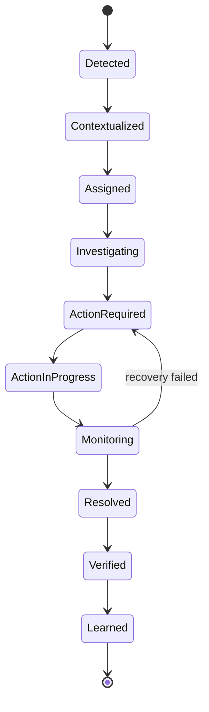
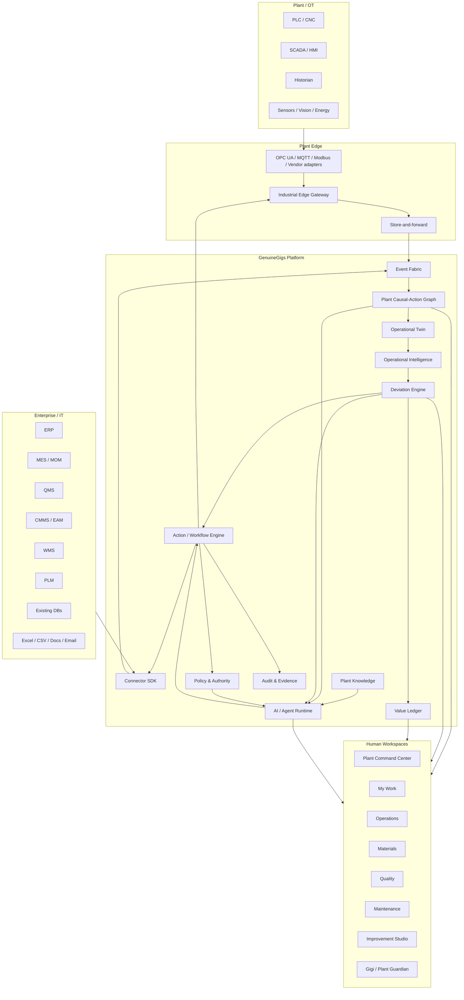

# GenuineGigs V2 — Master Product & Engineering Plan

> **Purpose:** This is the north-star product and engineering blueprint for GenuineGigs V2. It defines the complete end-state vision, product modules, domain model, IT/OT connectivity, event architecture, operational intelligence, AI/agent systems, safety, deployment, migration from V1, pilot strategy, and phased implementation order.
>
> **Critical instruction to Codex:** This document describes the complete destination. **Do not attempt a big-bang implementation.** Build the system through thin vertical slices. Every phase should preserve the end-state architecture while proving customer value before expanding scope.
>
> UI/UX requirements are defined separately in [`PLAN_UI.md`](./PLAN_UI.md). Treat that file as a hard design contract whenever modifying product surfaces.

---

# 1. Executive Summary

GenuineGigs V1 began as an AI-assisted procurement workflow product for manufacturing companies. It already contains useful primitives such as:

- organizations and users,
- roles and authority,
- procurement cycles,
- requirements/RFQs/quotes,
- approvals,
- tasks,
- documents,
- notifications,
- audit trails,
- workflow state,
- agent tools and proactive AI assistance.

GenuineGigs V2 should evolve these primitives into a much larger system:

# **The Plant Intelligence & Execution Layer**

The system should continuously answer:

1. What was supposed to happen?
2. What is actually happening?
3. Where is reality deviating from plan?
4. What is the operational and financial impact?
5. What caused or is contributing to the deviation?
6. Who or what must act?
7. What can GenuineGigs safely do automatically?
8. Did the action recover the expected outcome?
9. What should the plant learn from the incident?

The core operating loop is:

```text
SENSE
  ↓
UNDERSTAND
  ↓
QUANTIFY
  ↓
DECIDE
  ↓
ACT
  ↓
VERIFY
  ↓
LEARN
```

GenuineGigs must **not** become another ERP, MES clone, BI dashboard, IoT dashboard, or chatbot.

Existing systems remain authoritative where they already work:

- ERP owns core business/financial transactions.
- MES/MOM may own production execution.
- QMS may own quality records.
- CMMS/EAM may own maintenance records.
- WMS may own warehouse execution.
- PLM may own engineering definitions.
- PLC/SCADA/historians remain authoritative for physical-machine/process telemetry.

GenuineGigs connects, contextualizes, reasons across, and acts around those systems.

The long-term value is measured by:

- production recovered,
- downtime avoided,
- scrap/rework reduced,
- material shortages prevented,
- capacity unlocked,
- response/resolution time reduced,
- management coordination time reduced,
- supplier reliability improved,
- working capital improved,
- delivery risk reduced,
- and verified operational value created.

---

# 2. Product Vision

## 2.1 Long-term destination

GenuineGigs should become the intelligence and execution layer connecting:

- enterprise systems,
- plant operations,
- machines and sensors,
- production plans,
- materials,
- suppliers,
- quality,
- maintenance,
- people,
- tasks and commitments,
- SOPs and knowledge,
- approvals and authority,
- economic impact,
- and operational outcomes.

The system should maintain a live, contextual representation of the plant and progressively move operations through:

```text
Reactive
→ Visible
→ Explained
→ Predictive
→ Prescriptive
→ Bounded autonomous
```

## 2.2 External positioning

Do not lead with:

- dark factory,
- agentic AI,
- Manufacturing GPT,
- replacing ERP,
- generic Industry 4.0 buzzwords.

A better long-term positioning is:

> **GenuineGigs finds where a plant is losing production, quality, material, time and money — and drives recovery while the problem is still happening.**

Alternative:

> **Your existing systems record operations. GenuineGigs continuously understands what is preventing the plant from achieving its plan and coordinates the actions required to recover.**

## 2.3 Procurement's role in V2

Procurement remains important, but it is no longer the final product boundary.

The procurement module evolves from:

> “Create requirements, compare quotes and generate POs.”

into:

> **Protect material readiness and production continuity.**

Its end-to-end chain becomes:

```text
Production need / demand
→ material requirement
→ sourcing / RFQ
→ supplier selection
→ approval
→ PO in ERP
→ supplier acknowledgement
→ supplier commitment
→ dispatch
→ receipt
→ incoming quality
→ usable inventory
→ production readiness
```

---

# 3. Non-Negotiable Product Principles

## 3.1 Keep systems of record authoritative

Do not require duplicate entry.

If SAP/Tally/Oracle already owns the PO transaction, GenuineGigs should prepare and orchestrate the work, then safely synchronize the approved transaction.

If MES already records production counts, ingest them.

If QMS already owns a quality record, reference/synchronize it rather than creating parallel truth.

## 3.2 Operational outcome over feature automation

Every major feature must answer:

> What loss or operational burden does this reduce?

Examples:

- material readiness → prevent line starvation,
- maintenance response → reduce downtime,
- quality recovery → reduce scrap/rework and containment time,
- task orchestration → shorten time-to-resolution,
- supplier follow-up → improve commitment accuracy,
- AI → reduce uncertainty, monitoring and coordination effort.

## 3.3 Deterministic core, intelligent edge

Use deterministic software for:

- permissions,
- workflow states,
- inventory math,
- financial calculations,
- approval thresholds,
- ERP writes,
- safety limits,
- machine action validation,
- KPI calculations,
- deadlines,
- audit.

Use AI/ML for:

- unstructured documents,
- semantic retrieval,
- anomaly detection,
- prediction,
- root-cause assistance,
- optimization,
- summarization,
- prioritization,
- multi-step coordination.

## 3.4 Insight must close the loop

A detected issue should flow through:

```text
Detected
→ Contextualized
→ Impact quantified
→ Owner identified
→ Countermeasure proposed
→ Action initiated
→ Escalated if needed
→ Outcome verified
→ Learning captured
```

## 3.5 Evidence and explainability first

Every material recommendation must expose:

- source systems,
- relevant records,
- timestamps,
- assumptions,
- evidence,
- confidence when applicable,
- expected effect,
- risk.

## 3.6 Progressive autonomy

Do not jump to autonomous factory control.

Automation must progress from observation to recommendation to approval-gated action to bounded autonomy only after reliability is established.

## 3.7 Customer-specific configuration, reusable core

Design partners can shape the system, but company differences should usually be represented as:

- configuration,
- workflow templates,
- connector mappings,
- entity mappings,
- KPI definitions,
- policies,
- thresholds,
- plant hierarchy,
- SOP knowledge,
- permissions.

Avoid customer-specific forks.

## 3.8 Brownfield first

Assume target plants may contain:

- SAP/Tally/custom ERP,
- Excel,
- WhatsApp/email coordination,
- old PLCs,
- modern machines,
- manual data collection,
- SCADA/historians,
- on-prem databases,
- inconsistent tags/names,
- missing APIs.

GenuineGigs must provide value without requiring a greenfield factory architecture.

---

# 4. Target Customer and Buyer Model

## 4.1 Initial ideal plants

Prefer manufacturers with:

- ~100–2,000 employees,
- meaningful production complexity,
- one or more existing digital systems,
- measurable cross-functional coordination,
- enough operational loss to justify software,
- willingness to pilot one bounded value stream/line.

Priority verticals:

1. EMS/electronics manufacturing.
2. Automotive components.
3. Casting/machining/precision engineering.
4. Industrial equipment/component manufacturers.
5. Other discrete manufacturing after validation.

## 4.2 Primary buyers

### Plant Head / Factory Manager
Cares about:

- plan attainment,
- capacity,
- downtime,
- delivery,
- daily surprises,
- cross-functional execution.

### COO / VP Operations / Manufacturing Head
Cares about:

- site performance,
- standardization,
- capacity,
- cost,
- scalability,
- multi-plant performance.

### Production Head
Cares about:

- plan vs actual,
- line performance,
- material readiness,
- bottlenecks,
- recovery.

### Supply Chain / Procurement Head
Cares about:

- shortages,
- supplier commitments,
- material readiness,
- chasing,
- emergency procurement.

### Quality Head
Cares about:

- defect containment,
- scrap/rework,
- RCA/CAPA,
- recurring quality issues.

### Maintenance Head
Cares about:

- unplanned downtime,
- MTBF/MTTR,
- repeat failures,
- response time,
- spares.

---

# 5. Core Domain Object — Operational Deviation

The central object in V2 should be an **Operational Deviation**.

A deviation represents actual or forecast reality diverging from an expected operational state.

Examples:

- production behind plan,
- cycle time drift,
- machine stopped,
- material shortage predicted,
- supplier commitment slipped,
- quality rejection above threshold,
- changeover above standard,
- maintenance response overdue,
- inspection blocking production,
- WIP accumulating,
- approval blocking execution,
- shipment at risk.

## 5.1 Deviation entity

Recommended fields:

```text
Deviation
- id
- tenant_id
- plant_id
- area_id optional
- line_id optional
- asset_id optional
- category
- subtype
- source_event_ids[]
- detected_at
- started_at
- expected_state
- actual_state
- forecast_state optional
- severity
- confidence
- impacted_entities[]
- impacted_work_orders[]
- estimated_lost_units
- estimated_time_impact
- estimated_financial_impact
- delivery_risk
- root_cause_hypotheses[]
- confirmed_root_cause optional
- owner_role
- owner_user
- status
- SLA
- actions[]
- escalations[]
- evidence[]
- resolved_at
- resolution
- verified_outcome
- estimated_value_recovered
- verified_value_recovered
- recurrence_key
```

## 5.2 Lifecycle



---

# 6. End-State Architecture



---

# 7. Plant Causal-Action Graph

This should become the canonical contextual model of the plant.

Do not prematurely require a graph database. The **domain model** matters more than the storage engine. Start with explicit relational modeling if that is simpler.

## 7.1 Physical graph

```text
Enterprise
→ Site
→ Plant
→ Area
→ Line / Cell
→ Station
→ Machine / Asset
→ Component
→ Sensor / Tag
```

Entities include:

- plant,
- area,
- line,
- work center,
- machine,
- tooling,
- mold/die,
- PLC,
- sensor,
- meter,
- process variable.

## 7.2 Production graph

```text
Customer Order
→ Production Order
→ Routing
→ Operation
→ Work Center
→ Machine
→ Product
→ BOM
→ Material
→ Lot
```

## 7.3 Materials/supplier graph

```text
Material
→ Supplier
→ RFQ
→ Quote
→ PO
→ Supplier Commitment
→ Shipment
→ Receipt
→ Incoming Inspection
→ Inventory Lot
→ Production Order
```

## 7.4 Quality graph

- inspection,
- measurement,
- specification,
- control limit,
- defect,
- defect category,
- NCR,
- CAPA,
- rework,
- scrap,
- quality hold,
- supplier lot,
- process snapshot.

## 7.5 Maintenance graph

- asset,
- fault,
- alarm,
- downtime,
- maintenance request,
- maintenance work order,
- failure mode,
- spare,
- technician,
- maintenance plan,
- repair action.

## 7.6 Human/work graph

- user,
- role,
- department,
- shift,
- skill,
- certification,
- authority,
- responsibility,
- task,
- commitment,
- approval,
- escalation,
- handoff,
- SOP,
- work instruction.

## 7.7 Economic graph

Configured/derived measures:

- contribution per unit,
- production value/minute,
- labor cost,
- scrap cost,
- rework cost,
- downtime cost,
- premium freight,
- penalty exposure,
- inventory carrying cost,
- energy cost,
- lost revenue risk.

---

# 8. Operational Twin

The Operational Twin is the live current state generated from the graph plus incoming events.

It is **not** initially a photorealistic 3D digital twin.

For any plant/line/work order, it should answer:

- what should be running,
- what is running,
- current target,
- actual output,
- forecast completion,
- machine state,
- material state,
- quality state,
- maintenance state,
- active deviations,
- active actions,
- owners,
- operational risk.

Example:

```json
{
  "line": "Machining-2",
  "work_order": "WO-482",
  "part": "AX-109",
  "shift": "B",
  "planned_qty": 930,
  "actual_qty": 681,
  "expected_qty_now": 742,
  "forecast_end_qty": 854,
  "machine_state": "RUNNING",
  "standard_cycle_sec": 36,
  "actual_cycle_sec": 42.3,
  "rejection_pct": 3.9,
  "material_ready": true,
  "active_deviations": 3,
  "production_at_risk_units": 76
}
```

---

# 9. Event-Driven Architecture

V2 should evolve toward a canonical event model.

Reasons:

- plant conditions change continuously,
- connectors update asynchronously,
- deviations react to events,
- agents should wake on meaningful events,
- incident replay/testing requires history.

## 9.1 Canonical event envelope

```json
{
  "event_id": "uuid",
  "event_type": "production.output.recorded",
  "event_version": 1,
  "tenant_id": "uuid",
  "plant_id": "uuid",
  "source": "mes_connector",
  "source_record_id": "external-id",
  "occurred_at": "timestamp",
  "ingested_at": "timestamp",
  "correlation_id": "uuid",
  "causation_id": "uuid",
  "actor": {
    "type": "system|user|agent|machine",
    "id": "..."
  },
  "payload": {}
}
```

## 9.2 Event families

### Production

- production.order.created
- production.order.released
- production.operation.started
- production.operation.completed
- production.output.recorded
- production.scrap.recorded
- production.plan.updated
- production.rate.changed

### Machine

- machine.state.changed
- machine.alarm.started
- machine.alarm.cleared
- machine.cycle.recorded
- machine.parameter.changed
- machine.downtime.started
- machine.downtime.ended

### Material

- material.requirement.created
- inventory.changed
- material.shortage.predicted
- supplier.commitment.changed
- shipment.dispatched
- material.received
- material.inspection.completed

### Quality

- quality.measurement.recorded
- quality.threshold.breached
- quality.defect.detected
- quality.hold.created
- quality.hold.released
- quality.ncr.created
- quality.capa.created
- quality.capa.closed

### Maintenance

- maintenance.request.created
- maintenance.work_order.created
- maintenance.work_started
- maintenance.work_completed
- maintenance.spare.required
- maintenance.failure.repeated

### Work / human

- task.created
- task.accepted
- task.completed
- task.overdue
- approval.requested
- approval.completed
- escalation.triggered
- evidence.attached

### Agent

- agent.run.started
- agent.observation.created
- agent.recommendation.created
- agent.action.prepared
- agent.action.requested
- agent.action.executed
- agent.action.denied
- agent.run.completed
- agent.run.failed

## 9.3 Idempotency

All event consumers and connector writes must be idempotent.

External records require:

- source system,
- external ID,
- revision/version,
- last sync timestamp.

---

# 10. IT Connector Platform

Create a reusable Connector SDK.

## 10.1 Connector capabilities

Each connector declares support for:

```text
read_entities
read_changes
subscribe_events
write_entity
execute_action
upload_document
health_check
schema_discovery
```

## 10.2 Initial connector families

### ERP
- SAP
- Tally
- Oracle
- Dynamics
- ERPNext
- Odoo
- custom ERP

### Production
- MES/MOM
- production DBs
- Excel/CSV

### Quality
- QMS
- lab systems
- spreadsheets

### Maintenance
- CMMS/EAM
- maintenance logs

### Communication
- email
- later Teams/Slack/approved enterprise messaging

## 10.3 Rules

1. Connector code contains no product business logic.
2. Connector errors never silently mutate operational truth.
3. Read-only is preferred first.
4. Writes are explicit and permissioned.
5. External writes create audit records.
6. Read-back verification should be used where possible.
7. Secrets use proper secret storage.
8. Tenant/plant boundaries must be enforced.

---

# 11. OT / Edge Architecture

GenuineGigs should follow established industrial separation principles.

## 11.1 Never connect normal cloud application code directly to PLC networks

Architecture:

```text
PLC / CNC / SCADA / Sensor
          ↓
Plant OT Network
          ↓
Industrial Edge Gateway
          ↓
Protocol adapters + normalization
          ↓
Store-and-forward
          ↓
Controlled IT/OT boundary
          ↓
GenuineGigs platform
```

## 11.2 Protocol direction

Primary interoperability options:

- OPC UA where available,
- MQTT/Sparkplug where useful,
- Modbus/vendor-specific protocols through adapters/gateways,
- historian/API/database integration where available.

Do **not** make industrial driver development the core moat. Integrate existing gateways/vendors where appropriate.

## 11.3 Edge responsibilities

- connect to plant sources,
- map tags to canonical assets,
- normalize units,
- timestamp,
- detect connectivity loss,
- buffer during outages,
- publish upstream,
- enforce allowlisted downstream commands,
- expose health.

## 11.4 Edge deployment

Prefer:

- containerized runtime,
- outbound TLS,
- certificate identity,
- local persistent buffer,
- signed configuration,
- no arbitrary public inbound access.

## 11.5 Data classification

### High-frequency raw telemetry
Usually remain local/historian-first unless required for analysis.

### Operational telemetry
Examples:

- state,
- count,
- cycle,
- alarm,
- aggregated parameters,
- interval energy.

### Canonical operational events
Examples:

- downtime started,
- job changed,
- threshold crossed,
- production count reached,
- quality hold.

---

# 12. Data Platform

Avoid premature infrastructure complexity.

## 12.1 Starting stack

### PostgreSQL
Primary store for:

- identity,
- organization,
- plant model,
- workflows,
- deviations,
- tasks,
- approvals,
- connector mappings,
- audit metadata,
- operational entities.

### Time-series support
Use a PostgreSQL-compatible time-series approach initially if telemetry volume requires it.

### Object storage
For:

- documents,
- images,
- evidence,
- reports,
- model artifacts.

### Redis
For:

- cache,
- locks,
- short-lived agent state,
- rate limiting.

### Event infrastructure
Start with a reliable outbox + background queue if sufficient.

Introduce Kafka-compatible streaming when:

- replay volume,
- connector scale,
- independent consumers,
- telemetry throughput

justify it.

## 12.2 Later analytics layer

Add columnar/lakehouse infrastructure only when long-term OT history/model training/cross-plant analytics require it.

---

# 13. Value Ledger

The Value Ledger is a first-class domain capability.

Its purpose is to translate operational deviations into business impact.

## 13.1 Examples

### Downtime

```text
lost minutes
× expected production rate
→ lost units
× contribution/unit
→ contribution at risk
```

### Scrap

```text
material cost
+ conversion cost
+ rework/disposal cost
```

### Material shortage

```text
production delayed
+ expediting/overtime
+ shipment risk
```

## 13.2 Value confidence states

### Estimated loss
Model/formula estimate.

### Addressed value
Loss associated with issue where GenuineGigs drove action.

### Attributable recovery
Evidence reasonably indicates the intervention improved the outcome.

### Verified recovery
Confirmed by deterministic/business rules or authorized user.

Do not overclaim AI causality.

## 13.3 Customer configuration

Allow configuration/versioning of:

- contribution/unit,
- line cost/hour,
- labor cost,
- overtime,
- scrap/rework costing,
- energy cost,
- carrying cost,
- penalties.

---

# 14. Product Module — Plant Command Center

Primary users:

- Plant Head,
- COO,
- Manufacturing Head,
- Operations Director.

It must answer:

1. Are we going to hit plan?
2. What threatens the plan?
3. What is the impact?
4. Who is resolving it?
5. What needs my decision?

Core data:

- plan vs actual,
- end-of-shift forecast,
- production at risk,
- dominant loss categories,
- top deviations,
- decisions,
- value at risk,
- active recovery.

UI details: see `PLAN_UI.md`.

---

# 15. Product Module — Production Loss & Recovery

This should be the first major operational V2 vertical slice.

## 15.1 Goal

> Identify why today's production plan is being missed and drive recovery before the shift ends.

## 15.2 Initial inputs

Allow a staged approach:

- production plan via CSV/Excel/manual/API,
- actual output via manual/CSV/API,
- downtime events,
- rejection data,
- material availability,
- maintenance state.

Later automate through MES/OT.

## 15.3 Loss categories

Minimum:

- breakdown,
- planned downtime,
- changeover,
- minor stop,
- speed loss,
- material shortage,
- quality/scrap,
- manpower,
- tooling,
- waiting/approval,
- upstream starvation,
- downstream blockage,
- unknown.

## 15.4 Recovery workflow

Significant losses can trigger:

- owner assignment,
- contextual task,
- SLA,
- SOP/help,
- cross-functional dependency,
- escalation,
- decision request,
- outcome verification.

---

# 16. Product Module — Material Readiness

Core question:

> **Will all required material be physically available and usable when production needs it?**

## 16.1 Inputs

- production schedule,
- BOM,
- inventory,
- reservations,
- open PO,
- supplier commitments,
- dispatch/transit,
- expected receipts,
- quality holds,
- incoming inspection,
- approved alternates.

## 16.2 States

```text
READY
WATCH
AT_RISK
BLOCKED
UNKNOWN
```

## 16.3 Baseline calculation

```text
required quantity
- usable on-hand
- reliable expected receipt before need time
= projected shortage
```

Advanced confidence should consider:

- supplier reliability,
- transit uncertainty,
- quality risk,
- partial delivery,
- alternative material,
- allocations.

## 16.4 Actions

- chase supplier confirmation,
- notify buyer/planning,
- propose reallocation,
- propose alternate material/supplier,
- escalate production-threatening shortage.

---

# 17. Product Module — Procurement V2

Preserve and evolve V1:

- material requirement,
- RFQ,
- quotation ingestion/extraction,
- comparison,
- approval,
- PO preparation,
- ERP sync,
- supplier acknowledgement,
- commitment management.

The business value must connect to:

- material readiness,
- supplier response/commitment accuracy,
- production continuity,
- reduced expediting/chasing.

---

# 18. Product Module — Quality Intelligence & Recovery

## 18.1 Capabilities

- inspection,
- FPY,
- rejection,
- scrap/rework,
- defect Pareto,
- SPC/control-limit monitoring,
- quality holds,
- NCR,
- CAPA,
- containment,
- recurrence,
- supplier lot correlation,
- machine/process/shift correlation.

## 18.2 Deviation examples

- rejection threshold breached,
- SPC rule violated,
- repeated defect family,
- suspect supplier lot,
- unresolved quality hold blocking production.

## 18.3 AI assistance

- identify affected time window/lots,
- gather evidence,
- retrieve FMEA/control plan,
- draft containment/RCA support,
- track CAPA,
- monitor recurrence.

Human owns confirmed RCA and release decisions unless explicit policy says otherwise.

---

# 19. Product Module — Maintenance & Reliability

Do not immediately replace CMMS.

## 19.1 Initial scope

- downtime,
- alarms,
- maintenance status,
- repeated faults,
- MTBF,
- MTTR,
- response time,
- spare readiness,
- backlog.

## 19.2 Example context

> CNC-04 fault 701 has occurred four times in 45 days. Current downtime is 23 minutes. Two similar incidents required bearing BR-28. One spare is available.

## 19.3 Predictive maintenance

Only after sufficient:

- signal history,
- failures/labels,
- stable data quality,
- economic justification.

---

# 20. Product Module — Cross-Functional Action Orchestration

This should be a major GenuineGigs differentiator.

## 20.1 Contextual actions

Every action/task should know:

- originating deviation,
- business impact,
- dependencies,
- owner,
- deadline,
- authority,
- evidence required,
- escalation path.

## 20.2 Dependency engine

Example:

```text
Production order at risk
    ↓
Material shortage
    ↓
Supplier confirmation missing
    ↓
Buyer follows up
    ↓
Supplier reports delay
    ↓
Planner proposes alternate
    ↓
Quality approval
    ↓
Plant Head decision
```

The system should know which incomplete dependency blocks downstream work.

---

# 21. Product Module — My Work

Each employee sees:

```text
NOW
NEXT
WAITING
COMMITMENTS
DONE
```

Each action includes:

- what,
- why,
- impact,
- due time,
- dependencies,
- context,
- Gigi assistance.

Do not recreate Jira/ERP task tables.

---

# 22. Product Module — Shift & Daily Management

## Shift start

Gigi can provide:

- carry-over,
- current plan,
- material concerns,
- machine concerns,
- quality alerts,
- personal priorities.

## During shift

- deviations,
- recovery actions,
- reminders,
- escalations,
- forecast updates.

## Shift handover

Automatically prepare:

- plan vs actual,
- downtime,
- rejection,
- material issues,
- maintenance,
- unresolved deviations,
- carry-over actions,
- key decisions.

---

# 23. Product Module — Continuous Improvement Studio

Primary users:

- process engineering,
- Lean/Six Sigma,
- industrial engineering,
- plant leadership.

Capabilities:

- loss Pareto,
- recurring deviation discovery,
- line/shift/product/machine/supplier comparisons,
- response/resolution analysis,
- intervention effectiveness,
- annualized improvement opportunity.

Support improvement experiments:

- hypothesis,
- baseline,
- intervention,
- target,
- period,
- result,
- statistical confidence where relevant.

---

# 24. Multi-Plant Layer — Later

For corporate/COO users:

- site performance,
- standardized KPIs,
- systemic recurring losses,
- common countermeasures,
- best-practice transfer,
- enterprise agent summaries.

Avoid simplistic plant rankings where operational contexts differ.

---

# 25. Gigi — Plant Guardian

Gigi is the single human-facing AI identity.

The user should not need to understand the underlying agents/models.

Gigi must be:

- proactive,
- event-driven,
- role-aware,
- plant-aware,
- authority-aware,
- evidence-aware,
- deadline-aware.

Chat is only one surface.

## 25.1 Role behavior

### Operator
- next work,
- SOP help,
- alarm assistance,
- blocked dependencies.

### Supervisor
- plan,
- deviations,
- team work,
- handover.

### Maintenance
- fault context,
- similar history,
- manuals,
- spares.

### Quality
- affected production,
- evidence,
- containment/RCA.

### Procurement
- material risk,
- supplier commitments,
- RFQ/PO workflow.

### Plant Head
- only important deviations,
- value at risk,
- decisions,
- recovery status.

---

# 26. AI Architecture — Use Multiple Techniques

AI is not one LLM.

## 26.1 Deterministic analytics

- OEE,
- plan vs actual,
- throughput,
- material shortage,
- MTBF/MTTR,
- FPY,
- costing,
- SLA.

## 26.2 Statistical anomaly detection

Start simple:

- thresholds,
- SPC,
- robust z-score,
- EWMA,
- seasonality-aware baselines.

Apply to:

- cycle time,
- sensor/process drift,
- quality,
- rate,
- energy,
- microstops.

## 26.3 Forecasting

Forecast:

- end-of-shift production,
- completion time,
- stockout,
- supplier lateness,
- throughput,
- quality risk.

Always compare against a simple baseline.

## 26.4 Root-cause assistance

Build an evidence set across:

- machine,
- material lot,
- shift,
- process parameters,
- maintenance,
- supplier,
- prior incidents.

AI can rank hypotheses but must not present correlation as proven causation.

## 26.5 Optimization

Use mathematical optimization for:

- scheduling,
- machine allocation,
- material allocation,
- maintenance windows,
- sequence optimization.

Possible techniques:

- constraint programming,
- MILP,
- heuristics,
- simulation,
- Bayesian optimization.

LLMs explain/coordinate; they do not replace optimization algorithms.

## 26.6 GenAI / RAG

Use for:

- SOP/manual retrieval,
- incident summarization,
- explanation,
- Q&A,
- document interpretation,
- communication drafting.

## 26.7 Document intelligence

Evolve current procurement extraction into a shared capability for:

- quotations,
- inspection reports,
- invoices,
- maintenance reports,
- manuals,
- certificates.

## 26.8 Vision — future/selective

Potential uses:

- visual quality,
- assembly verification,
- PPE,
- counting,
- gauge reading.

Do not make CV foundational to initial V2.

---

# 27. Agent Architecture

Do not create agents simply because departments exist.

Every agent must define:

- objective,
- scope,
- allowed tools,
- success condition,
- stopping condition,
- authority level,
- audit.

## 27.1 Production Recovery Agent

Objective:

> Minimize preventable deviation from active production plan.

Watches:

- production rate,
- plan,
- downtime,
- material,
- quality,
- recovery actions.

## 27.2 Material Readiness Agent

Objective:

> Ensure upcoming work orders have usable material before need time.

## 27.3 Reliability Agent

Objective:

> Reduce impact and recurrence of equipment downtime.

## 27.4 Quality Recovery Agent

Objective:

> Shorten detection → containment → RCA → closure and reduce recurrence.

## 27.5 Shift Coordination Agent

Objective:

> Preserve priorities, commitments and handover context.

## 27.6 Continuous Improvement Agent

Objective:

> Identify recurring preventable losses worth addressing.

## 27.7 Supplier Commitment Agent

Objective:

> Keep supplier commitments accurate enough to protect production.

---

# 28. Agent Runtime

Use a stateful agent runtime where it adds value, but do not put business workflows inside an LLM framework.

The runtime should support:

- trigger,
- context hydration,
- plan,
- tool execution,
- checkpoint,
- wait,
- resume,
- approval,
- escalation,
- completion,
- audit.

## 28.1 Trigger sources

- domain event,
- deviation,
- schedule,
- user request,
- task deadline,
- connector update.

## 28.2 Context hydration

Retrieve only the relevant graph slice:

- user/role,
- current plant state,
- deviation,
- related work orders/material/assets,
- open tasks,
- authority,
- SOPs,
- similar incidents,
- recent timeline.

Never dump the entire database into model context.

## 28.3 Tool classes

### Read
- get_work_order
- get_machine_state
- get_material_status
- get_quality_history
- get_maintenance_history
- search_plant_knowledge
- get_related_deviations
- get_responsibility

### Prepare
- draft_supplier_followup
- prepare_task
- prepare_approval
- prepare_maintenance_request
- prepare_quality_hold
- prepare_schedule_change

### Execute — only through policy
- create_task
- send_external_message
- update_erp
- create_cmms_work_order
- assign_owner
- acknowledge_incident

---

# 29. Memory Model

Separate:

### Session memory
Current AI interaction.

### Operational memory
Authoritative plant/system facts.

### Incident memory
Previous deviations, actions and results.

### User preference memory
Safe workflow preferences only.

Chat history must never become authoritative operational truth.

---

# 30. Autonomy Ladder

## Level 0 — Observe
Detect/collect only.

## Level 1 — Explain
Summarize/diagnose.

## Level 2 — Recommend
Human selects action.

## Level 3 — Prepare
Draft action/transaction/message.

## Level 4 — Approval-gated execute
Authorized human approves.

## Level 5 — Bounded autonomous execution
Pre-approved low-risk actions execute automatically.

Examples:

- reminders,
- internal follow-up tasks,
- status requests,
- escalation,
- approved supplier follow-ups.

## Level 6 — Closed-loop physical control
Future, narrow, highly validated.

Never allow free-form LLM output to directly write PLC values.

---

# 31. Policy, Permission and Authority Engine

Every sensitive action should answer:

1. Can this role/user/agent perform this action type?
2. Can it perform it on this plant/entity/value range?
3. Does context require approval/escalation?

Combine:

- RBAC,
- ABAC,
- plant scope,
- action scope,
- monetary threshold,
- workflow state,
- safety class.

## 31.1 Risk classes

### R0 — read-only

### R1 — internal reversible
Example: create task.

### R2 — external reversible
Example: send supplier reminder.

### R3 — transactional
Example: ERP transaction/update.

### R4 — operationally sensitive
Example: production routing or quality hold/release.

### R5 — physical/process control

Safeguards increase with risk.

---

# 32. OT Safety Architecture

Any physical action must flow through:


Rules:

- no arbitrary code from LLM,
- no free-form machine write,
- allowlisted commands,
- typed/bounded parameters,
- existing PLC/interlock/safety systems remain authoritative,
- emergency stop is independent of GenuineGigs,
- all physical actions audited,
- read-back verification.

---

# 33. Plant Knowledge Layer

Sources:

- SOPs,
- machine manuals,
- maintenance manuals,
- FMEA,
- control plans,
- work instructions,
- quality procedures,
- incident reports,
- supplier specs.

Each knowledge chunk must retain:

- tenant,
- plant,
- document type,
- version,
- validity,
- approval status,
- relevant machine/product/process.

Retrieval should combine:

- semantic search,
- keyword,
- structured metadata,
- graph context.

Never prefer an obsolete SOP over a valid approved version.

---

# 34. KPI Framework

## Production

- plan attainment,
- throughput,
- OEE,
- availability,
- performance,
- quality,
- cycle time,
- schedule adherence,
- changeover,
- WIP.

## Quality

- FPY,
- scrap,
- rework,
- PPM,
- recurrence,
- containment time,
- CAPA closure.

## Maintenance

- downtime,
- MTBF,
- MTTR,
- response time,
- repeat failure,
- planned/unplanned maintenance.

## Materials

- material readiness,
- shortage incidence,
- supplier OTD,
- commitment accuracy,
- premium freight,
- blocked inventory.

## Execution

- time to detect,
- time to assign,
- time to acknowledge,
- time to act,
- time to resolve,
- escalation rate.

## Value

- estimated loss,
- addressed value,
- attributable recovery,
- verified recovery,
- ROI,
- payback.

---

# 35. Security

## Tenant isolation

- tenant_id on all tenant-owned records,
- service-layer enforcement,
- database-level controls where appropriate,
- tests for cross-tenant isolation.

## Authentication

Roadmap:

- standard auth initially,
- MFA,
- OIDC/SAML SSO,
- SCIM later.

## Secrets

Use proper secret manager/Vault; never plaintext connector credentials.

## IT/OT boundary

Prefer outbound edge connections and controlled DMZ/boundaries rather than public exposure of OT.

## Audit

Record:

- login,
- permission change,
- configuration,
- agent action,
- approval,
- connector write,
- external communication,
- recommendation,
- override.

---

# 36. Deployment Model

## Cloud control plane

Hosts:

- UI/API,
- workflow,
- graph/domain state,
- agents,
- analytics,
- configuration.

## Plant edge data plane

Hosts:

- OT connectivity,
- buffering,
- selected local processing,
- command enforcement.

## Future hybrid/private deployment

Architecture should permit:

- private cloud,
- customer VPC,
- on-prem components,
- local inference,
- restricted data egress.

---

# 37. Recommended Technology Direction

Do not rewrite working V1 components merely for fashion.

Codex must audit the repository before changing foundations.

## Frontend

If V1 is Next.js/React/TypeScript, continue unless a concrete blocker exists.

Need:

- real-time updates through SSE/WebSockets where justified,
- reusable V2 design system,
- efficient caching/query layer.

## Backend

Continue FastAPI/Python if already core.

Python is well-suited for:

- AI,
- data processing,
- optimization,
- ML.

Edge/high-throughput components may later use Go/Rust where justified.

## Database

- PostgreSQL,
- time-series support,
- Redis,
- object storage.

## Async/eventing

- reliable job queue,
- transactional outbox,
- typed domain events,
- later Kafka/Redpanda if scale warrants.

## Agent orchestration

LangGraph may remain useful for stateful AI flows.

But:

- domain workflows live in application services/workflow engine,
- LangGraph is not the business state machine,
- checkpoints reference canonical IDs/state.

## Optimization

Candidate tools:

- OR-Tools,
- scipy,
- suitable commercial/open-source solvers later.

---

# 38. Code Organization

Prefer a modular monolith before unnecessary microservices.

Logical modules:

```text
identity
organization
plant_model
production
materials
procurement
quality
maintenance
work
deviations
value
integrations
events
knowledge
agents
notifications
audit
analytics
```

Extract services only for:

- independent scaling,
- deployment boundary,
- edge boundary,
- security boundary,
- clear ownership.

---

# 39. API Design

Use explicit commands and queries.

Queries:

```text
get_line_status()
get_material_readiness()
get_active_deviations()
```

Commands:

```text
create_recovery_action()
approve_action()
resolve_deviation()
record_output()
```

Avoid unsafe generic mutation endpoints such as arbitrary status PATCH where business validation is required.

All external writes should create an ActionExecution record.

---

# 40. Observability and Data Health

## Platform observability

Track:

- API latency,
- errors,
- queue depth,
- connector failures,
- agent latency,
- model/token cost,
- database health.

## Plant-data health

Track:

- last event time,
- missing signals,
- edge disconnect,
- ERP sync lag,
- stale work-order context.

Never show stale data as live without clear indication.

---

# 41. AI Evaluation

## GenAI

Evaluate:

- groundedness,
- source correctness,
- hallucination,
- tool-call correctness,
- action correctness,
- unnecessary/missed escalation.

## Forecasting

Track appropriate metrics such as:

- MAE,
- MAPE where valid,
- calibration,
- baseline comparison.

## Agents

Track:

- objective success,
- accepted/rejected actions,
- override rate,
- false positives,
- false negatives,
- time saved,
- incident outcome.

Do not call an agent successful because its demo sounds intelligent.

---

# 42. V1 → V2 Migration

## Preserve

- auth,
- org/user/role foundation,
- procurement entities,
- documents,
- tasks,
- approvals,
- notifications,
- audit,
- existing agent tool primitives,
- working integrations.

## Evolve

### Task
→ contextual Operational Action / Commitment.

### Procurement cycle graph
→ broader Plant Causal-Action Graph.

### Role-focused agents
→ objective-focused operational agents.

### Chatbot/mascot
→ proactive Gigi Plant Guardian.

### Existing workflow events
→ canonical domain event model.

### Procurement dashboard
→ Materials / Material Readiness + procurement execution.

## Compatibility

Introduce V2 under feature flags/parallel routes as necessary.

Do not break proven V1 workflows during migration.

---

# 43. Phased Engineering Roadmap

The whole document is the destination. These phases define implementation order.

## PHASE 0 — Technical Audit

Goal: understand V1 before major refactoring.

Codex must produce:

`V2_TECHNICAL_AUDIT.md`

Include:

- repository map,
- frontend architecture,
- backend architecture,
- DB/ORM,
- auth,
- agents,
- queues,
- integrations,
- deployment,
- reusable components,
- blockers/technical debt,
- migration dependency map.

Do not start broad rewrite first.

---

## PHASE 1 — Production Loss & Recovery MVP

Goal:

> Prove GenuineGigs can model production deviation and coordinate recovery on one line without requiring live OT.

### Domain entities

- Plant
- Area
- Line
- Shift
- WorkOrder
- ProductionPlan
- ProductionActual
- DowntimeEvent
- QualityEvent
- MaterialReadinessSnapshot
- Deviation
- OperationalAction
- ValueEntry

### Data ingestion

- CSV/Excel/manual production plan,
- actual output,
- downtime,
- rejection,
- material state.

### UI

- V2 shell,
- Plant Command Center,
- Operations overview,
- Line Workspace,
- Loss Tree,
- Deviation Workspace,
- My Work V2,
- Gigi briefing.

See `PLAN_UI.md`.

### AI

Only:

- deterministic calculations,
- simple anomaly thresholds,
- grounded summaries,
- contextual task/follow-up orchestration.

### Gate

At least one real manufacturer should agree that this addresses a meaningful operational problem and be willing to test using real/redacted operational data.

---

## PHASE 2 — First Live IT Integrations

Goal:

> Eliminate duplicate data and connect the design partner's existing systems.

Build:

- connector SDK,
- mapping/config,
- connector health,
- idempotent sync,
- read-only first,
- controlled writes later.

Only implement the integrations required by active design partners plus reusable connector primitives.

Gate:

> GenuineGigs can run without maintaining a parallel manual copy of critical transactional data.

---

## PHASE 3 — Material Readiness + Procurement V2

Build:

- BOM/material requirements,
- inventory context,
- open PO,
- supplier commitment,
- receipt,
- quality hold,
- production need date,
- shortage forecast,
- material readiness board.

Upgrade current procurement:

- RFQ,
- quote extraction/comparison,
- approval,
- ERP PO sync,
- supplier acknowledgement,
- commitment follow-up.

AI:

- Material Readiness Agent,
- Supplier Commitment Agent.

Gate:

Measure earlier shortage detection / reduced chasing / fewer production surprises.

---

## PHASE 4 — OT Edge & Machine Context

Goal:

> Remove manual machine/production/downtime capture from one line.

Build:

- edge gateway,
- OPC UA path,
- MQTT path,
- canonical machine mapping,
- machine state,
- cycle/count,
- downtime detection,
- store-and-forward,
- health monitoring.

Read-only first.

Gate:

Live machine events reliably create operational context/deviations without compromising plant reliability or security.

---

## PHASE 5 — Quality + Maintenance Recovery

Quality:

- inspections,
- defects,
- SPC,
- holds,
- NCR/CAPA,
- Quality Recovery Agent.

Maintenance:

- faults,
- alarms,
- requests,
- recurring-failure analysis,
- spares,
- Reliability Agent.

Gate:

At least one repeatable quality or maintenance workflow demonstrates measurable improvement in response/resolution or loss.

---

## PHASE 6 — Predictive & Prescriptive Intelligence

Only after sufficient data.

Candidates:

- end-of-shift forecast,
- shortage probability,
- failure risk,
- quality risk,
- bottleneck prediction,
- production/material optimization.

Every model must outperform a simple baseline and have an actionable consumer.

---

## PHASE 7 — Bounded Autonomous Operations

Enable selected Level 5 actions.

Examples:

- reminders,
- task creation,
- supplier status requests,
- low-risk escalation,
- data reconciliation,
- draft/approved enterprise-system actions.

Physical control remains separate.

---

## PHASE 8 — Multi-Plant Operating Layer

Add:

- cross-plant model,
- corporate operations view,
- standardized KPIs,
- recurring-systemic-loss analysis,
- cross-site best practices,
- corporate Gigi briefing.

---

# 44. Product Development Gates

Before building a major feature, evaluate:

## Pain
Does a real target manufacturer care?

## Frequency
Does it happen often enough?

## Economics
Can we connect it to significant value?

## Data
Can required data realistically be obtained?

## Actionability
Can GenuineGigs influence the outcome?

## Reusability
Will the primitive apply across customers?

## Time-to-value
Can a pilot demonstrate benefit within ~30–60 days?

Features that fail most gates should not be prioritized.

---

# 45. Pilot Architecture

The V2 pilot should be sold as an operational design partnership, not “free software.”

## Suggested scope

- one plant,
- one line/value stream,
- 30–60 days,
- bounded integration scope,
- read-only first where possible,
- no requirement to replace existing systems.

## Customer commitments

- internal champion,
- data access,
- process walkthrough,
- weekly review,
- baseline metrics,
- feedback,
- timely decisions.

## GenuineGigs commitments

- configuration,
- agreed integrations,
- workflow setup,
- monitoring,
- support,
- before/after analysis.

## Baseline metrics

Examples:

- plan attainment,
- downtime,
- rejection,
- shortage time,
- response time,
- resolution time,
- coordination/follow-up effort.

## Pilot output

- deviations detected,
- actions initiated,
- outcomes,
- estimated/verified value,
- limitations,
- expansion recommendation.

---

# 46. Pricing Direction — Later

Do not finalize pricing before verified value.

Potential commercial structure:

```text
Annual plant platform fee
+
modules / scale
+
implementation / integration
+
edge services/hardware if required
```

Internally compare price to customer value.

Do not mechanically charge a fixed percentage of savings.

---

# 47. Competitive Positioning Rules

Never use these as the primary USP:

- AI agents,
- IT/OT integration,
- dashboards,
- OEE,
- ERP integration,
- chatbot.

These are capabilities or table stakes.

Desired differentiation:

> **GenuineGigs builds a contextual model of plant reality, detects deviations in terms of production/business impact, and closes the loop from detection to coordinated recovery.**

Potential long-term moat:

1. Plant Causal-Action Graph.
2. Cross-domain operational context.
3. Incident → action → outcome history.
4. Plant-specific learning.
5. Verified Value Ledger.
6. Deep integration into the resolution loop.

---

# 48. What Not To Build Too Early

Do not spend months building these before customer pull/data exists:

- full MES replacement,
- generic IoT platform,
- universal PLC driver library,
- photorealistic digital twin,
- predictive maintenance without data,
- AI scheduling without constraints/data,
- vision platform without use case,
- autonomous PLC control,
- dozens of agents,
- massive lakehouse,
- dozens of microservices,
- cross-plant enterprise suite before one-plant value.

---

# 49. Codex Implementation Discipline

For every implementation phase:

1. Read this file and `PLAN_UI.md`.
2. Audit existing V1 behavior before replacing it.
3. Identify reusable V1 primitives.
4. Write/update data models and contracts first.
5. Implement one vertical slice end-to-end.
6. Add seeded/demo data where live data is unavailable.
7. Add tests.
8. Verify audit/permissions.
9. Verify UI against `PLAN_UI.md`.
10. Produce screenshots for major UI changes.
11. Document what is complete, partial, mocked, or future.
12. Do not silently invent unrequested product scope.

---

# 50. Definition of GenuineGigs V2 Success

V2 is not successful merely because it has more modules.

The product is working when a real plant can say:

> GenuineGigs detected an operational problem we would otherwise have noticed later, showed us the impact, coordinated the correct people/actions, and helped us measurably recover production/time/money.

The key proof sequence is:

```text
One meaningful deviation
→ one successful recovery
→ one verified economic result
→ repeated recovery on one line
→ repeated value across one plant
→ expansion to more operational domains
→ deeper IT/OT integration
→ multi-plant intelligence
```

---

# 51. North-Star Architecture Summary

```text
Existing IT systems + OT systems + people + documents
                         ↓
                 Connector / Edge layer
                         ↓
                    Event fabric
                         ↓
              Plant Causal-Action Graph
                         ↓
                  Operational Twin
                         ↓
       Analytics / ML / Knowledge / Optimization
                         ↓
                  Deviation Engine
                         ↓
                     Value Ledger
                         ↓
                Action / Policy Engine
                         ↓
             Specialized operational agents
                         ↓
                 Gigi / Plant Guardian
                         ↓
                Human + system actions
                         ↓
                  Outcome verification
                         ↓
                 Operational memory
                         ↺
```

---

# 52. One-Sentence Engineering Rule

> **Do not build technology because it makes the architecture look advanced; build the smallest reusable capability that helps a real plant detect, understand, resolve, and learn from a financially meaningful operational deviation.**


---

# 53. CODEX EXECUTION CONTRACT — IMPLEMENT, DO NOT REDESIGN

This section is a hard implementation specification. Codex must not invent an alternative architecture, rename the core domain concepts, replace the deviation/action model with generic CRUD, or make independent technology/product decisions unless the existing V1 code already contains an equivalent working implementation that should be reused.

The only acceptable implementation flexibility is **mapping existing V1 components onto this contract without unnecessary rewrites**.

## 53.1 Required implementation stack

Preserve working V1 versions/packages where equivalent. Otherwise use:

```text
Frontend
- Next.js + React + TypeScript
- Tailwind CSS
- TanStack Query for server state
- Recharts for normal operational charts
- @xyflow/react only for causal/dependency graphs
- SSE first for live updates; WebSocket only where bidirectional streaming is actually required

Backend
- Python 3.12+
- FastAPI
- Pydantic v2
- SQLAlchemy 2.x
- Alembic
- PostgreSQL
- Redis
- Celery + Redis for workers/scheduled jobs in early phases
- transactional outbox for domain events

AI / Data
- retain LangGraph only for stateful agent orchestration
- keep business workflow/state outside LangGraph
- pgvector initially for embeddings
- scikit-learn/statsmodels for baseline statistical models
- OR-Tools for future constraint optimization

Storage
- PostgreSQL: canonical transactional/application state
- Object storage: documents, evidence, images, reports
- Redis: cache, locks, rate limits, transient coordination
- Customer historian/time-series source remains authoritative for high-frequency OT where present
```

Do **not** introduce Kafka, Neo4j, Kubernetes, a lakehouse, or microservices during Phase 1 unless an already-live system makes them unavoidable.

## 53.2 Target logical repository layout

```text
apps/
  web/

services/
  api/
  worker/
  edge-agent/          # Phase 4 onward

packages/
  contracts/
  ui/

infra/
  migrations/
  docker/
  observability/

docs/
  architecture/
  connector-specs/
  plant-model/
```

If V1 has an equivalent monorepo structure, map to it instead of restructuring for aesthetics.

---

# 54. Backend Module Contract

The backend must expose the following domain modules:

```text
identity
organization
plant_model
production
materials
procurement
quality
maintenance
work
deviations
value
events
integrations
knowledge
agents
notifications
audit
analytics
```

Where applicable, each module contains:

```text
models.py
schemas.py
repository.py
service.py
router.py
events.py
policies.py
tests/
```

Rules:

1. Routers contain HTTP concerns only.
2. Repositories contain persistence concerns only.
3. Business logic lives in services/domain policy.
4. Connectors contain no product business rules.
5. LLM prompts never become the canonical workflow/state engine.
6. Every important mutation is permission checked and audited.

---

# 55. Canonical V2 Data Model

The following is the minimum schema contract. Implement tables incrementally by phase, but do not create competing entities with different semantics.

## 55.1 Plant hierarchy

### `plants`

```text
id UUID PK
tenant_id UUID NOT NULL
code VARCHAR NOT NULL
name VARCHAR NOT NULL
timezone VARCHAR NOT NULL
currency VARCHAR NOT NULL
status ENUM(active,inactive)
created_at TIMESTAMPTZ
updated_at TIMESTAMPTZ
UNIQUE(tenant_id, code)
```

### `areas`

```text
id UUID PK
tenant_id UUID
plant_id UUID FK plants
parent_area_id UUID nullable
code VARCHAR
name VARCHAR
type VARCHAR nullable
created_at
updated_at
```

### `lines`

```text
id UUID PK
tenant_id UUID
plant_id UUID
area_id UUID nullable
code VARCHAR
name VARCHAR
line_type VARCHAR nullable
planned_rate_per_hour NUMERIC nullable
status
created_at
updated_at
```

### `assets`

```text
id UUID PK
tenant_id UUID
plant_id UUID
line_id UUID nullable
parent_asset_id UUID nullable
asset_code VARCHAR
name VARCHAR
asset_type ENUM(machine,station,tool,utility,sensor,other)
criticality ENUM(low,medium,high,critical)
source_system VARCHAR nullable
external_id VARCHAR nullable
metadata JSONB
status
created_at
updated_at
```

### `shifts`

```text
id UUID PK
tenant_id UUID
plant_id UUID
code VARCHAR
name VARCHAR
start_local TIME
end_local TIME
crosses_midnight BOOLEAN
created_at
updated_at
```

## 55.2 Production

### `work_orders`

```text
id UUID PK
tenant_id UUID
plant_id UUID
external_system VARCHAR nullable
external_id VARCHAR nullable
work_order_no VARCHAR
product_code VARCHAR
product_name VARCHAR nullable
planned_quantity NUMERIC
completed_quantity NUMERIC DEFAULT 0
scrap_quantity NUMERIC DEFAULT 0
planned_start TIMESTAMPTZ nullable
planned_end TIMESTAMPTZ nullable
actual_start TIMESTAMPTZ nullable
actual_end TIMESTAMPTZ nullable
line_id UUID nullable
status ENUM(planned,released,running,paused,completed,cancelled)
priority INTEGER DEFAULT 0
customer_ref VARCHAR nullable
metadata JSONB
created_at
updated_at
```

### `production_plan_points`

```text
id UUID PK
tenant_id UUID
plant_id UUID
line_id UUID
work_order_id UUID nullable
shift_id UUID nullable
bucket_start TIMESTAMPTZ
bucket_end TIMESTAMPTZ
planned_increment NUMERIC
planned_cumulative NUMERIC
source VARCHAR
created_at
```

### `production_actual_points`

```text
id UUID PK
tenant_id UUID
plant_id UUID
line_id UUID
work_order_id UUID nullable
asset_id UUID nullable
bucket_start TIMESTAMPTZ
bucket_end TIMESTAMPTZ
good_increment NUMERIC
scrap_increment NUMERIC DEFAULT 0
actual_cumulative NUMERIC
source VARCHAR
source_record_id VARCHAR nullable
created_at
```

### `downtime_events`

```text
id UUID PK
tenant_id UUID
plant_id UUID
line_id UUID nullable
asset_id UUID nullable
work_order_id UUID nullable
started_at TIMESTAMPTZ
ended_at TIMESTAMPTZ nullable
duration_seconds INTEGER nullable
planned BOOLEAN DEFAULT false
loss_category VARCHAR
reason_code VARCHAR nullable
reason_text TEXT nullable
source VARCHAR
source_record_id VARCHAR nullable
status ENUM(open,classified,closed)
created_at
updated_at
```

## 55.3 Quality

### `quality_events`

```text
id UUID PK
tenant_id UUID
plant_id UUID
line_id UUID nullable
asset_id UUID nullable
work_order_id UUID nullable
material_lot_id UUID nullable
event_type ENUM(measurement,defect,rejection,hold,release,ncr,capa)
defect_code VARCHAR nullable
quantity NUMERIC nullable
measurement_name VARCHAR nullable
measurement_value NUMERIC nullable
lower_limit NUMERIC nullable
upper_limit NUMERIC nullable
severity VARCHAR nullable
occurred_at TIMESTAMPTZ
source VARCHAR
source_record_id VARCHAR nullable
evidence JSONB
created_at
```

## 55.4 Materials

### `material_requirements`

```text
id UUID PK
tenant_id UUID
plant_id UUID
work_order_id UUID
material_code VARCHAR
material_name VARCHAR nullable
required_quantity NUMERIC
uom VARCHAR
required_at TIMESTAMPTZ
alternate_group VARCHAR nullable
source VARCHAR
external_id VARCHAR nullable
created_at
updated_at
```

### `inventory_positions`

```text
id UUID PK
tenant_id UUID
plant_id UUID
material_code VARCHAR
location_code VARCHAR nullable
on_hand NUMERIC
reserved NUMERIC
quality_hold NUMERIC DEFAULT 0
usable NUMERIC
captured_at TIMESTAMPTZ
source VARCHAR
source_record_id VARCHAR nullable
```

### `supplier_commitments`

```text
id UUID PK
tenant_id UUID
plant_id UUID
supplier_id UUID nullable
material_code VARCHAR
purchase_order_ref VARCHAR nullable
purchase_order_line_ref VARCHAR nullable
ordered_qty NUMERIC
committed_qty NUMERIC
committed_delivery_at TIMESTAMPTZ nullable
dispatch_status VARCHAR nullable
acknowledged BOOLEAN DEFAULT false
last_confirmation_at TIMESTAMPTZ nullable
source VARCHAR
external_id VARCHAR nullable
created_at
updated_at
```

### `material_readiness_snapshots`

```text
id UUID PK
tenant_id UUID
plant_id UUID
work_order_id UUID
captured_at TIMESTAMPTZ
overall_state ENUM(ready,watch,at_risk,blocked,unknown)
required_count INTEGER
ready_count INTEGER
watch_count INTEGER
risk_count INTEGER
blocked_count INTEGER
risk_score NUMERIC
details JSONB
```

## 55.5 Deviations, actions, evidence

### `deviations`

```text
id UUID PK
tenant_id UUID
plant_id UUID
category ENUM(production,material,quality,maintenance,flow,approval,supplier,other)
subtype VARCHAR
title VARCHAR
description TEXT nullable
severity ENUM(info,watch,medium,high,critical)
confidence NUMERIC nullable
detected_at TIMESTAMPTZ
started_at TIMESTAMPTZ nullable
status ENUM(detected,contextualized,assigned,investigating,action_required,action_in_progress,monitoring,resolved,verified,learned,dismissed)
owner_role VARCHAR nullable
owner_user_id UUID nullable
sla_due_at TIMESTAMPTZ nullable
expected_state JSONB
actual_state JSONB
forecast_state JSONB nullable
estimated_lost_units NUMERIC nullable
estimated_time_impact_seconds INTEGER nullable
estimated_financial_impact NUMERIC nullable
verified_value_recovered NUMERIC nullable
root_cause_summary TEXT nullable
root_cause_status ENUM(unknown,hypothesized,confirmed)
resolved_at TIMESTAMPTZ nullable
verified_at TIMESTAMPTZ nullable
recurrence_key VARCHAR nullable
created_at
updated_at
```

### `deviation_entity_links`

```text
id UUID PK
deviation_id UUID
entity_type VARCHAR
entity_id UUID
relationship VARCHAR
```

### `operational_actions`

Evolve V1 task primitives toward this schema rather than building a second unrelated task system.

```text
id UUID PK
tenant_id UUID
plant_id UUID
deviation_id UUID nullable
action_type VARCHAR
title VARCHAR
description TEXT nullable
owner_user_id UUID nullable
owner_role VARCHAR nullable
status ENUM(open,accepted,in_progress,waiting,completed,cancelled,overdue)
priority ENUM(low,normal,high,urgent)
due_at TIMESTAMPTZ nullable
blocked_by_action_id UUID nullable
source ENUM(system,user,agent,integration)
requires_approval BOOLEAN DEFAULT false
approval_id UUID nullable
expected_outcome JSONB nullable
completion_outcome JSONB nullable
completed_at TIMESTAMPTZ nullable
created_at
updated_at
```

### `action_executions`

Every external/important side effect must create one.

```text
id UUID PK
tenant_id UUID
action_id UUID nullable
requested_by_actor_type VARCHAR
requested_by_actor_id VARCHAR nullable
target_system VARCHAR
operation VARCHAR
risk_class VARCHAR
request_payload JSONB
policy_decision JSONB
approval_id UUID nullable
status ENUM(prepared,approved,executing,succeeded,failed,denied,rolled_back)
external_reference VARCHAR nullable
readback_payload JSONB nullable
started_at TIMESTAMPTZ nullable
completed_at TIMESTAMPTZ nullable
error TEXT nullable
created_at
```

### `evidence_refs`

```text
id UUID PK
tenant_id UUID
entity_type VARCHAR
entity_id UUID
evidence_type ENUM(document,image,event,metric,record,note,link)
source_system VARCHAR nullable
source_reference VARCHAR nullable
object_uri VARCHAR nullable
summary TEXT nullable
metadata JSONB
created_at
```

## 55.6 Value Ledger

### `value_entries`

```text
id UUID PK
tenant_id UUID
plant_id UUID
deviation_id UUID nullable
action_id UUID nullable
value_type ENUM(lost_output,downtime,scrap,rework,material,delivery,labor,energy,working_capital,other)
confidence_state ENUM(estimated,addressed,attributable,verified)
amount NUMERIC
currency VARCHAR
calculation_method VARCHAR
calculation_inputs JSONB
captured_at TIMESTAMPTZ
verified_by_user_id UUID nullable
verified_at TIMESTAMPTZ nullable
created_at
```

## 55.7 Integrations/events

Required tables:

```text
connector_instances
connector_mappings
sync_cursors
domain_events
outbox_events
```

`outbox_events` minimum:

```text
id UUID
event_type VARCHAR
event_version INTEGER
aggregate_type VARCHAR
aggregate_id UUID
tenant_id UUID
plant_id UUID nullable
payload JSONB
created_at TIMESTAMPTZ
published_at TIMESTAMPTZ nullable
attempts INTEGER
last_error TEXT nullable
```

## 55.8 Agent records

Required:

```text
agent_runs
agent_observations
agent_recommendations
agent_tool_calls
```

Every tool call records:

```text
agent_run_id
tool_name
arguments JSONB
result_summary JSONB
risk_class
policy_decision JSONB
status
latency_ms
created_at
```

---

# 56. Deviation Engine — Exact Processing Contract

The Deviation Engine is deterministic/event-driven, not a giant LLM prompt.

Required detector interface:

```python
class DeviationDetector(Protocol):
    key: str
    event_types: set[str]

    async def evaluate(
        self,
        event: DomainEvent,
        context: PlantContext,
    ) -> list[DeviationCandidate]:
        ...
```

Phase 1 detectors:

## `production_behind_plan`

Triggers:

```text
production.output.recorded
production.plan.updated
scheduled reconciliation every 5 minutes
```

Logic:

```text
expected_cumulative = plan at current timestamp
actual_cumulative = latest actual
gap_units = expected_cumulative - actual_cumulative
gap_pct = gap_units / max(expected_cumulative,1)

WATCH      if gap_pct >= configurable 5%
HIGH       if gap_pct >= configurable 10%
CRITICAL   if projected end-of-shift gap >= configurable 15%
```

Only one active deviation per:

```text
plant + line + shift + work_order + detector
```

Update it idempotently instead of opening duplicates.

## `downtime_exceeded_threshold`

Triggers on downtime start/end and an elapsed timer.

Threshold configurable by asset criticality.

## `rejection_rate_high`

```text
rejection_rate = reject_qty / total_output
```

Compare against configured product/line target.

## `material_readiness_risk`

Triggers when:

```text
material requirement changes
inventory changes
supplier commitment changes
quality hold changes
15-minute reconciliation
```

## Contextualization pipeline

```text
detect
→ load work order
→ load line/asset
→ load current plan/actual
→ load material readiness
→ load related quality/downtime
→ calculate operational impact
→ calculate financial estimate
→ route deterministic owner
→ create/update deviation
→ create required operational action
→ emit deviation.created/updated
```

No LLM chooses severity or calculates money.

---

# 57. Production Forecast — Baseline Contract

Phase 1 uses an explainable baseline.

```text
recent_window = configurable 30–60 min
net_rate = good_units / productive_minutes

remaining_productive_minutes =
    shift_end
    - now
    - known_planned_downtime
    - expected_changeover

forecast_end_quantity =
    current_good_quantity
    + net_rate * remaining_productive_minutes
```

API result:

```json
{
  "forecast_quantity": 16100,
  "target_quantity": 18000,
  "gap_quantity": -1900,
  "gap_pct": -0.1056,
  "confidence": "medium",
  "drivers": []
}
```

Later models can replace internals without changing this contract.

---

# 58. Material Readiness Engine — Exact Algorithm

For every work order/material:

```text
usable_now =
    on_hand
    - reserved_for_other_orders
    - quality_hold

confirmed_inbound_before_need =
    sum(committed_qty where
        acknowledged = true
        and committed_delivery_at <= required_at)

unconfirmed_inbound_before_need =
    equivalent unacknowledged inbound
```

States:

```text
READY
confirmed projected availability >= required

WATCH
confirmed insufficient, but confirmed + unconfirmed is enough and time buffer is still safe

AT_RISK
shortage remains but an inbound/alternate path could still recover it

BLOCKED
no viable material path exists before need time

UNKNOWN
inventory/requirement/commitment data is stale or incomplete
```

Return per-material state and aggregated work-order readiness.

---

# 59. Value Ledger — Reproducible Formulas

## Downtime

Preferred formula:

```text
lost_units =
  standard_good_rate_per_minute
  * unplanned_downtime_minutes

estimated_loss =
  lost_units
  * contribution_per_good_unit
```

Fallback if customer configures machine-hour value:

```text
estimated_loss =
  downtime_hours
  * value_per_machine_hour
```

## Scrap

```text
scrap_loss =
  scrap_qty
  * (material_cost_per_unit + completed_conversion_cost_per_unit)
```

## Recovery

Capture:

```text
baseline forecast before action
forecast after action
actual end result
```

Create values with explicit confidence:

```text
estimated
addressed
attributable
verified
```

Never label all improvement as GenuineGigs-caused.

---

# 60. Action Routing and SLA Contract

Routing is deterministic.

Default:

```text
machine downtime       → Maintenance
material shortage      → Procurement/Materials
quality deviation      → Quality
production recovery    → Production Manager
high financial impact  → Plant Head escalation
approval dependency    → configured approver
```

Function:

```python
route_action(
    plant_id,
    deviation_category,
    subtype,
    line_id,
    asset_id,
    severity
) -> OwnerAssignment
```

SLA fields:

```text
acknowledgement_due_at
completion_due_at
escalation_policy_id
```

Worker evaluates every minute.

---

# 61. Required V2 API Contract

All endpoints are tenant scoped and permission checked.

## Context

```http
GET /api/v2/me/context
GET /api/v2/plants
GET /api/v2/plants/{plant_id}/areas
GET /api/v2/plants/{plant_id}/lines
```

## Command Center

```http
GET /api/v2/plants/{plant_id}/command-center?shift_id=&at=
```

Response shape:

```json
{
  "pulse": {
    "target": 18000,
    "actual": 8250,
    "expected_now": 9700,
    "forecast": 16100,
    "forecast_confidence": "medium"
  },
  "loss_breakdown": [],
  "top_deviations": [],
  "decisions_required": [],
  "automation_activity": [],
  "data_health": []
}
```

## Operations

```http
GET /api/v2/plants/{plant_id}/operations/overview
GET /api/v2/lines/{line_id}/workspace?shift_id=
GET /api/v2/lines/{line_id}/timeline?from=&to=
GET /api/v2/lines/{line_id}/loss-tree?from=&to=
```

## Deviations

```http
GET  /api/v2/deviations
GET  /api/v2/deviations/{id}
GET  /api/v2/deviations/{id}/timeline
GET  /api/v2/deviations/{id}/evidence
POST /api/v2/deviations/{id}/assign
POST /api/v2/deviations/{id}/acknowledge
POST /api/v2/deviations/{id}/resolve
POST /api/v2/deviations/{id}/verify
```

## My Work / Actions

```http
GET  /api/v2/my-work
GET  /api/v2/actions/{id}
POST /api/v2/actions/{id}/accept
POST /api/v2/actions/{id}/start
POST /api/v2/actions/{id}/wait
POST /api/v2/actions/{id}/complete
POST /api/v2/actions/{id}/evidence
```

Do not expose a generic arbitrary state PATCH.

## Materials

```http
GET /api/v2/materials/readiness
GET /api/v2/work-orders/{id}/material-readiness
GET /api/v2/materials/{code}/risk
```

## Value

```http
GET  /api/v2/value/summary
GET  /api/v2/deviations/{id}/value
POST /api/v2/value/{entry_id}/verify
```

## Gigi

```http
GET  /api/v2/gigi/briefing
POST /api/v2/gigi/query
POST /api/v2/gigi/prepare-action
POST /api/v2/gigi/actions/{prepared_action_id}/execute
GET  /api/v2/gigi/activity
```

`query` cannot directly mutate ERP/MES/OT.

## Integrations

```http
GET  /api/v2/integrations
POST /api/v2/integrations
POST /api/v2/integrations/{id}/test
POST /api/v2/integrations/{id}/sync
GET  /api/v2/integrations/{id}/health
GET  /api/v2/integrations/{id}/mappings
PUT  /api/v2/integrations/{id}/mappings
```

---

# 62. Real-Time Contract

Use SSE first:

```http
GET /api/v2/stream?plant_id={id}
```

Topics:

```text
deviation.created
deviation.updated
deviation.resolved
action.created
action.updated
production.actual.updated
material.readiness.updated
connector.health.changed
gigi.activity.created
```

Frontend updates/invalidate relevant TanStack Query caches. Do not reload pages.

---

# 63. Worker and Scheduled Jobs

Required named jobs:

```text
sync_connector(instance_id)
publish_outbox_event(event_id)
reconcile_line_performance(line_id, shift_id)
recompute_material_readiness(work_order_id)
evaluate_open_deviations(plant_id)
evaluate_action_slas(plant_id)
calculate_value_entries(deviation_id)
generate_shift_briefing(plant_id, shift_id)
generate_shift_handover(plant_id, shift_id)
index_knowledge_document(document_id)
run_agent(agent_type, trigger)
```

Baseline cadence:

```text
outbox publisher                 continuous
action SLA evaluation            1 minute
line performance reconciliation  5 minutes
material readiness fallback      15 minutes
connector health                 1–5 minutes
```

Events should run immediately; schedules are reconciliation/safety nets.

---

# 64. Connector SDK Contract

```python
class Connector(ABC):
    connector_type: str

    async def health_check(self) -> ConnectorHealth:
        ...

    async def discover_schema(self) -> ConnectorSchema:
        ...

    async def read_entities(
        self,
        entity_type: str,
        cursor: str | None,
    ) -> ReadBatch:
        ...

    async def execute_action(
        self,
        action: ConnectorAction,
    ) -> ConnectorActionResult:
        ...

    async def read_back(
        self,
        external_reference: str,
    ) -> dict:
        ...
```

Adapters convert external records into canonical domain schemas.

No connector decides product workflow logic.

---

# 65. OT Edge Agent Contract — Phase 4

Target:

```text
service: services/edge-agent
language: Go
deployment: Docker/system service inside plant network
local persistence: SQLite
outbound transport: MQTT/TLS or HTTPS
identity: per-edge certificate
configuration: signed versioned document
```

Pipeline:

```text
protocol read
→ tag normalization
→ unit normalization
→ asset mapping
→ local buffering
→ canonical telemetry/event
→ outbound publish
```

Required local persistence:

```text
pending_messages
configuration_versions
source_health
command_log
```

No public inbound internet endpoint.

Downstream commands must be:

```text
signed
time-bounded
asset-specific
operation allowlisted
parameter-range validated
logged
read-back verified
```

An LLM can never directly emit PLC/protocol writes.

---

# 66. Gigi Technical Contract

Gigi is one UX identity over multiple systems.

## Pipeline

```text
user/event trigger
→ resolve tenant/plant/user/role
→ classify objective
→ hydrate canonical context
→ retrieve evidence/knowledge
→ invoke deterministic read tools
→ model reasoning
→ structured result
→ if action:
      prepare action
      policy/risk evaluation
      approval if required
→ persist run/evidence
→ surface result
```

Required context packet:

```json
{
  "user": {"id":"...","role":"...","permissions":[]},
  "plant": {},
  "time": {"now":"...","shift":"B"},
  "focus_entities": [],
  "active_deviations": [],
  "open_actions": [],
  "material_risks": [],
  "production_state": {},
  "data_health": [],
  "knowledge_refs": []
}
```

Read tools:

```text
get_plant_pulse
get_line_status
get_work_order
get_material_readiness
get_active_deviations
get_deviation_timeline
get_related_incidents
get_open_actions
search_plant_knowledge
get_supplier_commitment
get_connector_health
```

Prepare tools:

```text
prepare_internal_task
prepare_followup
prepare_supplier_email
prepare_escalation
prepare_material_substitution_request
prepare_maintenance_request
prepare_shift_handover
```

Structured response:

```json
{
  "summary": "...",
  "severity": "normal|watch|urgent",
  "facts": [],
  "hypotheses": [],
  "recommended_actions": [],
  "evidence_refs": [],
  "confidence": "low|medium|high"
}
```

Free-form prose must never be parsed to execute a side effect.

---

# 67. Objective Agent Contract

Base shape:

```python
class OperationalAgent(Protocol):
    key: str
    supported_triggers: set[str]

    async def observe(self, trigger, context) -> AgentObservation:
        ...

    async def decide(self, observation) -> AgentDecision:
        ...

    async def prepare_actions(
        self,
        decision,
    ) -> list[PreparedAction]:
        ...
```

## Production Recovery Agent

Triggers:

```text
behind-plan deviation
major downtime
quality loss
material risk affecting active WO
```

May:

- collect context,
- calculate production-at-risk,
- retrieve similar incidents,
- recommend recovery,
- prepare recovery actions,
- follow action SLAs.

May not directly command machines or arbitrarily rewrite schedules.

## Material Readiness Agent

Triggers on work-order/material/inventory/supplier/quality changes.

May:

- identify shortages,
- prepare supplier follow-up,
- alert Procurement/Stores/Planning,
- suggest already-approved alternates.

## Reliability Agent

Triggers on downtime/repeat alarms/maintenance/anomaly signals.

May:

- retrieve prior incidents/manuals,
- check spare status,
- prepare maintenance work,
- escalate recurrence.

## Quality Recovery Agent

Triggers on quality threshold/hold/defect recurrence.

May:

- collect machine/material/shift context,
- prepare containment,
- retrieve previous RCA,
- suggest investigation factors.

---

# 68. Knowledge/RAG Contract

Every knowledge document must carry:

```text
tenant
plant
document_type
asset/product/process scope
revision
effective_from
effective_to
approval_state
```

Pipeline:

```text
upload
→ type/security validation
→ extract
→ preserve page/section references
→ semantic chunks
→ embeddings
→ metadata/vector storage
→ searchable only when approved
```

For SOP/manual answers:

- prefer active approved revision,
- warn about stale/superseded material,
- cite evidence internally/visibly,
- do not merge conflicting revisions silently.

---

# 69. Authorization/Action Policy Contract

Input:

```json
{
  "user_id": "...",
  "role": "...",
  "plant_id": "...",
  "action": "...",
  "target": {},
  "risk_class": "R0-R5",
  "context": {
    "amount": null,
    "asset_criticality": "...",
    "production_state": "..."
  }
}
```

Output:

```json
{
  "allowed": true,
  "requires_approval": true,
  "approver_role": "plant_manager",
  "reason": "...",
  "policy_version": "..."
}
```

Persist policy version in every `action_execution`.

---

# 70. Phase Definition of Done

Codex must not mark a phase complete merely because pages compile.

## Phase 0

Complete only when:

- V2 technical audit exists,
- reusable V1 modules mapped,
- migration dependencies known,
- no blind rewrite started.

## Phase 1

Complete only when all are true:

1. production plan is persisted;
2. actual output is persisted;
3. server computes plan vs actual;
4. downtime/quality/material inputs affect loss;
5. four baseline deviation detectors work;
6. deviations update idempotently;
7. impact/value calculation works;
8. owner/action is generated;
9. action appears in My Work;
10. action lifecycle affects deviation lifecycle;
11. Command Center updates live;
12. Gigi can explain a deviation using grounded records;
13. evidence/audit exists;
14. tests cover lifecycle.

## Phase 2

Complete only when:

- one real external source connected,
- incremental sync idempotent,
- connector health visible,
- stale data visibly degrades dependent views,
- any write has audit and read-back.

## Phase 3

Complete only when:

- work order has material requirements,
- inventory/commitments drive readiness,
- readiness changes automatically,
- supplier commitment changes affect production risk,
- V1 procurement records are linked rather than duplicated.

## Phase 4

Complete only when:

- one real/representative edge source produces machine state/counts,
- store-and-forward survives connection loss,
- data maps to canonical asset,
- machine event can create/update deviation,
- IT/OT security contract is respected.

---

# 71. Test Contract

Minimum test classes:

```text
unit
- calculation
- state transition
- routing
- policy
- value formula

integration
- repository
- API + DB
- transactional outbox
- connector idempotency

scenario
- behind plan → deviation → action → resolution → value
- supplier commitment slip → material risk → action
- stale connector → degraded data UI state
- Gigi prepare-action → approval → execution audit
```

Create deterministic fixtures for:

```text
tenant
plant
line
shift
work order
plan
actual
downtime
quality
inventory
supplier commitment
```

---

# 72. Canonical Demo Dataset

Do not hardcode random arrays in React.

Seed through backend fixture:

```text
Pune Plant
Machining area
Lines L1–L4
Shift B
4 active work orders
full shift production plans
actual points
1 current 43-min machine downtime
1 material risk
1 quality rejection deviation
1 already resolved deviation
operational actions
value entries
```

Every V2 prototype screen consumes this API-backed dataset until real data is connected.

---

# 73. Codex Change Protocol

For every major V2 task:

```text
1. Read PLAN.md.
2. Read PLAN_UI.md.
3. Read V2_TECHNICAL_AUDIT.md if available.
4. Identify exact phase/subsection.
5. Identify V1 modules/files to reuse.
6. Implement/extend backend entity.
7. Add migration.
8. Add service logic.
9. Add tests.
10. Add API contract.
11. Add frontend query/hook.
12. Build UI exactly from PLAN_UI.
13. Verify state transitions/live updates.
14. Capture screenshots for major UI.
15. Run tests/lint/typecheck.
16. Update implementation-status document.
```

Do not solve ambiguities by inventing a different product. If existing code conflicts, preserve working behavior where necessary and migrate toward this contract.
