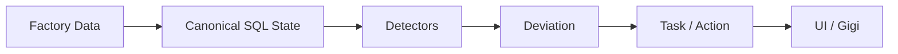
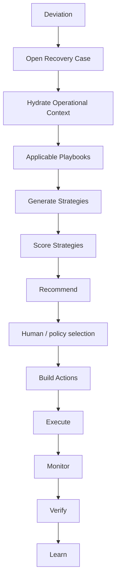
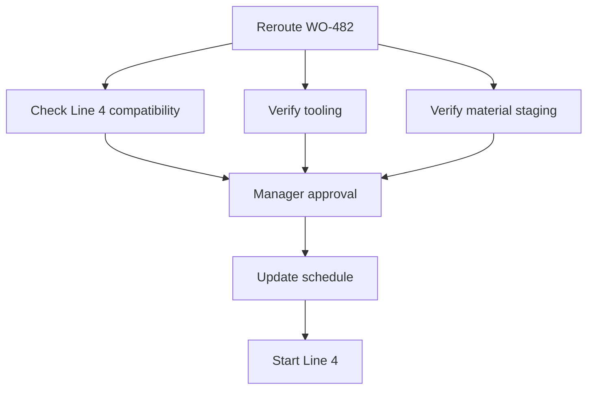
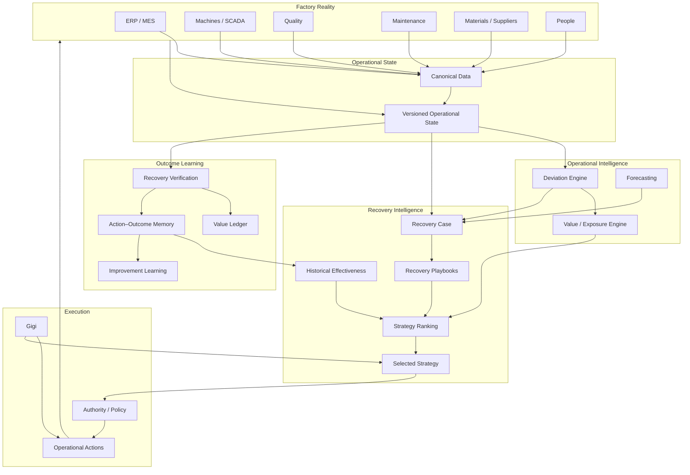

# GenuineGigs V2.1 — Recovery Intelligence Upgrade Plan

> **Purpose**
>
> This document is the implementation plan for upgrading the current GenuineGigs V2 codebase into the product we actually want to build.
>
> The current V2 foundation is **not to be rewritten**. It already has strong building blocks:
>
> - canonical PostgreSQL operational state,
> - simulator/source connectors,
> - integration normalization,
> - production/quality/material/machine/maintenance records,
> - deterministic detectors,
> - deviations,
> - tasks and operational actions,
> - action dependencies,
> - value entries,
> - role-specific projections,
> - authorization concepts,
> - transactional outbox,
> - SSE/browser live refresh,
> - Gigi runs and controlled tool usage.
>
> The purpose of V2.1 is to add the missing intelligence and learning loop:
>
> **Deviation → Recovery Strategy → Execution → Verified Outcome → Learned Effectiveness → Better Next Recovery**
>
> This is the layer that should move GenuineGigs away from being just another manufacturing analytics/workflow platform.

---

# 0. NON-NEGOTIABLE PRODUCT PRINCIPLE

The current product largely does:

```text
collect data
→ detect deviation
→ calculate impact
→ create task/action
→ show status
```

V2.1 must do:

```text
collect data
→ detect deviation
→ understand business impact
→ generate possible recovery strategies
→ rank strategies
→ coordinate execution
→ verify actual recovery
→ record outcome
→ learn which recovery strategies work
→ improve the next recommendation
```

The central product concept becomes:

# **Operational Recovery**

The key question is no longer only:

> What is going wrong?

It becomes:

> What is the best available way to recover, what needs to happen, did it work, and what should GenuineGigs learn from it?

---

# 1. DO NOT REWRITE THE CURRENT FOUNDATION

Codex must first inspect and reuse the current implementation.

Do **not** replace:

- PostgreSQL with Neo4j,
- polling with Kafka just for architectural purity,
- current FastAPI modular monolith with microservices,
- current action/task system with a parallel workflow engine,
- current value-entry system with a second ROI database,
- current Gigi runtime with a single giant agent,
- current source simulator,
- current authorization model,
- current outbox/eventing implementation.

The existing V2 foundation should be extended.

The objective of this phase is **product intelligence**, not infrastructure vanity.

---

# 2. CURRENT V2 → TARGET V2.1

## Current



## Target

```mermaid
flowchart LR
    DATA[Factory Reality]
    STATE[Canonical Plant State]
    DETECT[Deviation Engine]
    DEV[Deviation]
    VALUE[Exposure / Value]
    REC[Recovery Engine]
    STRAT[Recovery Strategy]
    EXEC[Operational Actions]
    RESULT[Observed Outcome]
    VERIFY[Recovery Verification]
    MEMORY[Action–Outcome Memory]
    LEARN[Effectiveness Learning]

    DATA --> STATE --> DETECT --> DEV
    DEV --> VALUE
    VALUE --> REC
    REC --> STRAT
    STRAT --> EXEC
    EXEC --> RESULT
    RESULT --> VERIFY
    VERIFY --> MEMORY
    MEMORY --> LEARN
    LEARN --> REC
```



---

# 3. V2.1 MAJOR WORKSTREAMS

Implement in this order:

1. Fix current correctness issues.
2. Separate operational state dimensions.
3. Add canonical operational-state snapshots.
4. Add Recovery Case model.
5. Add Recovery Strategy model.
6. Add recovery playbooks.
7. Add deterministic Recovery Engine.
8. Link strategies to operational actions.
9. Add Recovery Verification Engine.
10. Expand Value Ledger into recovery-value tracking.
11. Add Action–Outcome Memory.
12. Add effectiveness scoring.
13. Upgrade Gigi to recovery coordination.
14. Upgrade UI around recovery.
15. Add learning/improvement workflows.
16. Add tests, observability and migration protections.
17. Only after the above, improve forecasting/ML.

---

# 4. PHASE A — FIX CURRENT V2 CORRECTNESS ISSUES FIRST

Before adding new concepts, fix known runtime defects.

## 4.1 Duplicate Gigi recovery activity

In the behind-plan deviation creation flow, `_queue_gigi_recovery_activity(...)` is currently queued twice.

Fix this.

Add a test:

```text
Given a new behind-plan deviation
When the detector creates it
Then exactly one Gigi recovery activity is queued
```

## 4.2 Missing frontend `machine.signal.updated` listener

Backend SSE emits:

```text
machine.signal.updated
```

but `V2LiveUpdates.tsx` does not react to it.

Add listener.

It should invalidate/update the relevant queries:

```text
line workspace
operations overview
maintenance workspace
active deviation queries
command center if affected
```

Do not refresh the entire app.

## 4.3 Authorization audit

Perform endpoint-by-endpoint authorization review for all `/api/v2/*` read/write routes.

Every operational query must filter at the service/repository level, not only after a broad projection is built.

Specifically verify:

```text
plant access
area access
line access
asset access
action authority
financial visibility
```

Create tests for:

- Plant Manager with one plant.
- Maintenance engineer with limited assets/line.
- Quality role without financial visibility.
- Corporate role with multiple plants.
- User attempting URL-level access to unauthorized line/deviation.

No API should return unauthorized records and then rely on frontend hiding.

## 4.4 Simulator scenario realism

Some old scenarios emit several downstream facts immediately.

Where practical, convert them to gradual factual timelines.

Example:

Bad:

```text
machine alarm
+ downtime
+ maintenance ticket
+ recovery
```

all emitted together.

Better:

```text
signal drift
→ threshold breach
→ alarm
→ downtime
→ CMMS work creation
→ technician acknowledgement
→ repair
→ healthy signals
```

Keep old scenarios only if required for deterministic testing.

---

# 5. PHASE B — SEPARATE OPERATIONAL STATE DIMENSIONS

Do not use one generic line status to represent different ideas.

Create explicit state dimensions.

## 5.1 Line Execution State

Enum:

```text
RUNNING
IDLE
CHANGEOVER
STARVED
BLOCKED_PHYSICALLY
DOWN
UNKNOWN
```

This state answers:

> What is the line physically doing?

## 5.2 Production Performance State

Enum:

```text
AHEAD
ON_PLAN
WATCH
BEHIND
RECOVERING
UNKNOWN
```

This answers:

> Is production tracking plan?

## 5.3 Material Readiness State

Existing conceptual enum remains:

```text
READY
WATCH
AT_RISK
BLOCKED
UNKNOWN
```

This answers:

> Is required material ready for the relevant work order/horizon?

## 5.4 Machine Health State

Enum:

```text
HEALTHY
WATCH
DEGRADED
FAULT
UNKNOWN
```

## 5.5 Quality State

Enum:

```text
NORMAL
WATCH
HOLD
CONTAINMENT
UNKNOWN
```

## 5.6 Recovery State

Enum:

```text
NONE
ASSESSING
STRATEGY_SELECTED
ACTION_IN_PROGRESS
MONITORING
RECOVERED
FAILED
```

## 5.7 API model

Every line workspace must return separate fields:

```json
{
  "line_id": "...",
  "execution_state": "RUNNING",
  "performance_state": "BEHIND",
  "machine_health_state": "WATCH",
  "quality_state": "NORMAL",
  "recovery_state": "ACTION_IN_PROGRESS",
  "active_work_order": {},
  "material_readiness": {}
}
```

Never collapse these into one badge.

---

# 6. PHASE C — CREATE CANONICAL OPERATIONAL STATE SNAPSHOTS

The current “operational twin” is assembled independently at query time.

Do not create a huge digital-twin platform.

Create a lightweight, versioned snapshot model that gives every major subsystem the same current interpretation.

## 6.1 Table: `operational_state_snapshots`

```text
id UUID PK
tenant_id UUID
plant_id UUID
scope_type ENUM(plant,line,work_order,asset)
scope_id UUID
version BIGINT
captured_at TIMESTAMPTZ

execution_state VARCHAR nullable
performance_state VARCHAR nullable
machine_health_state VARCHAR nullable
quality_state VARCHAR nullable
recovery_state VARCHAR nullable

active_work_order_id UUID nullable
shift_id UUID nullable

target_quantity NUMERIC nullable
expected_now NUMERIC nullable
actual_quantity NUMERIC nullable
forecast_quantity NUMERIC nullable

material_readiness_state VARCHAR nullable

active_deviation_ids JSONB
active_action_ids JSONB

state_payload JSONB
source_freshness JSONB
created_at TIMESTAMPTZ
```

Index:

```text
tenant_id + plant_id
scope_type + scope_id + captured_at DESC
```

## 6.2 Snapshot generation

Create service:

```python
build_operational_state_snapshot(
    scope_type,
    scope_id,
    as_of
) -> OperationalStateSnapshot
```

Create latest-state helper:

```python
get_latest_operational_state(
    scope_type,
    scope_id
)
```

## 6.3 Update triggers

Recompute affected line/work-order state after:

```text
production.actual.updated
downtime.started
downtime.ended
machine.signal.updated
machine.fault.created
quality.event.created
material.readiness.updated
action.updated
deviation.updated
work_order.updated
```

Fallback reconciliation every 1–5 minutes.

## 6.4 Use

The following should preferentially read from the same snapshot/service:

```text
Command Center
Operations Overview
Line Workspace
Gigi context
Recovery Engine
Recovery Verification
```

This does not mean every historical chart must be snapshot-backed.

---

# 7. PHASE D — ADD `RecoveryCase`

A deviation is the problem.

A Recovery Case is the structured process of getting the operation back toward the target state.

One deviation may have one primary Recovery Case.

## 7.1 Table: `recovery_cases`

```text
id UUID PK
tenant_id UUID
plant_id UUID
deviation_id UUID NOT NULL
scope_type VARCHAR
scope_id UUID nullable

status ENUM(
  assessing,
  options_ready,
  strategy_selected,
  executing,
  monitoring,
  recovered,
  partially_recovered,
  failed,
  abandoned,
  verified
)

opened_at TIMESTAMPTZ
target_state JSONB
baseline_state JSONB
baseline_snapshot_id UUID nullable

business_exposure_amount NUMERIC nullable
business_exposure_currency VARCHAR nullable

selected_strategy_id UUID nullable

decision_actor_type VARCHAR nullable
decision_actor_id VARCHAR nullable
decision_reason TEXT nullable
selected_at TIMESTAMPTZ nullable

execution_started_at TIMESTAMPTZ nullable
monitoring_started_at TIMESTAMPTZ nullable
recovered_at TIMESTAMPTZ nullable
verified_at TIMESTAMPTZ nullable

actual_outcome JSONB nullable

estimated_recovered_units NUMERIC nullable
actual_recovered_units NUMERIC nullable
estimated_value_recovered NUMERIC nullable
verified_value_recovered NUMERIC nullable

recovery_score NUMERIC nullable
recovery_success BOOLEAN nullable

created_at
updated_at
```

## 7.2 Recovery Case creation

When eligible deviations are created, open a Recovery Case.

Initial supported categories:

```text
production behind plan
machine downtime/fault
material shortage/readiness
quality rejection/SPC breach
supplier commitment slip
```

Not every low-value informational deviation needs a Recovery Case.

Configurable rule:

```text
deviation severity >= threshold
OR
financial exposure >= threshold
OR
production impact >= threshold
```

## 7.3 Baseline

When Recovery Case opens, persist the before-state.

At minimum:

```text
target
actual
forecast
gap
execution state
machine health
material readiness
quality state
active incidents
open actions
business exposure
```

Never reconstruct the baseline later from mutable current data.

---

# 8. PHASE E — ADD `RecoveryStrategy`

A strategy is not the same thing as an action.

Example:

```text
Strategy:
Reroute WO-482 to Line 4

Actions:
- confirm compatibility
- verify tooling
- verify material staging
- obtain approval
- update production schedule
- start Line 4
```

## 8.1 Table: `recovery_strategies`

```text
id UUID PK
tenant_id UUID
plant_id UUID
recovery_case_id UUID

strategy_type VARCHAR
title VARCHAR
description TEXT nullable

source ENUM(
  playbook,
  historical,
  optimizer,
  agent_suggested,
  user_created
)

status ENUM(
  candidate,
  evaluated,
  recommended,
  selected,
  rejected,
  executed,
  failed
)

expected_recovered_units NUMERIC nullable
expected_recovered_time_seconds INTEGER nullable
expected_value_recovered NUMERIC nullable

direct_cost NUMERIC nullable
implementation_time_seconds INTEGER nullable

quality_risk_score NUMERIC nullable
safety_risk_score NUMERIC nullable
operational_risk_score NUMERIC nullable
uncertainty_score NUMERIC nullable

historical_effectiveness_score NUMERIC nullable
historical_sample_size INTEGER nullable

recovery_score NUMERIC nullable
ranking_position INTEGER nullable

requirements JSONB
constraints JSONB
evidence JSONB
reasoning_summary TEXT nullable

created_at
updated_at
```

## 8.2 Table: `recovery_strategy_actions`

```text
id UUID PK
strategy_id UUID
operational_action_id UUID
sequence_no INTEGER
required BOOLEAN
created_at
```

## 8.3 Candidate strategy lifecycle

```text
candidate
→ evaluated
→ recommended
→ selected
→ executed
```

Rejected strategies remain stored.

This is important because the learning system needs to know:

> Which options were considered but rejected?

---

# 9. PHASE F — RECOVERY PLAYBOOKS

Do not have the LLM invent recovery strategies from scratch.

Create explicit manufacturing recovery playbooks.

## 9.1 Core interface

```python
class RecoveryPlaybook(Protocol):
    key: str
    supported_deviation_types: set[str]

    async def is_applicable(
        self,
        case: RecoveryCaseContext
    ) -> bool:
        ...

    async def generate_candidates(
        self,
        case: RecoveryCaseContext
    ) -> list[RecoveryStrategyCandidate]:
        ...

    async def build_actions(
        self,
        selected: RecoveryStrategyCandidate,
        case: RecoveryCaseContext
    ) -> list[ActionDefinition]:
        ...

    async def verification_rules(
        self,
        selected: RecoveryStrategyCandidate,
        case: RecoveryCaseContext
    ) -> list[VerificationRule]:
        ...
```

## 9.2 Initial playbooks

### Production Behind Plan

Candidate strategies may include:

```text
recover current line rate
reroute work order
extend shift/overtime
change production sequence
split quantity across line
expedite blocking material
release approved alternate material
```

Only return applicable candidates.

### Machine Failure

Candidates:

```text
repair current asset
replace module/spare
reroute work
planned temporary bypass if approved
overtime after recovery
```

### Material Shortage

Candidates:

```text
expedite supplier
use alternate approved material
transfer stock internally
reallocate material from lower-priority WO
change production sequence
partial production
substitute supplier
```

### Quality Deviation

Candidates:

```text
contain affected lot
adjust process within approved range
switch material lot
inspect 100%
reroute inspection
rework
pause line
```

AI may assist with evidence; deterministic policies decide allowed strategies.

### Supplier Commitment Slip

Candidates:

```text
request reconfirmation
expedite
split shipment
alternate supplier
use current inventory strategically
reschedule affected WO
```

---

# 10. PHASE G — BUILD THE RECOVERY ENGINE

Create a new service:

```text
apps/api/app/recovery/
```

Logical files:

```text
models.py
schemas.py
service.py
router.py
playbooks/
ranking.py
verification.py
learning.py
events.py
tests/
```

## 10.1 Recovery Engine flow



## 10.2 Context object

```python
@dataclass
class RecoveryCaseContext:
    recovery_case: RecoveryCase
    deviation: Deviation
    operational_state: OperationalStateSnapshot
    work_order: WorkOrder | None
    line: ProductionLine | None
    assets: list[Asset]
    material_readiness: ...
    quality_context: ...
    maintenance_context: ...
    supplier_context: ...
    open_actions: list[OperationalAction]
    related_incidents: list[HistoricalRecoverySummary]
    authority_context: ...
    value_context: ...
```

---

# 11. PHASE H — STRATEGY RANKING

Initial ranking must be deterministic and explainable.

Do not use an LLM as the primary ranker.

## 11.1 Baseline score

Create configurable weighted scoring:

```text
net_recoverable_value
+ historical effectiveness
+ speed of implementation
+ probability of success
- direct cost
- quality risk
- safety risk
- operational disruption
- uncertainty
```

Example:

```python
score =
    w_value * normalized_expected_net_value
  + w_effectiveness * historical_effectiveness
  + w_speed * speed_score
  + w_success * estimated_success_probability
  - w_quality * quality_risk
  - w_safety * safety_risk
  - w_disruption * disruption
  - w_uncertainty * uncertainty
```

Weights configured per tenant/plant.

Safety constraints can veto a strategy entirely.

## 11.2 `expected_net_value`

```text
expected_value_recovered
- direct_cost
- estimated_secondary_loss
```

## 11.3 Recommendation output

Recovery Engine returns:

```json
{
  "recommended_strategy": {},
  "alternatives": [],
  "recommendation_reason": [
    "Expected recovery: 320 units",
    "Estimated direct cost: ₹8,000",
    "Historical success: 7/9 comparable cases",
    "Lower quality risk than rerouting"
  ]
}
```

No opaque “AI score 87”.

---

# 12. PHASE I — HISTORICAL EFFECTIVENESS

This begins the moat.

Create a normalized record of what actually worked.

## 12.1 Table: `recovery_outcomes`

```text
id UUID PK
tenant_id UUID
plant_id UUID

recovery_case_id UUID
strategy_id UUID

baseline_snapshot_id UUID nullable
post_snapshot_id UUID nullable

started_at
completed_at

expected_recovered_units NUMERIC nullable
actual_recovered_units NUMERIC nullable

expected_value_recovered NUMERIC nullable
estimated_value_recovered NUMERIC nullable
verified_value_recovered NUMERIC nullable

time_to_first_response_seconds INTEGER nullable
time_to_recovery_seconds INTEGER nullable

target_achieved BOOLEAN nullable
partial_recovery BOOLEAN nullable

quality_side_effect BOOLEAN nullable
safety_side_effect BOOLEAN nullable
delivery_side_effect BOOLEAN nullable

recurred_within_7d BOOLEAN nullable
recurred_within_30d BOOLEAN nullable

outcome_rating ENUM(
  successful,
  partially_successful,
  unsuccessful,
  harmful,
  inconclusive
)

verification_method VARCHAR nullable
verified_by_user_id UUID nullable
verified_at TIMESTAMPTZ nullable

context_fingerprint JSONB
metrics_before JSONB
metrics_after JSONB

created_at
```

## 12.2 Context fingerprint

Store relevant comparable context.

Example:

```json
{
  "deviation_type": "machine_failure",
  "asset_family": "CNC",
  "fault_code": "701",
  "product_family": "AX",
  "shift": "B",
  "material_state": "READY",
  "quality_state": "NORMAL",
  "initial_gap_pct": 0.11
}
```

This is used to find comparable prior recovery cases.

---

# 13. PHASE J — RECOVERY VERIFICATION ENGINE

Do not mark a recovery successful because a task is completed.

Create verification logic.

## 13.1 Interface

```python
class RecoveryVerifier(Protocol):
    async def evaluate(
        self,
        recovery_case: RecoveryCase,
        selected_strategy: RecoveryStrategy,
        before: OperationalStateSnapshot,
        current: OperationalStateSnapshot,
    ) -> RecoveryVerificationResult:
        ...
```

## 13.2 Production recovery

Evaluate:

```text
forecast before strategy
forecast after strategy
actual production trajectory
final target attainment
time to stable rate
```

Possible results:

```text
RECOVERED
PARTIALLY_RECOVERED
NO_EFFECT
WORSENED
INCONCLUSIVE
```

## 13.3 Machine recovery

Require:

```text
fault cleared
healthy machine state
healthy signal window
production resumes
no immediate recurrence
```

## 13.4 Material recovery

Require:

```text
readiness state returns READY
OR
affected production is successfully rescheduled/covered
```

## 13.5 Quality recovery

Require:

```text
containment completed
quality measurements return within threshold
affected production disposition recorded
```

---

# 14. PHASE K — VALUE LEDGER UPGRADE

The current Value Ledger calculates exposure.

Upgrade it to track recovery economics.

For every Recovery Case track:

```text
Initial Exposure
Expected Recovery
Estimated Recovery
Attributable Recovery
Verified Recovery
Direct Recovery Cost
Net Verified Value
```

## 14.1 New value-entry types

Add:

```text
recovery_expected
recovery_estimated
recovery_attributable
recovery_verified
recovery_direct_cost
recovery_net_value
```

## 14.2 Attribution rules

Do not automatically claim all improvement.

Example:

```text
forecast before action     16,100
forecast after action      16,440
actual end                 16,520
```

Potential recovery:

```text
+340 forecast improvement
```

But attributable recovery must consider:

```text
other concurrent actions
machine natural recovery
plan changes
material arrival unrelated to action
```

Initially use conservative rule-based attribution.

Human verification remains available.

---

# 15. PHASE L — ACTION–OUTCOME MEMORY

Create a retrieval layer for prior recoveries.

Do not introduce Neo4j yet.

PostgreSQL is sufficient.

Create service:

```python
find_similar_recovery_cases(
    tenant_id,
    plant_id,
    context_fingerprint,
    strategy_type=None,
    limit=10
)
```

Similarity features:

```text
deviation subtype
asset/machine family
fault code
product family
material
line
shift
severity
initial gap
quality state
material state
strategy type
```

Initial implementation can use weighted exact/category matching.

Later use embeddings/ML only if justified.

## 15.1 Historical strategy statistics

For each:

```text
context + strategy type
```

calculate:

```text
sample size
success rate
partial success rate
median recovery units
median time to recovery
median net value
quality side-effect rate
30-day recurrence rate
```

Store/cache projection if necessary.

---

# 16. PHASE M — GIGI V2.1: RECOVERY COORDINATOR

Gigi must evolve from explanation assistant to operational recovery coordinator.

It must still operate inside deterministic policy boundaries.

## 16.1 Gigi objective

Gigi's operating question becomes:

> What important operational deviation requires attention, what recovery is currently possible, what is already being handled, and what decision does the user need to make?

## 16.2 New read tools

Add:

```text
get_recovery_case
get_recovery_strategies
get_strategy_comparison
get_historical_recovery_effectiveness
get_recovery_progress
get_recovery_verification
get_verified_value_recovered
```

## 16.3 New prepare tools

Add:

```text
prepare_recovery_strategy_selection
prepare_recovery_action_sequence
prepare_reroute_request
prepare_overtime_request
prepare_material_reallocation
prepare_quality_containment
prepare_supplier_expedite
prepare_improvement_investigation
```

## 16.4 Gigi may NOT

Gigi may not:

```text
choose restricted strategy without policy
modify PLC settings directly
release quality hold
approve high-value transaction
change ERP records without governed execution
invent unsupported recovery metrics
label a hypothesis as confirmed root cause
```

## 16.5 Gigi response format

For operational recovery:

```json
{
  "situation": "...",
  "business_impact": {
    "lost_units": 420,
    "financial_exposure": 38400
  },
  "current_handling": [],
  "recommended_strategy": {
    "id": "...",
    "title": "...",
    "expected_recovery": "...",
    "reason": []
  },
  "alternatives": [],
  "decision_required": {},
  "evidence_refs": [],
  "confidence": "medium"
}
```

## 16.6 Example desired Gigi behavior

Instead of:

> CNC-04 is down. Maintenance has been notified.

Gigi should say:

> CNC-04 has now put WO-482 roughly 420 units at risk.
>
> I evaluated three recovery paths.
>
> **Recommended:** repair CNC-04 and reserve 90 minutes of overtime.
>
> Expected recovery: 310–360 units.
>
> Rerouting to Line 4 could start sooner, but two comparable AX-family runs had dimensional-quality problems after rerouting.
>
> Maintenance is already working on CNC-04. The only decision I need from you now is overtime authorization.

---

# 17. PHASE N — UI/UX CHANGES

Do not redesign the whole application again.

Update existing V2 pages to expose the recovery loop.

---

# 18. COMMAND CENTER CHANGES

Add a section:

# **Recovery Opportunities**

Not just active deviations.

Each card:

```text
WO-482 behind plan

₹38,400 at risk

Recommended recovery
Repair CNC-04 + reserve overtime

Expected recovery
310–360 units

Current status
Maintenance working

Decision needed
Approve overtime
```

## 18.1 Command Center priorities

Sort management attention by:

```text
economic exposure
urgency
recoverability
decision need
severity
```

Not severity alone.

## 18.2 New top summary

Show:

```text
Operational value at risk
₹X

Recovery actions in progress
₹Y addressed

Verified recovered value today
₹Z
```

Use conservative numbers.

---

# 19. DEVIATION WORKSPACE → RECOVERY WORKSPACE

Keep the existing deviation page, but make Recovery central.

New structure:

```text
1. What happened
2. Business impact
3. Recovery options
4. Selected strategy
5. Execution progress
6. Recovery verification
7. Historical evidence
```

## 19.1 Recovery Options component

Example:

```text
Recommended

Repair CNC-04 + overtime
Expected recovery      340 units
Direct cost            ₹8k
Historical success     78% (7/9)
Quality risk           Low
Time to effect         45 min

[Select]
```

Alternative cards below.

Do not present more than 3–4 strategies initially.

## 19.2 Why recommended

Show structured explanation.

```text
Why GenuineGigs recommends this

+ spare is available
+ technician already engaged
+ 7/9 similar cases recovered
+ lower quality risk

Tradeoff
- requires 90 min overtime
```

---

# 20. LINE WORKSPACE CHANGES

Add compact panel:

```text
Recovery Status
```

Example:

```text
Production gap
-76

Active recovery
Repair CNC-04

Expected recovered
+58

Remaining expected gap
-18

State
MONITORING
```

---

# 21. MY WORK CHANGES

Tasks should connect to the recovery strategy.

Example:

```text
Repair CNC-04

Why
This is step 2 of recovery plan for WO-482.

Expected effect
+240–300 units

Due
13:10
```

Users should understand the objective, not only the task.

---

# 22. IMPROVEMENT STUDIO CHANGES

Add:

# **Recurring Recovery Failures**

Show cases where the plant repeatedly fights the same problem.

Example:

```text
CNC-04 Fault 701

4 incidents
₹2.4L estimated monthly loss
3 reactive repairs
30-day recurrence: 75%

Recommended:
Open permanent improvement investigation
```

---

# 23. CREATE `ImprovementInvestigation`

Optional in this phase, but recommended after RecoveryCase works.

Minimum:

```text
id
tenant_id
plant_id
title
problem_signature
related_recovery_case_ids
estimated_annual_loss
status
owner
hypothesis
countermeasure
experiment_id nullable
created_at
```

Gigi can propose an investigation after recurrence threshold.

---

# 24. FORECASTING UPGRADE — AFTER RECOVERY LOOP WORKS

Do not prioritize fancy ML first.

Keep current bounded rate forecast as baseline.

Add forecast evaluation logging.

For every forecast:

```text
timestamp
forecast horizon
forecast quantity
actual eventual quantity
absolute error
percentage error
context
```

Create:

```text
forecast_evaluations
```

Only after enough data, test alternatives.

Possible later models:

```text
EWMA/rate-adjusted
product/line conditioned regression
gradient boosting
time-series model
```

No model should replace baseline unless it improves accuracy and operational decisions.

---

# 25. MACHINE-CONDITION UPGRADE — AFTER RECOVERY LOOP

Current thresholds are acceptable.

Add:

```text
anomaly episode
signal trend context
historical relation to failures
```

But do not build predictive maintenance platform before pilot evidence.

---

# 26. EVENT CONTRACT ADDITIONS

Add event types:

```text
recovery.case.opened
recovery.options.generated
recovery.strategy.recommended
recovery.strategy.selected
recovery.execution.started
recovery.monitoring.started
recovery.outcome.detected
recovery.verified
recovery.failed
recovery.learning.updated
improvement.investigation.suggested
```

All must use existing outbox semantics.

---

# 27. API CONTRACT

Add:

## Recovery Cases

```http
GET  /api/v2/recovery-cases
GET  /api/v2/recovery-cases/{id}
POST /api/v2/recovery-cases/{id}/refresh-options
POST /api/v2/recovery-cases/{id}/select-strategy
POST /api/v2/recovery-cases/{id}/start
POST /api/v2/recovery-cases/{id}/verify
POST /api/v2/recovery-cases/{id}/abandon
```

## Strategies

```http
GET /api/v2/recovery-cases/{id}/strategies
GET /api/v2/recovery-strategies/{id}
GET /api/v2/recovery-strategies/{id}/historical-evidence
```

## Outcome

```http
GET /api/v2/recovery-cases/{id}/outcome
GET /api/v2/recovery-cases/{id}/value
```

## Learning

```http
GET /api/v2/recovery-effectiveness
GET /api/v2/recovery-effectiveness/{strategy_type}
```

---

# 28. STATE TRANSITIONS

## Recovery Case

```text
assessing
→ options_ready
→ strategy_selected
→ executing
→ monitoring
→ recovered
→ verified
```

Alternate:

```text
monitoring → partially_recovered
monitoring → failed
executing → failed
any non-terminal → abandoned
```

Use service methods.

No arbitrary frontend PATCH.

---

# 29. OPERATING ACTION LINKAGE

Operational actions remain execution primitives.

RecoveryStrategy produces a graph/sequence of actions.

Example:



Use current action dependency model.

Do not build a new DAG engine unless existing dependencies cannot support this.

---

# 30. POLICY / AUTHORITY

Every RecoveryStrategy must declare required permissions.

Examples:

```text
repair machine
→ Maintenance can execute

reroute work order
→ Production Manager approval

alternate material
→ Quality + Materials approval

overtime
→ configured Plant Manager/HR authority

supplier expedite
→ Procurement

machine parameter change
→ disallowed unless explicitly configured
```

Recovery Engine can rank a strategy even if approval is required.

It must clearly say:

```text
Requires Plant Manager approval
```

---

# 31. DATA FRESHNESS

Recovery ranking cannot use stale data silently.

Every candidate strategy must record required inputs and freshness.

If critical data is stale:

```text
strategy confidence = reduced
OR
strategy unavailable
```

Example:

> Cannot recommend rerouting because Line 4 availability data is 47 minutes old.

---

# 32. STRATEGY EVIDENCE

Each strategy must store evidence references.

Example:

```text
current spare stock
line availability
historical recovery cases
quality incidents
supplier commitment
work-order compatibility
```

Gigi and UI must be able to show:

> Why do you believe this option is valid?

---

# 33. RECOVERY EFFECTIVENESS SERVICE

Implement:

```python
get_effectiveness(
    plant_id,
    strategy_type,
    context
) -> StrategyEffectiveness
```

Initial result:

```json
{
  "sample_size": 9,
  "success_rate": 0.78,
  "partial_success_rate": 0.11,
  "median_recovered_units": 286,
  "median_recovery_time_seconds": 3300,
  "quality_side_effect_rate": 0.11,
  "recurrence_30d_rate": 0.22
}
```

If sample size < configured threshold, show:

```text
insufficient history
```

Do not fabricate confidence.

---

# 34. CROSS-PLANT LEARNING — NOT YET GLOBAL AI

Initially learning hierarchy:

```text
same asset
→ same line
→ same plant
→ same tenant/company
```

Only later consider privacy-safe aggregated patterns across customers.

Do not mix customer operational data across tenants.

---

# 35. RECOVERY SCORE

Create two scores:

## Strategy score

Used before execution.

## Recovery score

Used after execution.

Example recovery score components:

```text
target recovery achieved
time to recovery
net value recovered
side effects
recurrence
```

Store component breakdown.

Never show one opaque score without explanation.

---

# 36. SUCCESS CRITERIA FOR V2.1

V2.1 is not complete because tables exist.

A single scenario must work end-to-end.

## Scenario: Machine failure causes production risk

1. Machine signals deteriorate.
2. Machine detector creates fault/deviation.
3. Production impact is calculated.
4. Recovery Case opens automatically.
5. Recovery Engine generates at least 2 applicable strategies.
6. Historical evidence is loaded where available.
7. Strategies are scored.
8. One strategy is recommended.
9. User selects/approves strategy.
10. Operational actions are created.
11. My Work updates for responsible roles.
12. Gigi explains:
    - problem,
    - impact,
    - recommendation,
    - current handling,
    - decision required.
13. Machine/production data improves.
14. Recovery Verification detects improvement.
15. Outcome is stored.
16. Value Ledger records recovered value.
17. Recovery Case becomes verified.
18. Similar future incident can retrieve this case as historical evidence.

If this complete loop does not work, V2.1 is not done.

---

# 37. SECOND ACCEPTANCE SCENARIO — MATERIAL SHORTAGE

1. Supplier commitment slips.
2. Material Readiness becomes AT_RISK.
3. Affected work order is found.
4. Financial/production exposure is calculated.
5. Recovery Case opens.
6. Candidate strategies:
   - expedite,
   - approved alternate,
   - resequence production.
7. Strategy comparison is shown.
8. User chooses alternate material path.
9. Quality approval action is created.
10. Material readiness returns READY.
11. Recovery Case verifies:
    - no line stop occurred,
    - production need protected.
12. Value at risk becomes verified protected value.
13. Outcome stored for future supplier/material cases.

---

# 38. THIRD ACCEPTANCE SCENARIO — QUALITY

1. SPC/rejection deviation occurs.
2. Recovery Case opens.
3. Candidates:
   - contain lot,
   - switch lot,
   - inspect 100%,
   - stop/restart after adjustment.
4. Gigi summarizes likely factors.
5. Human confirms strategy.
6. Quality action sequence executes.
7. Measurements return normal.
8. Recovery verifies.
9. Outcome + quality side effects stored.

---

# 39. DEMO DATA CHANGES

Extend Northstar simulator to include recoverable branches.

For every major scenario, support multiple possible recovery choices.

Example CNC fault:

```text
branch A
repair with spare available
→ good outcome

branch B
reroute to Line 4
→ faster output but small quality risk

branch C
do nothing
→ continued production loss
```

The simulator must not simply force a single “correct” path.

It should react to chosen strategy where possible.

This is important for demonstrating the Recovery Engine.

---

# 40. OBSERVABILITY

Add structured logs/metrics:

```text
recovery_case_opened_total
strategies_generated_total
strategy_selected_total
recovery_success_total
recovery_failed_total
recovery_verification_latency
time_to_first_recovery_action
recovery_value_verified
historical_evidence_used_total
gigi_recovery_recommendations_total
human_override_total
```

Trace:

```text
deviation_id
recovery_case_id
strategy_id
action_id
agent_run_id
correlation_id
```

---

# 41. HUMAN OVERRIDES

If a user rejects GenuineGigs' recommended strategy:

store:

```text
recommended_strategy
selected_strategy
override_reason
user
timestamp
eventual outcome
```

This becomes valuable learning data.

Do not treat override as failure.

---

# 42. PLAYBOOK CONFIGURATION

Playbooks should have code-defined defaults initially.

Tenant configuration may override:

```text
allowed strategies
approval rules
cost parameters
line compatibility
material substitution rules
overtime limits
supplier escalation policy
```

Do not make all logic editable in a generic rule-builder yet.

---

# 43. ROOT-CAUSE STATUS

Maintain strict distinction:

```text
unknown
hypothesized
confirmed
```

Recovery strategy may be chosen even before root cause is confirmed.

Example:

> We do not need to know the exact bearing failure mechanism before rerouting production.

Do not block recovery on perfect RCA.

---

# 44. RECOVERY VS RCA

Product should support two loops:

## Immediate Recovery

```text
restore operational objective
```

## Permanent Improvement

```text
remove recurring cause
```

Do not merge them.

Example:

```text
Immediate:
reroute WO

Permanent:
replace recurring coolant subsystem issue
```

Improvement Studio owns the second loop.

---

# 45. UI PRIORITY ORDER

For every deviation/recovery view:

1. What is at risk?
2. What is the recommended recovery?
3. What is already happening?
4. What needs the user?
5. What alternatives exist?
6. What evidence supports recommendation?
7. What happened historically?
8. Raw telemetry/details.

Do not put raw machine charts above the recovery decision.

---

# 46. GIGI PROACTIVE BEHAVIOR

Gigi should proactively interrupt only when:

```text
new high-value deviation
recommended strategy ready
critical decision required
strategy failed
recovery verified
recurrence suggests systemic problem
```

Routine updates go to activity history.

---

# 47. RECOVERY DAILY BRIEF

Plant Head morning/shift view:

```text
3 risks likely to need intervention today.

₹4.2L current operational value at risk.

2 active recoveries.

₹1.1L verified recovered this shift.

Largest risk:
RM-218 material readiness.

GenuineGigs is handling:
- supplier follow-up
- maintenance follow-up
- Quality containment

Needs you:
- approve Line 4 reroute
```

---

# 48. CODE ORGANIZATION

Preferred new backend structure:

```text
apps/api/app/recovery/
  __init__.py
  models.py
  schemas.py
  repository.py
  service.py
  ranking.py
  verification.py
  effectiveness.py
  events.py
  router.py

  playbooks/
    base.py
    production.py
    machine.py
    material.py
    quality.py
    supplier.py

  tests/
    test_recovery_case.py
    test_strategy_generation.py
    test_ranking.py
    test_verification.py
    test_effectiveness.py
```

Use current repo conventions if different.

---

# 49. FRONTEND STRUCTURE

Suggested:

```text
apps/web/components/v2/recovery/
  RecoverySummary.tsx
  RecoveryOptions.tsx
  RecoveryStrategyCard.tsx
  RecoveryComparison.tsx
  RecoveryProgress.tsx
  RecoveryVerification.tsx
  HistoricalEvidence.tsx
  VerifiedValue.tsx
```

Pages should consume API responses.

No recovery calculations in React.

---

# 50. MIGRATION STRATEGY

Add DB migrations safely.

Do not break V1/V2 pages.

Sequence:

```text
add new tables/enums
→ deploy backend
→ populate Recovery Cases only for new deviations
→ validate
→ optional backfill recent historical deviations
→ enable UI
```

Do not backfill all historical data in first migration.

---

# 51. OPTIONAL BACKFILL

After core works, create offline job:

```text
backfill_recovery_cases(
  from_date,
  to_date
)
```

Only derive cases where enough evidence exists.

Mark reconstructed cases:

```text
source = historical_reconstruction
confidence = lower
```

Never pretend they were live-managed cases.

---

# 52. TESTING REQUIREMENTS

## Unit

```text
state dimension derivation
playbook applicability
strategy generation
strategy ranking
value formulas
verification logic
effectiveness aggregation
```

## Integration

```text
deviation → Recovery Case
Recovery Case → strategies
strategy selection → actions
actions → monitoring
monitoring → outcome
outcome → value
```

## Authorization

Ensure recovery data obeys scope and financial visibility.

## Eventing

Ensure outbox idempotency and no duplicate Gigi activity.

---

# 53. FAILURE TESTS

Required:

### Strategy cannot execute

Example:

Line 4 becomes unavailable after reroute strategy recommendation.

System must:

```text
invalidate/mark strategy unavailable
re-evaluate options
notify user/Gigi
```

### Data becomes stale

Recovery Engine must reduce confidence or pause recommendation.

### Action fails

Strategy status:

```text
executing → failed
```

Recovery Case returns to:

```text
assessing
```

if alternatives exist.

### Recovery does not improve plant state

Do not mark recovered.

Record unsuccessful outcome.

---

# 54. PERFORMANCE REQUIREMENTS

Do not compute full historical learning on every page request.

Cache/aggregate strategy effectiveness where necessary.

Recovery option generation target:

```text
<2 seconds deterministic
```

Gigi explanation may occur asynchronously/streamed after deterministic recovery options exist.

The user should not wait for an LLM before seeing recovery strategies.

---

# 55. AI BOUNDARY

The Recovery Engine owns:

```text
applicability
constraints
value
risk
historical effectiveness
ranking baseline
authority
```

LLM/Gigi owns:

```text
explanation
summarization
messy evidence interpretation
drafting
hypothesis suggestions
interaction
```

This boundary is mandatory.

---

# 56. DO NOT BUILD THESE IN V2.1

Do not spend the phase on:

```text
Kafka migration
Neo4j migration
Kubernetes
full data lake
full digital twin 3D visualization
fully autonomous PLC writes
generic visual workflow builder
advanced deep-learning forecasting
computer-vision platform
multi-agent swarm
```

These do not create the immediate moat.

---

# 57. PRODUCT LANGUAGE UPDATE

Internally rename the product thesis:

From:

> Manufacturing Intelligence / Operational Analytics

To:

# **Manufacturing Operational Recovery**

GenuineGigs should be judged by:

> Did we help the plant recover an important operational objective?

not:

> Did we display enough metrics?

---

# 58. CORE MOAT DATA THAT MUST BE CAPTURED FROM DAY ONE

Every managed Recovery Case must capture:

```text
context before
deviation
business exposure
root-cause status
strategies considered
strategy recommended
strategy selected
selection/override reason
approval actor
actions created
action timestamps
dependencies
state during recovery
state after recovery
actual units recovered
value recovered
side effects
success/failure
recurrence
```

This dataset is the beginning of the Action–Outcome Graph.

Do not omit fields because they are “not needed for current UI”.

---

# 59. DEFINITION OF A SUCCESSFUL V2.1 PRODUCT DEMO

A demo should no longer be:

> “See, machine is down and the dashboard turned red.”

It should be:

1. Factory state changes.
2. GenuineGigs detects deviation.
3. GenuineGigs explains business impact.
4. GenuineGigs generates multiple valid recovery strategies.
5. GenuineGigs explains tradeoffs and historical evidence.
6. User approves one.
7. Multiple departments receive coordinated actions.
8. Gigi follows execution.
9. Factory state recovers.
10. GenuineGigs verifies the recovery.
11. Value Ledger shows protected/recovered value.
12. Future similar incident uses this outcome as evidence.

That is the V2.1 story.

---

# 60. IMPLEMENTATION ORDER FOR CODEX

Execute strictly in this order.

## Sprint 1 — Correctness + state semantics

```text
fix duplicate Gigi event
fix SSE machine signal listener
authorization audit
separate state enums
state derivation service
```

## Sprint 2 — Operational state snapshots

```text
snapshot table
snapshot service
event-triggered refresh
query integration
```

## Sprint 3 — Recovery domain

```text
RecoveryCase
RecoveryStrategy
RecoveryStrategyAction
RecoveryOutcome
migrations
services
API
events
```

## Sprint 4 — Playbooks

```text
production
machine
material
quality
supplier
```

## Sprint 5 — Ranking

```text
scoring
constraints
historical-effectiveness interface
strategy comparison API
```

## Sprint 6 — Execution integration

```text
selected strategy
→ current OperationalAction system
→ dependencies
→ policy
→ escalation
```

## Sprint 7 — Verification + Value Ledger

```text
verification engines
outcomes
recovery value
verified value
```

## Sprint 8 — Action–Outcome learning

```text
historical retrieval
effectiveness aggregation
context fingerprint
recurrence
```

## Sprint 9 — Gigi recovery coordinator

```text
new tools
new proactive triggers
recommendation explanation
decision UX
```

## Sprint 10 — UI

```text
Command Center recovery
Deviation/Recovery Workspace
Line recovery panel
My Work recovery context
Improvement recurring problems
```

## Sprint 11 — simulator + acceptance scenarios

```text
branching recovery scenarios
machine
material
quality
```

## Sprint 12 — hardening

```text
load
authorization
stale-data behavior
failure/retry
observability
tests
```

---

# 61. CODEX WORKING RULES

For every sprint:

1. Read this document.
2. Audit current code relevant to the sprint.
3. Reuse current primitives before creating new ones.
4. Write migrations.
5. Write service/business logic.
6. Write tests.
7. Add API.
8. Add events.
9. Update frontend.
10. Run scenario tests.
11. Take screenshots for changed V2 UI.
12. Document what was implemented and deviations from plan.

If an existing V2 abstraction already satisfies a requirement, extend it instead of duplicating it.

---

# 62. FINAL TARGET ARCHITECTURE



---

# 63. THE PRODUCT WE ARE TRYING TO CREATE

When this phase is complete, GenuineGigs should no longer feel like:

> a dashboard that detects issues.

It should feel like:

> **a plant recovery system that understands what is at risk, evaluates ways to recover, coordinates the organization, verifies whether recovery happened, and remembers which interventions actually worked.**

The system should become better with every real recovery cycle.

That learning loop is not an optional analytics feature.

It is the beginning of the long-term moat.

---

# 64. FINAL ACCEPTANCE QUESTION

Before considering V2.1 complete, ask:

> If a competitor copied our UI, used the same LLM, connected the same PLCs and built similar dashboards, would they still be missing the recovery history, effectiveness data and plant-specific operational learning that GenuineGigs has accumulated?

If the answer is **yes**, we are finally building toward a defensible system.

If the answer is **no**, we are still building features rather than a moat.
